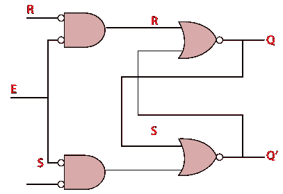
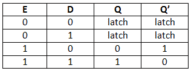
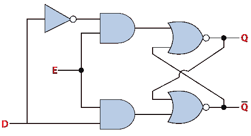
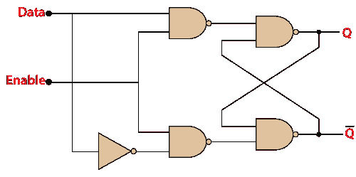
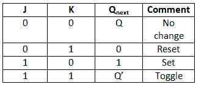
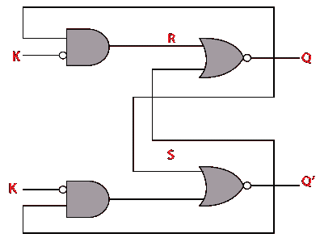
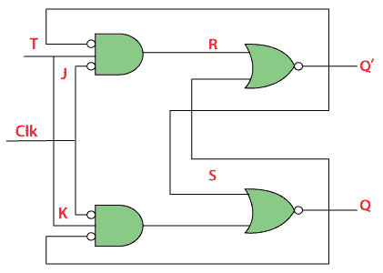

# 理解

> 原文：<https://www.javatpoint.com/latches-in-digital-electronics>

一个**锁存器**是一种特殊类型的逻辑电路。插销有**低**和**高**两种稳定状态。由于这些状态，锁存器也称为**双稳态多谐振荡器**。锁存器是使用反馈通道保存数据的存储设备。锁存器存储 1 位，直到器件设为 1。当使能输入设为 1 时，锁存器改变存储的数据，并不断尝试输入。

基于使能信号，电路工作在两种状态。当使能输入为高电平时，两个输入均为低电平，当使能输入为低电平时，两个输入均为高电平。

## 闩锁的类型

数字电路中使用的锁存器有以下几种类型:

*   **SR 闩锁**
*   **门控开关闩锁**
*   **D 闩锁**
*   **门控 D 闩锁**
*   **JK 插销**
*   **T 型插销。**

### SR 锁存器

SR 锁存器是一种特殊类型的异步设备，它为控制信号单独工作。这取决于 S 态和 R 输入。SR 闩锁设计通过交叉回路连接两个 [**或非**门](https://www.javatpoint.com/nor-gate-in-digital-electronics)。SR 锁存器也可以使用[与非门](https://www.javatpoint.com/nand-gate-in-digital-electronics)来设计。下面是 SR 锁存器的电路图和真值表。

**真值表**

| S | 稀有 | Q | q ' |
| Zero | Zero | 门闩 | 门闩 |
| Zero | one | Zero | one |
| one | Zero | one | Zero |
| one | one | Zero | Zero |

**电路图** 

### 门控 SR 锁存器

一个**门控 SR 锁存器**是一种特殊类型的 **SR 锁存器**，具有三个输入，即置位、复位和使能。要使设置和复位输入有效，使能输入必须有效。门控 SR 锁存器的**使能**输入使能设置和复位输入的操作。该**使能**输入与一个开关连接。当此开关打开时，设置-复位输入被启用。否则，设置和复位输入中的所有更改都将被忽略。下面是门控 SR 锁存器的电路图和真值表。

**真值表**

**电路图**

### 锁闩

**D 锁存器**与**T3】D 触发器 T5 相同。这两者之间唯一的区别是**启用**输入。当**使能**输入设置为 1 时，锁存器的输出与传递到**数据**输入的输入相同。此时，锁存器打开，路径从输入到输出是透明的。如果**使能**输入设置为 0，D 锁存器的输出是锁存器的最后一个值，即独立于输入 D，锁存器关闭。下面是 D 锁存器的电路图和真值表。**

**真值表**

****电路图****

**

### 选通 D 锁存器

**选通 D 锁存器**是另一种特殊类型的选通锁存器，具有两个输入，即数据和使能。当使能输入设置为 1 时，输入与数据输入相同。否则，输出没有变化。

我们可以通过使用门控 SR 锁存器来设计门控 D 锁存器。设置和复位输入通过反相器连接在一起。这样，输出将彼此相反。下图是门控 D 锁存器的电路图。

**电路图**

### JK 插销

**JK 插销**与 **SR 插销**相同。在 JK 锁存器中，不清楚的状态被移除，并且当 JK 输入为高时输出被切换。SR 锁存器和 JK 锁存器的唯一区别在于，SR 锁存器中没有针对输入的输出反馈，但它存在于 JK 锁存器中。JK 锁存器的电路图和真值表如下:

**真值表**

**电路图**

### T 锁存器

T 锁存器通过短路 JK 锁存器输入形成。当输入设置为 1 或高电平时，T 锁存的输出切换。下面是 T 型锁存器的电路图。

**电路图**

* * ***