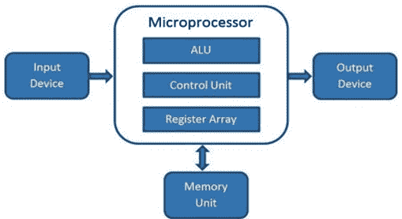

# 什么是微处理器？

> 原文：<https://www.javatpoint.com/microprocessor-introduction>

建立在单个集成电路上的计算机中央处理器被称为**微处理器**。

有一个微处理器作为中央处理器的数字计算机称为微型计算机。

它是一种可编程、多用途、时钟驱动、基于寄存器的电子设备，从称为存储器的存储设备中读取二进制指令，接受二进制数据作为输入，并根据这些指令处理数据，并将结果作为输出提供。

微处理器包含数以百万计的微小元件，如晶体管、寄存器和二极管，它们协同工作。

## 微型计算机框图

微处理器由算术逻辑单元、控制单元和寄存器阵列组成。其中 **ALU** 对从输入设备或存储器接收的数据执行算术和逻辑运算。控制单元控制计算机内的指令和数据流。并且，**寄存器阵列**由类似于 B、C、D、E、H、L 和累加器的字母标识的寄存器组成。

* * *

## 微处理器的发展

我们可以根据代次或微处理器的大小对微处理器进行分类:

## 第一代(4 位微处理器)

英特尔公司于 1971-1972 年推出了第一代微处理器。因为是 4 位处理器，所以被命名为**英特尔 4004** 。

这是一个单芯片处理器。它可以执行简单的算术和逻辑运算，如加法、减法、布尔“或”和布尔“与”。

我有一个控制单元，能够执行控制功能，比如从存储存储器中取出指令，对其进行解码，然后产生控制脉冲来执行它。

## 第二代(8 位微处理器)

英特尔于 1973 年再次推出第二代微处理器。这是第一个 8 位微处理器，可以对 8 位字进行算术和逻辑运算。它是英特尔 8008，另一个改进版本是英特尔 8088。

## 第三代(16 位微处理器)

1978 年推出的第三代微处理器以**英特尔的 8086、Zilog Z800 和 80286** 为代表，它们都是 16 位处理器，性能类似小型机。

## 第四代(32 位微处理器)

几家不同的公司推出了 32 位微处理器，但最受欢迎的是英特尔 80386。

## 第五代(64 位微处理器)

从 1995 年到现在，我们已经是第五代了。80856 之后，英特尔又推出了一款新的处理器，即奔腾处理器，后面是**奔腾 Pro CPU** ，允许单个系统中的多个 CPU 实现多处理。

其他改进的 64 位处理器有**赛扬、双核、四核、八核处理器**。

## 表:重要的英特尔微处理器

| 微处理器 | 发明年 | 字长 | 存储器寻址容量 | 腿 | 时钟 | 评论 |
| Four thousand and four | One thousand nine hundred and seventy-one | 4 位 | 1 KB | Sixteen | 750 千赫 | 第一台微处理器 |
| Eight thousand and eighty-five | One thousand nine hundred and seventy-six | 8 位 | 64 KB | Forty | 3-6 兆赫 | 流行的 8 位微处理器 |
| Eight thousand and eighty-six | One thousand nine hundred and seventy-eight | 16 位 | 1MB | Forty | 5-8 兆赫 | 广泛应用于 PC/XT |
| Eighty thousand two hundred and eighty-six | One thousand nine hundred and eighty-two | 16 位 | 16MB 真实，4 GB 虚拟 | sixty-eight | 6-12.5 兆赫 | 广泛应用于 PC 机/AT |
| Eighty thousand three hundred and eighty-six | One thousand nine hundred and eighty-five | 32 位 | 4GB 真实，64TB 虚拟 | 132 14X14 PGA | 20-33 兆赫 | 包含片上内存管理单元 |
| Eighty thousand four hundred and eighty-six | One thousand nine hundred and eighty-nine | 32 位 | 4GB 真实，64TB 虚拟 | 168 17X17 PGA | 25-100 兆赫 | 包含 MMU、缓存和 FPU，120 万个晶体管 |
| 美国英特尔公司生产的微处理器ˌ中文译名为“奔腾” | One thousand nine hundred and ninety-three | 32 位 | 4GB 真实、32 位地址、64 位数据总线 | 237 PGA | 60-200 | 包含 2 个运算器、2 个高速缓存、FPU、330 万个晶体管、330 万个电压、750 万个晶体管 |
| 奔腾 Pro | One thousand nine hundred and ninety-five | 32 位 | 64GB 实 36 位地址总线 | 387 PGA | 150-200 兆赫 | 它是一个数据流处理器。它还包含二级缓存，3.3 V |
| 奔腾 II 处理器 | One thousand nine hundred and ninety-seven | 32 位 | - | - | 233-400 兆赫 | 全部采用奔腾 pro plus MMX 技术，3.3 V，750 万晶体管 |
| 奔腾 III 处理器 | One thousand nine hundred and ninety-nine | 32 位 | 64GB | 370 PGA | 600-1.3 兆赫 | 奔腾 II 的改进版；70 新 SIMD 指令 |
| 奔腾 4 | Two thousand | 32 位 | 64GB | 423 PGA | 600-1.3 千兆赫 | 奔腾三的改进版本 |
| 安腾 | Two thousand and one | 64 位 | 64 条地址线 | 423 PGA | 733 兆赫-1.3 千兆赫 | 64 位 EPIC 处理器 |

**在哪里，**

*   **PGA** -引脚栅格阵列
*   **MMX** -多媒体扩展
*   **EPIC** -显式并行指令计算
*   **SIMD** -单指令多数据
*   **算术逻辑单元** -算术和逻辑单元
*   **内存管理单元** -内存管理单元
*   **浮点单元** -浮点单元

* * *

## 微处理器中使用的基本术语

以下是微处理器中使用的一些基本术语:

**指令集** -微处理器能够理解的一组命令称为指令集。它是硬件和软件之间的接口。

**总线** -一组导线，用于向微处理器中的不同元件传输数据、地址或控制信息。微处理器将有三种类型的总线，即数据总线、地址总线和控制总线。

**IPC(每周期指令数)** -它是衡量一个 CPU 在单个时钟内能够执行多少条指令的指标。

**时钟速度** -是处理器每秒可以执行的操作数。它可以用兆赫(MHz)或千兆赫(GHz)来表示。它也被称为时钟速率。

**带宽** -单个指令处理的位数称为带宽。

**字长** -处理器一次可以处理的位数称为处理器的字长。8 位微处理器可以一次处理 8 位数据。根据微型计算机的类型，字长的范围从 4 位到 64 位。

**数据类型** -微处理器支持多种数据类型格式，如二进制、ASCII、有符号和无符号数字。

* * *

## 微处理器的工作

微处理器按照一个顺序执行指令:提取、解码，然后执行。

最初，指令按顺序存储在计算机的存储存储器中。微处理器从存储区(存储器)取出这些指令，然后解码并执行这些指令，直到满足停止指令。然后，它将结果以二进制形式发送到输出端口。在这些过程之间，寄存器存储临时数据，算术逻辑单元执行计算功能。

* * *

## 微处理器的特点

*   **低成本** -由于集成电路技术，微处理器的成本非常低。它将降低计算机系统的成本。
*   **高速** -由于其中涉及的技术，微处理器可以以非常高的速度工作。它每秒可以执行数百万条指令。
*   **小尺寸** -由于超大规模和超大规模集成技术，微处理器的制造占用空间非常小。正因为如此，计算机系统的尺寸减小了。
*   **通用** -同一芯片可以用于多种应用，因此，微处理器是通用的。
*   **低功耗** -微处理器采用金属氧化物半导体技术，功耗更低。
*   **发热更少** -微处理器采用半导体技术，与真空管器件相比，不会散发太多热量。
*   **可靠** -由于微处理器采用半导体技术，因此故障率非常低。因此它非常可靠。
*   **便携** -由于体积小，功耗低，微处理器是便携的。