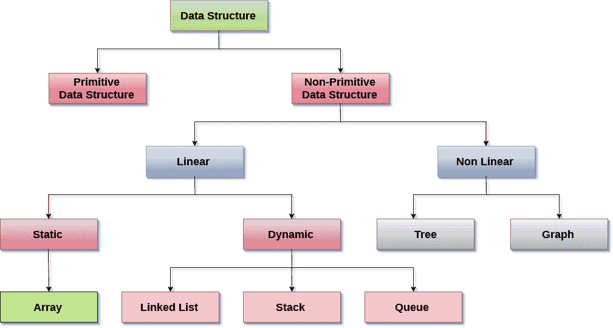

# 数据结构

> 原文：<https://www.javatpoint.com/data-structure-introduction>

* * *

## 介绍

数据结构可以被定义为一组数据元素，它提供了一种在计算机中存储和组织数据的有效方式，从而可以有效地使用数据。数据结构的一些例子有数组、链表、栈、队列等。数据结构被广泛应用于计算机科学的几乎每个方面，如操作系统、编译器设计、人工智能、图形学等。

数据结构是许多计算机科学算法的主要部分，因为它们使程序员能够以有效的方式处理数据。它在提高软件或程序的性能方面起着至关重要的作用，因为软件的主要功能是尽可能快地存储和检索用户的数据。

### 基本术语

数据结构是任何程序或软件的构建模块。为程序选择合适的数据结构是程序员最困难的任务。就数据结构而言，使用以下术语。

**数据:**数据可以定义为一个基本值或值的集合，例如，学生的姓名及其 id 就是关于学生的数据。

**组项:**有从属数据项的数据项称为组项，例如学生的名字可以有名字和姓氏。

**记录:**记录可以定义为各种数据项的集合，例如，如果我们谈论学生实体，那么它的姓名、地址、课程和标记可以组合在一起，为学生形成记录。

**档案:**一个档案是一种实体类型的各种记录的集合，例如，如果类中有 60 个员工，那么相关的档案中就会有 20 条记录，其中每条记录都包含关于每个员工的数据。

**属性和实体:**实体代表某些对象的类别。它包含各种属性。每个属性代表该实体的特定属性。

**字段:**字段是表示实体属性的单个基本信息单位。

### 数据结构的需求

随着应用程序日益复杂，数据量日益增加，可能会出现以下问题:

**处理器速度:**要处理非常大量的数据，需要高速处理，但随着数据日益增长到每个实体数十亿个文件，处理器可能无法处理那么多数据。

**数据搜索:**考虑一个商店中 106 个商品的库存规模，如果我们的应用程序需要搜索某个特定的商品，那么它每次需要遍历 106 个商品，导致搜索过程变慢。

**多个请求:**如果成千上万的用户同时在一个网络服务器上搜索数据，那么在这个过程中，一个非常大的服务器可能会失败

为了解决上述问题，使用了数据结构。数据被组织成一个数据结构，这样就不需要搜索所有的项目，并且可以立即搜索到所需的数据。

### 数据结构的优势

**效率:**程序的效率取决于数据结构的选择。例如:假设我们有一些数据，我们需要搜索一个完整的记录。在这种情况下，如果我们将数据组织在一个数组中，我们将不得不逐个元素地进行搜索。因此，在这里使用数组可能不是很有效。有更好的数据结构可以使搜索过程更有效，如有序数组、二叉查找树或哈希表。

**可重用性:**数据结构是可重用的，即一旦我们实现了特定的数据结构，我们就可以在任何其他地方使用它。数据结构的实现可以编译成库，供不同的客户端使用。

**抽象:**数据结构由提供抽象级别的 ADT 指定。客户端程序只通过接口使用数据结构，不涉及实现细节。

### 数据结构分类

**线性数据结构:**如果一个数据结构的所有元素都以线性顺序排列，则称之为线性。在线性数据结构中，元素以非分层方式存储，其中除了第一个和最后一个元素之外，每个元素都有后继元素和前置元素。

线性数据结构的类型如下:

**数组:**数组是相似类型数据项的集合，每个数据项称为数组的一个元素。元素的数据类型可以是任何有效的数据类型，如 char、int、float 或 double。

数组的元素共享同一个变量名，但是每个元素携带不同的索引号，称为下标。该阵列可以是一维的、二维的或多维的。

数组时代的单个元素是:

年龄[0]，年龄[1]，年龄[2]，年龄[3]，.........年龄[98]，年龄[99]。

**链表:**链表是一种线性数据结构，用于在内存中维护一个列表。它可以看作是存储在非连续内存位置的节点的集合。列表的每个节点都包含一个指向其相邻节点的指针。

**Stack:** Stack 是一个线性列表，其中只允许在一端插入和删除，称为 **top** 。

堆栈是一种抽象数据类型(ADT)，可以用大多数编程语言实现。它之所以被命名为堆栈，是因为它的行为类似于现实世界的堆栈，例如:-成堆的盘子或一副牌等。

**队列:**队列是一个线性列表，其中元素只能在称为**后**的一端插入，只能在称为**前**的另一端删除。

它是一种抽象的数据结构，类似于堆栈。队列在两端都打开，因此它遵循先进先出(FIFO)方法来存储数据项。

**非线性数据结构:**该数据结构不形成序列，即每个项目或元素以非线性排列与两个或多个其他项目连接。数据元素没有按顺序结构排列。

非线性数据结构的类型如下:

**树:**树是多级数据结构，其元素之间具有层次关系，称为节点。树中最底部的节点称为**叶节点**，而最顶部的节点称为**根节点**。每个节点都包含指向相邻节点的指针。

树形数据结构基于节点之间的父子关系。除叶节点外，树中的每个节点可以有多个子节点，而除根节点外，每个节点可以有一个父节点。树可以分为许多种类，这将在本教程后面讨论。

**图形:**图形可以定义为由称为边的链接连接的元素集(由顶点表示)的图形表示。图不同于树，因为图可以有循环，而树不能有循环。

### 对数据结构的操作

1) **遍历:**每个数据结构都包含该组数据元素。遍历数据结构意味着访问数据结构的每个元素，以便执行一些特定的操作，如搜索或排序。

**例:**如果我们需要计算一个学生在 6 个不同科目中获得的分数的平均值，我们需要遍历完整的分数数组并计算总和，然后我们将该总和除以科目数，即 6，以便找到平均值。

2) **插入:**插入可以定义为在任意位置将元素添加到数据结构中的过程。

如果数据结构的大小是 **n** ，那么我们只能在其中插入 **n-1** 数据元素。

3) **删除:**从数据结构中删除元素的过程称为删除。我们可以在任意位置从数据结构中删除一个元素。

如果我们试图从空数据结构中删除一个元素，那么**下溢**发生。

4) **搜索:**在数据结构中查找元素位置的过程称为搜索。有两种算法来执行搜索，线性搜索和二分搜索法。我们将在本教程的后面讨论它们。

5) **排序:**将数据结构按照特定顺序排列的过程称为排序。有许多算法可以用来执行排序，例如，插入排序、选择排序、冒泡排序等。

6) **合并:**当相似类型元素的大小分别为 M 和 N 的两个列表 List A 和 List B 被俱乐部化或连接以产生第三个列表，大小为(M+N)的 List C 时，则该过程称为合并