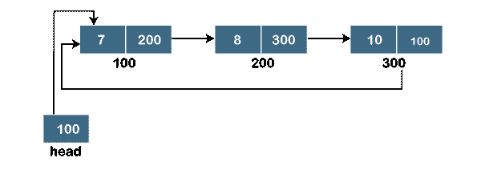

# 链表的类型

> 原文：<https://www.javatpoint.com/ds-types-of-linked-list>

在了解链表的类型之前，我们应该知道什么是 ***链表*** 。因此，要了解链表，请点击下面给出的链接:

## 链表的类型

**以下是链表的类型:**

*   [单链表](#Singly)
*   [双向链表](#Doubly)
*   [循环链表](#Circular)
*   [双循环链表](#Doubly-Circular)

### 单链表

它是程序中常用的链表。如果我们说的是链表，那就意味着它是一个单链表。单链表是包含两部分的数据结构，一部分是数据部分，另一部分是地址部分，包含下一个或后续节点的地址。节点中的地址部分也被称为**指针**。

假设我们有三个节点，这三个节点的地址分别是 100、200 和 300。下图显示了三个节点的链表表示形式:


在上图中，我们可以观察到有三个不同的节点，分别具有地址 100、200 和 300。第一个节点包含下一个节点的地址，即 200，第二个节点包含最后一个节点的地址，即 300，第三个节点在其地址部分包含空值，因为它不指向任何节点。保存初始节点地址的指针称为 ***头指针*** 。

上图中显示的链表称为单链表，因为它只包含一个链接。在这个列表中，只有向前遍历是可能的；我们不能向后遍历，因为它在列表中只有一个链接。

**单链表中节点的表示**

```

struct node
{
   int data;
   struct node *next;
}

```

在上面的表示中，我们定义了一个名为**节点**的用户定义结构，包含两个成员，第一个是整数类型的数据，另一个是节点类型的指针(next)。

要了解更多关于单链表的信息，请点击下面的链接:

[https://www.javatpoint.com/singly-linked-list](https://www.javatpoint.com/singly-linked-list)

### 双向链表

顾名思义，双向链表包含两个指针。我们可以将双向链表定义为一个线性数据结构，它有三个部分:数据部分和另外两个地址部分。换句话说，双链表是在单个节点中有三个部分的列表，包括一个数据部分、指向其前一个节点的指针和指向下一个节点的指针。

假设我们有三个节点，这些节点的地址分别是 100、200 和 300。这些节点在双向链表中的表示如下所示:


从上图中我们可以观察到，双链表中的节点有两个地址部分；一部分存储下一个 的 ***地址，而节点的另一部分存储上一个节点的 ***地址*** 。双链表中的初始节点在地址部分有 **NULL** 值，提供前一个节点的地址。***

**双向链表中节点的表示**

```

struct node
{
  int data;
  struct node *next;
 struct node *prev; 
} 

```

在上面的表示中，我们定义了一个名为 ***的用户定义结构，一个节点*** 有三个成员，一个是整数类型的**数据**，另外两个是指针，即节点类型的 **next 和 prev** 。**下一个指针**变量保存下一个节点的地址，**上一个指针**保存上一个节点的地址。两个指针的类型，即 **next 和 prev** 是**结构节点**，因为两个指针都存储 ***结构节点*** 类型的节点的地址。

要了解更多关于双向链表的信息，请点击下面的链接:

[https://www.javatpoint.com/doubly-linked-list](https://www.javatpoint.com/doubly-linked-list)

### 循环链表

循环链表是单链表的变体。 ***单链表*** 和 ***循环链表*** 的唯一区别是最后一个节点没有指向单链表中的任何节点，所以它的链接部分包含一个空值。另一方面，循环链表是最后一个节点连接到第一个节点的列表，所以最后一个节点的链接部分保存第一个节点的地址。循环链表没有开始和结束节点。我们可以向任何方向行进，即向后或向前。循环链表的图示如下所示:

```

struct node
{
   int data;
   struct node *next;
}

```

循环链表是一个元素序列，其中每个节点都有到下一个节点的链接，最后一个节点有到第一个节点的链接。循环链表的表示类似于单链表，如下所示:



要了解更多关于循环链表的信息，请点击下面的链接:

[https://www.javatpoint.com/circular-singly-linked-list](https://www.javatpoint.com/circular-singly-linked-list)

### 双循环链表

双循环链表兼有 ***循环链表*** 和 ***双链表*** 的特点。


上图显示了双循环链表的表示，其中最后一个节点连接到第一个节点，从而创建了一个圆。这是一个双向链表，因为每个节点也保存前一个节点的地址。双向链表和双向循环链表的主要区别在于双向循环链表不包含节点前一字段的空值。由于双循环链接包含三个部分，即两个地址部分和一个数据部分，因此其表示类似于双链表。

```

struct node
{
  int data;
  struct node *next;
 struct node *prev; 
}

```

要了解更多关于双循环链表的信息，请点击下面的链接:

[https://www.javatpoint.com/circular-doubly-linked-list](https://www.javatpoint.com/circular-doubly-linked-list)

* * *