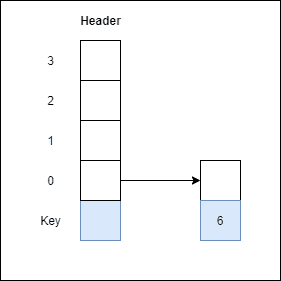
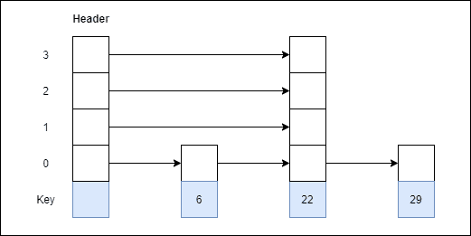
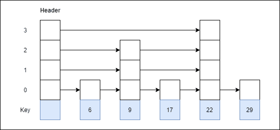
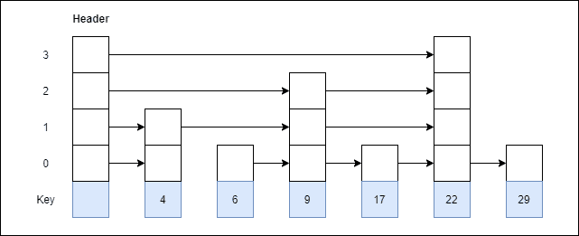
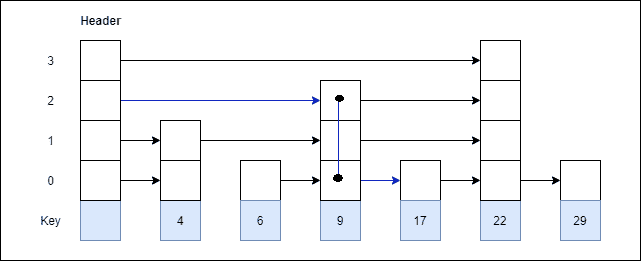

# 数据结构中的跳过列表

> 原文：<https://www.javatpoint.com/skip-list-in-data-structure>

## 什么是跳过列表？

跳过列表是一种概率数据结构。跳过列表用于存储带有链表的元素或数据的排序列表。它允许有效地查看元素或数据的过程。在一个步骤中，它跳过了整个列表中的几个元素，这就是它被称为跳过列表的原因。

跳过列表是链表的扩展版本。它允许用户非常快速地搜索、移除和插入元素。它由一个基本列表组成，该列表包含一组维护后续元素的链接层次结构的元素。

## 跳过列表结构

它分为两层:最底层和顶层。

跳过列表的最底层是一个常见的排序链表，而跳过列表的顶层就像一条“快线”，元素被跳过。

## 跳过列表的复杂性表

| 南不 | 复杂性 | 平均案例 | 最坏情况 |
| 1. | 访问复杂性 | O(logn) | O(n) |
| 2. | 搜索复杂性 | O(logn) | O(n) |
| 3. | 删除复杂性 | O(logn) | O(n) |
| 4. | 插入复杂性 | O(logn) | O(n) |
| 5. | 空间复杂性 | - | 他(波兰) |

## 跳过列表的工作

让我们举个例子来理解跳过列表的工作原理。在这个例子中，我们有 14 个节点，这样这些节点被分成两层，如图所示。

下层是链接所有节点的公共线，顶层是仅链接主要节点的快线，如图所示。

假设你想在这个例子中找到 47。您将从快线的第一个节点开始搜索，并继续在快线上运行，直到找到等于 47 或大于 47 的节点。

在示例中可以看到，快线中不存在 47，因此搜索小于 47 的节点，即 40。现在，你在 40 的帮助下进入正常线，搜索 47，如图所示。


#### 注意:一旦你在“快线”上找到这样一个节点，你就可以用指针从这个节点进入一个“正常通道”，当你在正常线中搜索这个节点的时候。

## 跳过列表基本操作

跳过列表中有以下类型的操作。

*   **插入操作:**用于在特定情况下向特定位置添加新节点。
*   **删除操作:**用于删除特定情况下的节点。
*   **搜索操作:**搜索操作用于搜索跳过列表中的特定节点。

**插入操作的算法**

```

Insertion (L, Key)
local update [0...Max_Level + 1]
a = L → header
for i = L → level down to 0 do.
       while a → forward[i] → key  forward[i]
update[i] = a

a = a → forward[0]
lvl = random_Level()
if lvl > L → level then
for i = L → level + 1 to lvl do
      update[i] = L → header
      L → level = lvl

a = makeNode(lvl, Key, value)
for i = 0 to level do
      a → forward[i] = update[i] → forward[i]
update[i] → forward[i] = a

```

**删除操作的算法**

```

Deletion (L, Key)
local update [0... Max_Level + 1]
a = L → header
for i = L → level down to 0 do.
   while a → forward[i] → key forward[i]
      update[i] = a
a = a → forward[0]
if a → key = Key then
   for i = 0 to L → level do
        if update[i] → forward[i] ? a then break
        update[i] → forward[i] = a → forward[i]
   free(a)
   while L → level > 0 and L → header → forward[L → level] = NIL do
        L → level = L → level - 1

```

**搜索操作的算法**

```

Searching (L, SKey)
        a = L → header
        loop invariant: a → key level down to 0 do.
             while a → forward[i] → key forward[i]
        a = a → forward[0]
       if a → key = SKey then return a → value
       else return failure

```

**示例 1:** 创建一个跳过列表，我们要在空的跳过列表中插入以下这些键。

1.  6 个一级。
2.  29 级有 1 级。
3.  22 级有 4 级。
4.  9 个 3 级。
5.  17 级有 1 级。
6.  四级配二级。

**年:**

**第 1 步:**插入第 1 级的 6



**第 2 步:**插入 29 级 1


**第 3 步:**插入 22 个 4 级



**第 4 步:**插入第 3 级的 9


**第 5 步:**插入 17 级 1



**第 6 步:**插入第 2 级的 4


**示例 2:** 考虑我们想要搜索关键字 17 的这个示例。



**年:**



## 跳过列表的优点

1.  如果您想要在跳过列表中插入一个新节点，那么它将会非常快地插入该节点，因为在跳过列表中没有循环。
2.  与散列表和二叉查找树相比，跳过列表易于实现。
3.  在列表中查找节点非常简单，因为它以排序的形式存储节点。
4.  跳过列表算法可以非常容易地在更具体的结构中修改，例如可索引的跳过列表、树或优先级队列。
5.  跳过列表是一个强大而可靠的列表。

## 跳过列表的缺点

1.  它比平衡树需要更多的内存。
2.  不允许反向搜索。
3.  跳过列表搜索节点的速度比链表慢得多。

## 跳过列表的应用

1.  它用于分布式应用程序，代表分布式应用程序中的指针和系统。
2.  它用于实现低锁争用的动态弹性并发队列。
3.  它也与 QMap 模板类一起使用。
4.  跳过列表的索引用于运行中值问题。
5.  跳过列表用于 Lucene 搜索中的增量编码发布。

* * *