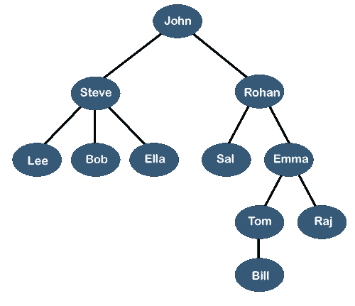
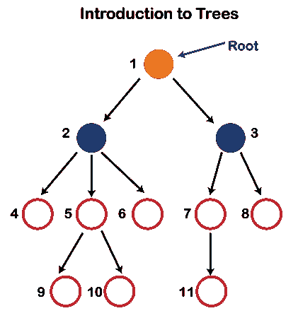
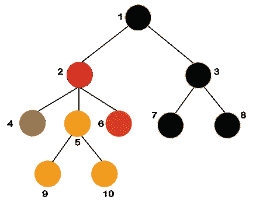
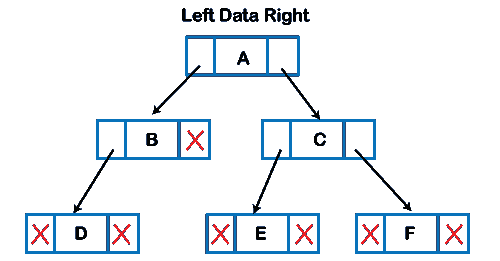
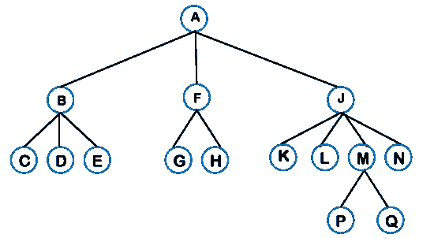

# 树形数据结构

> 原文：<https://www.javatpoint.com/tree>

我们阅读线性数据结构，如数组、链表、堆栈和队列，其中所有元素都以顺序方式排列。不同的数据结构用于不同类型的数据。

**选择数据结构要考虑一些因素:**

*   **需要存储什么类型的数据**？:某种数据结构可能最适合某种数据。
*   **运营成本:**如果我们希望最频繁执行的运营的运营成本最小化。例如，我们有一个简单的列表，我们必须在上面执行搜索操作；然后，我们可以创建一个数组，其中的元素按照排序顺序存储，以执行 ***【二分搜索法】*** 。对于简单列表，二分搜索法运算速度非常快，因为它将搜索空间分成了一半。
*   **内存使用情况:**有时候，我们希望数据结构使用更少的内存。

***一棵树*** 也是表示分层数据的数据结构之一。假设我们想以层级形式显示员工及其职位，那么它可以表示如下:



上图为某公司的**组织层级**。在上面的结构中， ***约翰*** 是公司的 **CEO** ，约翰有两个直接下属名为 ***史蒂夫*** 和 ***罗翰*** 。史蒂夫有三个直接下属名为 ***李、鲍勃、艾拉*** 其中 ***史蒂夫*** 是一名经理。鲍勃有两个直接下属，名为 ***萨尔*** 和 ***艾玛*** 。**艾玛**有两个直接下属名为 ***汤姆*** 和 ***拉吉*** 。汤姆有一个直接下属名叫 ***比尔*** 。这种特殊的逻辑结构被称为 ***树*** 。其结构与真树相似，故命名为 ***树*** 。在这个结构中， ***根*** 在顶部，其分支向下运动。因此，我们可以说树形数据结构是一种以分层方式存储数据的有效方式。

**我们来了解一下 Tree 数据结构的一些要点。**

*   树数据结构被定义为称为节点的对象或实体的集合，这些对象或实体被链接在一起以表示或模拟层次结构。
*   树型数据结构是一种非线性数据结构，因为它不以顺序方式存储。它是一种分层结构，因为树中的元素排列在多个级别。
*   在树数据结构中，最顶端的节点称为根节点。每个节点都包含一些数据，数据可以是任何类型。在上面的树结构中，节点包含员工的姓名，因此数据类型将是一个字符串。
*   每个节点都包含一些数据以及可以称为子节点的其他节点的链接或引用。

**Tree 数据结构中使用的一些基本术语。**

让我们考虑一下树结构，如下所示:



在上面的结构中，每个节点都标有一些数字。上图所示的每个箭头被称为两个节点之间的 ***链接*** 。

*   **根:**根节点是树层次结构中最顶端的节点。换句话说，根节点是没有任何父节点的节点。在上面的结构中，编号为 1 的节点是**树的根节点。**如果一个节点直接链接到某个其他节点，则称之为父子关系。
*   **子节点:**如果该节点是任意节点的后代，则该节点被称为子节点。
*   **父节点:**如果该节点包含任何子节点，则该节点被称为该子节点的父节点。
*   **兄弟节点:**具有相同父节点的节点称为兄弟节点。
*   **叶节点:-** 树中没有任何子节点的节点称为叶节点。叶节点是树的最底部节点。一般树中可以有任意数量的叶节点。叶节点也可以称为外部节点。
*   **内部节点:**一个节点至少有一个子节点，称为 ***内部***
*   **祖先节点:-** 节点的祖先是从根节点到该节点的路径上的任何前身节点。根节点没有任何祖先。在上图所示的树中，节点 1、2 和 5 是节点 10 的祖先。
*   **后代:**给定节点的直接后继者被称为节点的后代。在上图中，10 是节点 5 的后代。

### 树数据结构的属性

*   **递归数据结构:**该树又称为 ***递归数据结构*** 。树可以被定义为递归的，因为树数据结构中的可分辨节点被称为 ***根节点*** 。树的根节点包含到其子树的所有根的链接。下图中左边的子树显示为黄色，右边的子树显示为红色。左边的子树可以进一步分成三种不同颜色的子树。递归意味着以自相似的方式减少一些东西。因此，树数据结构的这种递归特性在各种应用程序中得以实现。
    
*   **边数:**如果有 n 个节点，则有 n-1 条边。结构中的每个箭头代表链接或路径。除了根节点之外，每个节点都至少有一个称为边缘的传入链路。父子关系只有一个环节。
*   **节点 x 的深度:**节点 x 的深度可以定义为从根到节点 x 的路径长度，一条边在路径中贡献一个单位长度。所以，节点 x 的深度也可以定义为根节点和节点 x 之间的边数，根节点深度为 0。
*   **节点 x 的高度:**节点 x 的高度可以定义为从节点 x 到叶节点的最长路径。

基于树数据结构的属性，树被分为不同的类别。

### 树的实现

树数据结构可以通过在指针的帮助下动态创建节点来创建。内存中的树可以表示如下:



上图显示了内存中树形数据结构的表示。在上面的结构中，节点包含三个字段。第二个字段存储数据；第一个字段存储左边孩子的地址，第三个字段存储右边孩子的地址。

在编程中，节点的结构可以定义为:

```

struct node
{
  int data;
struct node *left;
struct node *right; 
}

```

上述结构只能为二叉树定义，因为二叉树最多可以有两个子树，而类属树可以有两个以上的子树。与二叉树相比，一般树的节点结构会有所不同。

### 树木的应用

以下是树的应用:

*   **自然存储分层数据:**树用于存储分层结构中的数据。例如，文件系统。存储在盘驱动器上的文件系统、文件和文件夹是自然分层数据的形式，并以树的形式存储。
*   **组织数据:**用于组织数据进行高效的插入、删除和搜索。例如，二叉树搜索一个元素有一个 logN 时间。
*   **Trie:** 是一种特殊的树，用来存储字典。这是一种快速有效的动态拼写检查方法。
*   **堆:**也是使用数组实现的树形数据结构。它用于实现优先级队列。
*   **B-Tree 和 B+Tree:** B-Tree 和 B+Tree 是用于在数据库中实现索引的树数据结构。
*   **路由表:**树形数据结构也用于将数据存储在路由器的路由表中。

### 树数据结构的类型

**以下是树形数据结构的类型:**

*   **一般树:**一般树是树数据结构的类型之一。在一般树中，一个节点可以有 0 个或最多 n 个节点。对节点的度(一个节点可以包含的节点数)没有限制。一般树中最顶端的节点称为根节点。父节点的子节点称为 ***子树*** 。
    
    一般树中可以有 ***n*** 个子树。在一般树中，子树是无序的，因为子树中的节点不能被排序。
    每棵非空树都有一条向下的边，这些边连接到被称为 ***子节点*** 的节点。根节点标记为 0 级。具有相同父节点的节点被称为 ***兄弟节点*** 。
*   **[二叉树](https://www.javatpoint.com/binary-tree) :** 这里，二进制名字本身就暗示了两个数字，即 0 和 1。在二叉树中，树中的每个节点最多可以有两个子节点。这里，最大是指节点是 0 节点、1 节点还是 2 节点。
    
    **要了解更多关于二叉树的知识，点击下面给出的链接:**
    [https://www.javatpoint.com/binary-tree](https://www.javatpoint.com/binary-tree)
*   **[【二叉查找树】](https://www.javatpoint.com/binary-search-tree) :** 二叉查找树是一个非线性数据结构，其中一个节点连接到 ***n*** 个节点。它是基于节点的数据结构。一个节点可以在二叉查找树中用三个字段表示，即数据部分、左子和右子。一个节点最多可以连接到二叉查找树中的两个子节点，因此该节点包含两个指针(左子指针和右子指针)。
    左子树中的每个节点必须包含小于根节点值的值，右子树中每个节点的值必须大于根节点的值。

可以借助用户定义的数据类型 ***struct、*** 来创建节点，如下所示:

```

struct node
{
    int data;
    struct node *left;
struct node *right; 
}

```

上面是节点结构，有三个字段:数据字段，第二个字段是节点类型的左指针，第三个字段是节点类型的右指针。

**要了解更多关于二叉查找树的信息，请点击下面的链接:**

[https://www.javatpoint.com/binary-search-tree](https://www.javatpoint.com/binary-search-tree)

*   **[AVL 树](https://www.javatpoint.com/avl-tree)**

它是二叉树的类型之一，或者我们可以说它是二叉查找树树的变种。AVL 树满足 ***二叉树*** 以及 ***二叉查找树*** 的属性。是阿德尔森·维尔斯基·林达斯 发明的自平衡二叉查找树。这里的自平衡是指平衡左子树和右子树的高度。这种平衡是用 ***平衡系数*** 来衡量的。

如果一棵树服从二叉查找树平衡因子，我们可以把它看作是一棵 AVL 树。平衡因子可以定义为左子树的高度和右子树的高度之间的 ***差*** 。平衡因子的值必须是 0、-1 或 1；因此，AVL 树中的每个节点都应该将平衡因子的值设置为 0、-1 或 1。

**要了解更多关于 AVL 树的信息，请点击下面给出的链接:**

[https://www.javatpoint.com/avl-tree](https://www.javatpoint.com/avl-tree)

*   **[红黑树](https://www.javatpoint.com/red-black-tree)**

**红黑树**是二叉查找树。红黑树的前提是我们应该了解二叉查找树。在二叉查找树中，左子树的值应该小于该节点的值，右子树的值应该大于该节点的值。我们知道平均情况下二分搜索法的时间复杂度是 log <sub>2</sub> n，最好的情况是 O(1)，最坏的情况是 O(n)。

当在树上执行任何操作时，我们希望我们的树是平衡的，以便所有的操作，如搜索、插入、删除等。，花费的时间更少，所有这些操作的时间复杂度将达到 ***log <sub>2</sub> n.***

***红黑树*** 是一个自我平衡的二叉查找树。AVL 树也是一个高度平衡的二叉查找树那么**为什么我们需要一个红黑树**。在 AVL 树中，我们不知道需要多少次旋转来平衡树，但是在红黑树中，最多需要 2 次旋转来平衡树。它包含一个额外的位，代表节点的红色或黑色，以确保树的平衡。

*   **张开树**

展开树数据结构也是二叉查找树，其中最近访问的元素通过执行一些旋转操作被放置在树的根位置。这里， ***八字形*** 表示最近访问的节点。它是一棵 ***自平衡*** 二叉查找树没有像 **AVL** 那样明确的平衡条件的树。

展曲树的高度可能不平衡，即左右子树的高度可能不同，但是展曲树中的操作按照 **logN** 时间的顺序进行，其中 **n** 是节点的数量。

八字树是一个平衡的树，但它不能被认为是一个高度平衡的树，因为在每个操作之后，执行旋转，这导致一个平衡的树。

*   **治疗**

Treap 数据结构来自树和堆数据结构。因此，它包括树和堆数据结构的属性。在二叉查找树，左子树上的每个节点必须等于或小于根节点的值，右子树上的每个节点必须等于或大于根节点的值。在堆数据结构中，左右子树都包含比根大的键；因此，我们可以说根节点包含最低值。

在 treap 数据结构中，每个节点都有 ***键*** 和 ***优先级*** ，其中键来自二叉查找树，优先级来自堆数据结构。

**Treap** 数据结构遵循下面给出的两个属性:

*   节点的右子节点> =当前节点，节点的左子节点< =当前节点(二叉树)
*   任何子树的子树必须大于节点(堆)

*   **[B-树](https://www.javatpoint.com/b-tree)**

b 树是平衡的 **m 向**树，其中 **m** 定义树的顺序。到目前为止，我们了解到节点只包含一个键，但是 b 树可以有多个键和 2 个以上的子节点。它始终维护已排序的数据。在二叉树中，叶节点可以处于不同的级别，但是在 b 树中，所有的叶节点必须处于同一级别。

**如果顺序为 m，则节点具有以下属性:**

*   b 树中的每个节点最多可以有 **m 个**子节点
*   对于最小子节点，一个叶节点有 0 个子节点，根节点至少有 2 个子节点，内部节点的最小上限为 m/2 个子节点。例如，m 的值为 5，这意味着一个节点可以有 5 个子节点，内部节点最多可以包含 3 个子节点。
*   每个节点有最大(m-1)个键。

根节点必须至少包含 1 个键，所有其他节点必须至少包含 m/2 减去 1 个键的**上限。**

* * *