# 二叉查找树

> 原文：<https://www.javatpoint.com/binary-search-tree>

在这篇文章中，我们将讨论二叉查找树。这篇文章将对有技术背景的学生非常有帮助和信息，因为这是他们课程的一个重要主题。

在直接移动到二叉查找树之前，让我们先看一下树的简要描述。

### 什么是树？

树是一种用于以层次形式表示数据的数据结构。它可以被定义为被称为节点的对象或实体的集合，这些对象或实体被链接在一起以模拟层次结构。树是一种非线性数据结构，因为树中的数据不是线性或顺序存储的。

现在，让我们开始这个话题，二叉查找树。

### 什么是二叉查找树？

二叉查找树按照一定的顺序排列元素。在二叉查找树中，左节点的值必须小于父节点，右节点的值必须大于父节点。这个规则递归地应用于根的左右子树。

让我们用一个例子来理解二叉查找树的概念。

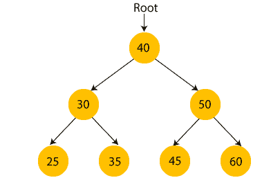

在上图中，我们可以观察到根节点为 40，左子树的所有节点都小于根节点，右子树的所有节点都大于根节点。

同样，我们可以看到根节点的左子节点大于其左子节点，小于其右子节点。所以，它也满足了二叉查找树的属性。因此，我们可以说上图中的树是二叉查找树。

假设我们将上面树中节点 35 的值更改为 55，检查该树是否为二叉查找树树。

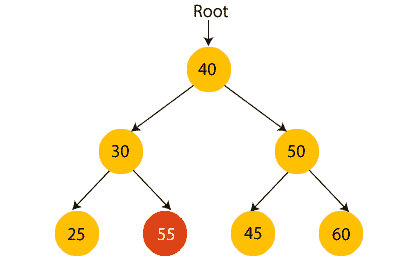

在上面的树中，根节点的值是 40，大于它的左子节点 30，但小于右子节点 30，即 55。所以，上面的树不满足二叉查找树的属性。因此，上面的树不是二叉查找树。

### 二叉查找树的优势

*   在二叉查找树搜索一个元素很容易，因为我们总是有一个提示，哪个子树有想要的元素。
*   与数组和链表相比，插入和删除操作在 BST 中更快。

### 创建二叉查找树的示例

现在，让我们用一个例子来看看二叉查找树的创作。

假设数据元素是 **- 45、15、79、90、10、55、12、20、50**

*   首先我们要把 **45** 作为树根插入到树里面。
*   然后，阅读下一个元素；如果它小于根节点，将其作为左子树的根插入，并移动到下一个元素。
*   否则，如果元素大于根节点，则将其作为右子树的根插入。

现在，让我们看看使用给定的数据元素创建二叉查找树的过程。创建基站的过程如下所示-

**步骤 1 -插入 45。**


**步骤 2 -插入 15。**

因为 15 小于 45，所以插入它作为左子树的根节点。

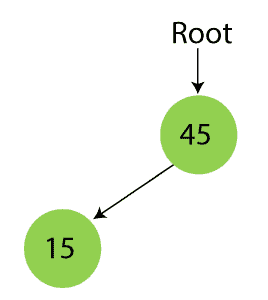

**步骤 3 -插入 79。**

因为 79 大于 45，所以插入它作为右子树的根节点。

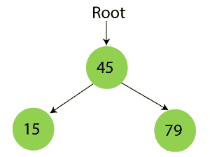

**步骤 4 -插入 90。**

90 大于 45 和 79，所以它将作为 79 的右子树插入。


**步骤 5 -插入 10。**

10 小于 45 和 15，因此它将作为 15 的左子树插入。

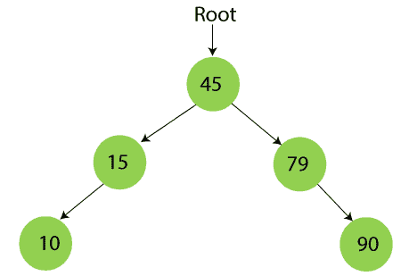

**步骤 6 -插入 55。**

55 大于 45，小于 79，所以它将作为 79 的左子树插入。


**步骤 7 -插入 12。**

12 小于 45 和 15，但大于 10，因此它将作为 10 的右子树插入。

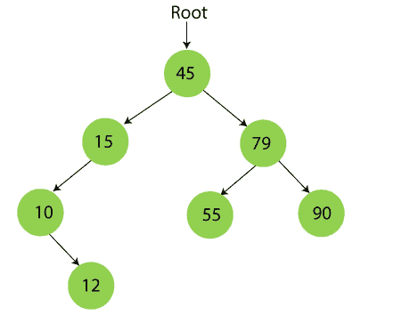

**步骤 8 -插入 20。**

20 小于 45 但大于 15，因此它将作为 15 的右子树插入。

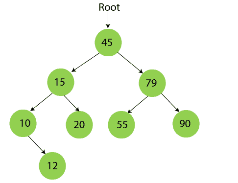

**步骤 9 -插入 50。**

50 大于 45，但小于 79 和 55。因此，它将作为 55 的左子树插入。

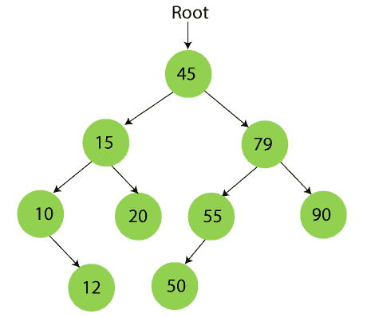

现在，二叉查找树的创作完成了。之后，让我们转向可以在二叉查找树执行的操作。

我们可以在二叉查找树上执行插入、删除和搜索操作。

让我们了解如何在二叉查找树上执行搜索。

## 在二叉查找树搜索

搜索是指在数据结构中查找或定位特定的元素或节点。在二叉查找树，搜索一个节点很容易，因为 BST 中的元素是以特定的顺序存储的。搜索二叉查找树节点的步骤如下-

1.  首先，将要搜索的元素与树的根元素进行比较。
2.  如果根元素与目标元素匹配，则返回节点的位置。
3.  如果不匹配，则检查该项是否小于根元素，如果小于根元素，则移动到左子树。
4.  如果它大于根元素，则移动到右边的子树。
5.  递归地重复上述过程，直到找到匹配。
6.  如果在树中找不到或不存在该元素，则返回空值。

现在，让我们用一个例子来理解二叉树中的搜索。我们正在拍摄上面形成的二叉查找树。假设我们必须从下面的树中找到节点 20。

**第一步:**

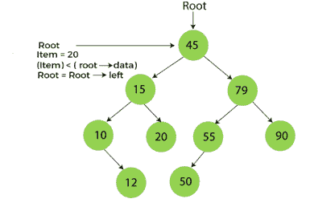

**第二步:**


**第三步:**

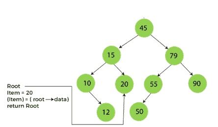

现在，让我们看看在二叉查找树搜索元素的算法。

### 在二叉查找树搜索元素的算法

```

Search (root, item)
Step 1 - if (item = root → data) or (root = NULL)
return root
else if (item < root → data)
return Search(root → left, item)
else
return Search(root → right, item)
END if
Step 2 - END

```

现在让我们了解删除是如何在二叉查找树上执行的。我们还将看到一个从给定的树中删除元素的例子。

### 在二叉查找树删除

在二叉查找树，我们必须从树中删除一个节点，记住 BST 的属性没有被违反。要从 BST 中删除一个节点，可能会出现三种情况-

*   要删除的节点是叶节点，或者，
*   要删除的节点只有一个子节点，
*   要删除的节点有两个子节点

我们将详细了解上面列出的情况。

**当要删除的节点是叶节点时**

删除 BST 中的一个节点是最简单的情况。这里，我们必须用空值替换叶节点，并简单地释放分配的空间。

我们可以在下图中看到从 BST 中删除叶节点的过程。在下图中，假设我们必须删除节点 90，因为要删除的节点是叶节点，所以它将被替换为空，分配的空间将被释放。


**待删除节点只有一个子节点时**

在这种情况下，我们必须用它的子节点替换目标节点，然后删除子节点。这意味着在用子节点替换目标节点后，子节点现在将包含要删除的值。因此，我们只需将子节点替换为空，并释放分配的空间。

我们可以在下图中看到从 BST 中删除一个有一个子节点的节点的过程。在下图中，假设我们必须删除节点 79，因为要删除的节点只有一个子节点，所以它将被其子节点 55 替换。

因此，被替换的节点 79 现在将是可以容易删除的叶节点。


**待删除节点有两个子节点时**

在其他两种情况中，删除 BST 中的一个节点的情况有点复杂。在这种情况下，应遵循的步骤如下-

*   首先，找到要删除的节点的后续节点。
*   之后，用更高级的后继节点替换该节点，直到目标节点被放置在树叶上。
*   最后，将节点替换为空，释放分配的空间。

当节点的右子节点不为空时，需要更高级的后继节点。我们可以通过在节点的右子节点中找到最小元素来获得有序后继节点。

我们可以在下图中看到从 BST 中删除一个有两个子节点的节点的过程。在下图中，假设我们必须删除作为根节点的节点 45，因为要删除的节点有两个子节点，所以它将被替换为它的有序后继节点。现在，节点 45 将位于树的叶子上，以便可以轻松删除。


现在让我们来了解如何在二叉查找树上执行插入。

### 插入二叉查找树

BST 中的一个新键总是插入在叶子处。要在 BST 中插入一个元素，我们必须从根节点开始搜索；如果要插入的节点小于根节点，则在左侧子树中搜索一个空位置。否则，搜索右子树中的空位置并插入数据。BST 中的 Insert 类似于搜索，因为我们总是要维护左子树小于根，右子树大于根的规则。

现在，让我们用一个例子来看看将一个节点插入到 BST 中的过程。


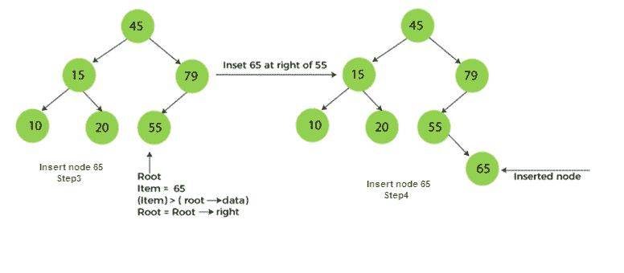

### 二叉查找树的复杂性

让我们看看二叉查找树的时间和空间复杂性。我们将看到最佳情况、一般情况和最坏情况下插入、删除和搜索操作的时间复杂度。

### 1.时间复杂性

| 操作 | 最佳情况时间复杂度 | 平均案例时间复杂度 | 最坏情况时间复杂度 |
| 插入 | o(对数 n) | o(对数 n) | O(n) |
| **删除** | o(对数 n) | o(对数 n) | O(n) |
| **搜索** | o(对数 n) | o(对数 n) | O(n) |

其中“n”是给定树中的节点数。

### 2.空间复杂性

| 操作 | 空间复杂性 |
| 插入 | O(n) |
| **删除** | O(n) |
| **搜索** | O(n) |

*   二叉查找树所有运算的空间复杂度是 O(n)。

## 二叉查找树的执行情况

现在，让我们看看实施二叉查找树操作的程序。

**程序:**用 C++写一个执行二叉查找树运算的程序。

在这个节目中，我们将看到二叉查找树行动的实施。在这里，我们将看到树的创建、有序遍历、插入和删除操作。

在这里，我们将看到树的有序遍历，以检查树的节点是否在它们正确的位置。我们知道有序遍历总是以升序给我们数据。因此，在执行插入和删除操作之后，我们执行有序遍历，遍历之后，如果我们以升序获得数据，那么很明显节点在它们正确的位置。

```

#include <iostream>
using namespace std;
struct Node {
    int data;
    Node *left;
    Node *right;
};
Node* create(int item)
{
    Node* node = new Node;
    node->data = item;
    node->left = node->right = NULL;
    return node;
}
/*Inorder traversal of the tree formed*/
void inorder(Node *root)
{
    if (root == NULL)
        return;
    inorder(root->left); //traverse left subtree
    cout<< root->data << "	"; //traverse root node
    inorder(root->right); //traverse right subtree
}
Node* findMinimum(Node* cur) /*To find the inorder successor*/
{
    while(cur->left != NULL) {
        cur = cur->left;
    }
    return cur;
}
Node* insertion(Node* root, int item) /*Insert a node*/
{
    if (root == NULL)
        return create(item); /*return new node if tree is empty*/
    if (item < root->data)
        root->left = insertion(root->left, item);
    else
        root->right = insertion(root->right, item);
    return root;
}
void search(Node* &cur, int item, Node* &parent)
{
    while (cur != NULL && cur->data != item)
    {
        parent = cur;
        if (item < cur->data)
            cur = cur->left;
        else
            cur = cur->right;
    }
}
void deletion(Node*& root, int item) /*function to delete a node*/
{
    Node* parent = NULL;
    Node* cur = root;
    search(cur, item, parent); /*find the node to be deleted*/
    if (cur == NULL)
        return;
    if (cur->left == NULL && cur->right == NULL) /*When node has no children*/
    {
        if (cur != root)
        {
            if (parent->left == cur)
                parent->left = NULL;
            else
                parent->right = NULL;
        }
        else
            root = NULL;
        free(cur);     
    }
    else if (cur->left && cur->right)
    {
        Node* succ  = findMinimum(cur->right);
        int val = succ->data;
        deletion(root, succ->data);
        cur->data = val;
    }
    else
    {
        Node* child = (cur->left)? cur->left: cur->right;
        if (cur != root)
        {
            if (cur == parent->left)
                parent->left = child;
            else
                parent->right = child;
        }
        else
            root = child;
        free(cur);
    }
}
int main()
{
  Node* root = NULL;
  root = insertion(root, 45);
  root = insertion(root, 30);
  root = insertion(root, 50);
  root = insertion(root, 25);
  root = insertion(root, 35);
  root = insertion(root, 45);
  root = insertion(root, 60);
  root = insertion(root, 4);
  printf("The inorder traversal of the given binary tree is - \n");
  inorder(root);
  deletion(root, 25);
  printf("\nAfter deleting node 25, the inorder traversal of the given binary tree is - \n");
  inorder(root); 
  insertion(root, 2);
  printf("\nAfter inserting node 2, the inorder traversal of the given binary tree is - \n");
  inorder(root);
  return 0;
}

```

**输出**

执行上述代码后，输出将是-


所以，这就是文章的全部内容。希望文章对你有所帮助和启发。

* * *