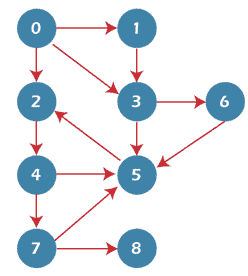

# BFS 算法

> 原文：<https://www.javatpoint.com/breadth-first-search-algorithm>

在本文中，我们将讨论数据结构中的 BFS 算法。广度优先搜索是一种图遍历算法，它从根节点开始遍历图，并探索所有相邻节点。然后，它选择最近的节点并探索所有未探索的节点。当使用 BFS 进行遍历时，图中的任何节点都可以被认为是根节点。

遍历图的方法有很多，但其中 BFS 是最常用的方法。它是一种递归算法，用于搜索树或图数据结构的所有顶点。BFS 把图的每个顶点分为两类——已访问的和未访问的。它在图中选择一个节点，然后访问与所选节点相邻的所有节点。

### BFS 算法的应用

宽度优先算法的应用如下-

*   BFS 可以用来从给定的源位置找到邻近的位置。
*   在对等网络中，BFS 算法可以作为寻找所有相邻节点的遍历方法。大多数 torrent 客户端，如 BitTorrent、uTorrent 等。利用这个过程在网络中寻找“种子”和“同伴”。
*   BFS 可以用于网络爬虫来创建网页索引。它是可用于索引网页的主要算法之一。它从源页面开始遍历，并跟随与该页面相关联的链接。这里，每个网页都被视为图中的一个节点。
*   BFS 用于确定最短路径和最小生成树。
*   BFS 也被用在切尼的重复垃圾收集技术中。
*   它可以用在福特-富尔克森方法中来计算流网络中的最大流量。

### 算法

探索图的 BFS 算法的步骤如下

**步骤 1:** 为 G 中的每个节点设置 STATUS = 1(就绪状态)

**步骤 2:** 将起始节点 A 入队，并将其状态设置为 2(等待状态)

**步骤 3:** 重复步骤 4 和 5，直到 QUEUE 为空

**第 4 步:**将一个节点 n 出列，进行处理，将其 STATUS 设置为 3(已处理状态)。

**步骤 5:** 将所有处于就绪状态(其状态= 1)的 N 个邻居排队并置位

他们的状态= 2

(等待状态)

[循环结束]

**第 6 步:**退出

### BFS 算法示例

现在，让我们通过一个例子来了解 BFS 算法的工作原理。在下面给出的例子中，有一个有 7 个顶点的有向图。


在上图中，最小路径“P”可以通过使用从节点 A 开始到节点 e 结束的 BFS 来找到。该算法使用两个队列，即 QUEUE1 和 QUEUE2。QUEUE1 保存所有要处理的节点，而 QUEUE2 保存所有从 QUEUE1 中处理和删除的节点。

现在，让我们从节点 a 开始检查图表

**步骤 1** -首先，将 A 添加到队列 1，将 NULL 添加到队列 2。

```

QUEUE1 = {A}  
QUEUE2 = {NULL}  

```

**步骤 2** -现在，从队列 1 中删除节点 A，并将其添加到队列 2 中。将节点 A 的所有邻居插入队列 1。

```

QUEUE1 = {B, D}  
QUEUE2 = {A}

```

**步骤 3** -现在，从队列 1 中删除节点 B，并将其添加到队列 2 中。将节点 B 的所有邻居插入队列 1。

```

QUEUE1 = {D, C, F}  
QUEUE2 = {A, B}

```

**步骤 4** -现在，从队列 1 中删除节点 D，并将其添加到队列 2 中。将节点 D 的所有邻居插入队列 1。节点 D 的唯一邻居是 F，因为它已经被插入，所以不会再被插入。

```

QUEUE1 = {C, F}  
QUEUE2 = {A, B, D}

```

**步骤 5** -从队列 1 中删除节点 C，并将其添加到队列 2 中。将节点 C 的所有邻居插入队列 1。

```

QUEUE1 = {F, E, G}  
QUEUE2 = {A, B, D, C}

```

**步骤 5** -从队列 1 中删除节点 F，并将其添加到队列 2 中。将节点 F 的所有邻居插入队列 1。由于节点 F 的所有邻居都已经存在，我们将不再插入它们。

```

QUEUE1 = {E, G}  
QUEUE2 = {A, B, D, C, F}

```

**步骤 6** -从队列 1 中删除节点 E。由于它的所有邻居都已经添加了，所以我们不会再插入它们。现在，所有的节点都被访问了，目标节点 E 进入了队列 2。

```

QUEUE1 = {G}  
QUEUE2 = {A, B, D, C, F, E}

```

### BFS 算法的复杂性

BFS 的时间复杂度取决于用于表示图形的数据结构。BFS 算法的时间复杂度是 **O(V+E)** ，因为在最坏的情况下，BFS 算法探索每个节点和边。在图中，顶点的数量是 O(V)，而边的数量是 O(E)。

BFS 的空间复杂度可以表示为 **O(V)** ，其中 V 为顶点数。

### BFS 算法的实现

现在，让我们看看 BFS 算法在 java 中的实现。

在这段代码中，我们使用邻接表来表示我们的图。在 Java 中实现广度优先搜索算法使得处理邻接表变得容易得多，因为一旦节点从队列的头部(或开始)出列，我们只需要遍历连接到每个节点的节点列表。

在这个例子中，我们用来演示代码的图表如下



```

import java.io.*;  
import java.util.*;  
public class BFSTraversal  
{  
    private int vertex;       /* total number number of vertices in the graph */  
    private LinkedList adj[];      /* adjacency list */  
    private Queue <integer>que;           /* maintaining a queue */  
    BFSTraversal(int v)  
    {  
        vertex = v;  
        adj = new LinkedList[vertex];  
        for (int i=0; i<v i="" adj="" new="" linkedlist="">();  
        }  
        que = new LinkedList<integer>();  
    }  
    void insertEdge(int v,int w)  
    {  
        adj[v].add(w);      /* adding an edge to the adjacency list (edges are bidirectional in this example) */  
    }  
    void BFS(int n)  
    {  
        boolean nodes[] = new boolean[vertex];       /* initialize boolean array for holding the data */  
        int a = 0;  
        nodes[n]=true;                    
        que.add(n);       /* root node is added to the top of the queue */  
        while (que.size() != 0)  
        {  
            n = que.poll();        /* remove the top element of the queue */   
            System.out.print(n+" ");    /* print the top element of the queue */  
            for (int i = 0; i < adj[n].size(); i++)  /* iterate through the linked list and push all neighbors into queue */  
            {  
                a = adj[n].get(i);  
                if (!nodes[a])      /* only insert nodes into queue if they have not been explored already */  
                {  
                    nodes[a] = true;  
                    que.add(a);  
                }  
            }    
        }  
    }  
    public static void main(String args[])  
    {  
        BFSTraversal graph = new BFSTraversal(10);  
        graph.insertEdge(0, 1);  
        graph.insertEdge(0, 2);  
        graph.insertEdge(0, 3);  
        graph.insertEdge(1, 3);  
        graph.insertEdge(2, 4);
        graph.insertEdge(3, 5);		
        graph.insertEdge(3, 6);  
        graph.insertEdge(4, 7);  
        graph.insertEdge(4, 5);  
        graph.insertEdge(5, 2);  
        graph.insertEdge(6, 5);  
        graph.insertEdge(7, 5);
        graph.insertEdge(7, 8);	
        System.out.println("Breadth First Traversal for the graph is:");  
        graph.BFS(2);  
    }  
}</integer></v></integer> 
```

**输出**


### 结论

在本文中，我们讨论了广度优先搜索技术，以及它的例子、复杂性和在 java 编程语言中的实现。在这里，我们也看到了 BFS 的实际应用，向它展示了重要的数据结构算法。

所以，这就是文章的全部内容。希望对你有所帮助和启发。

* * *