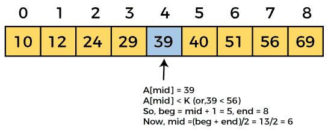

# 二分搜索法算法

> 原文：<https://www.javatpoint.com/binary-search>

在本文中，我们将讨论二分搜索法算法。搜索是在列表中找到某个特定元素的过程。如果该元素出现在列表中，则该过程被称为成功，并且该过程返回该元素的位置。否则，搜索被称为不成功。

线性搜索和二分搜索法是两种流行的搜索技术。这里我们将讨论二分搜索法算法。

二分搜索法是一种在排序列表上有效工作的搜索技术。因此，要使用二分搜索法技术将一个元素搜索到某个列表中，我们必须确保该列表是有序的。

二分搜索法采用分治法，将清单分成两半，将物品与清单的中间部分进行比较。如果找到匹配，则返回中间元素的位置。否则，我们会根据比赛的结果来搜索两个半场。

#### 注意:二分搜索法可以在排序的数组元素上实现。如果列表元素没有以排序的方式排列，我们必须首先对它们进行排序。

现在，让我们看看二分搜索法的算法。

## 算法

```

Binary_Search(a, lower_bound, upper_bound, val) // 'a' is the given array, 'lower_bound' is the index of the first array element, 'upper_bound' is the index of the last array element, 'val' is the value to search
Step 1: set beg = lower_bound, end = upper_bound, pos = - 1
Step 2: repeat steps 3 and 4 while beg <=end
Step 3: set mid = (beg + end)/2
Step 4: if a[mid] = val
set pos = mid
print pos
go to step 6
else if a[mid] > val
set end = mid - 1
else
set beg = mid + 1
[end of if]
[end of loop]
Step 5: if pos = -1
print "value is not present in the array"
[end of if]
Step 6: exit

```

## 二分搜索法的工作

现在，让我们看看二分搜索法算法的工作原理。

为了理解二进制搜索算法的工作原理，我们来看一个排序数组。用一个例子就很容易理解二分搜索法的工作。

有两种方法可以实现二分搜索法算法

*   迭代法
*   递归方法

二分搜索法的递归方法遵循分治法。

让数组的元素是-


让要搜索的元素是， **K = 56**

我们要用下面的公式来计算数组的**中间**

```

mid = (beg + end)/2

```

所以，在给定的数组中-

**求** = 0

**结束** = 8

**中间** = (0 + 8)/2 = 4。所以，4 是数组的中间。




现在，找到了要搜索的元素。因此算法将返回匹配元素的索引。

## 二分搜索法复杂性

现在，让我们看看二分搜索法在最佳情况、一般情况和最坏情况下的时间复杂性。我们也会看到二分搜索法的空间复杂性。

### 1.时间复杂性

| 情况 | 时间复杂性 |
| **最佳情况** | O(1) |
| **平均情况** | O(logn) |
| **最坏情况** | O(logn) |

*   **最佳案例复杂性-** 在二分搜索法，最佳案例发生在第一次比较中找到要搜索的元素时，即第一个中间元素本身就是要搜索的元素时。二分搜索法最好的时间复杂度是 **O(1)。**
*   **平均病例复杂度-** 二分搜索法的平均病例时间复杂度为 **O(logn)。**
*   **最坏情况复杂度-** 在二分搜索法，最坏的情况发生了，我们必须不断缩小搜索空间，直到它只有一个元素。二分搜索法最坏的时间复杂度是 **O(logn)。**

### 2.空间复杂性

| **空间复杂度** | O(1) |

*   二分搜索法的空间复杂性是 O(1)。

## 二分搜索法的执行情况

现在，让我们看看二分搜索法用不同编程语言编写的程序。

**程序:**写一个用 C 语言实现二分搜索法的程序。

```

#include <stdio.h>
int binarySearch(int a[], int beg, int end, int val)  
{  
    int mid;  
    if(end >= beg)   
    {        mid = (beg + end)/2;  
/* if the item to be searched is present at middle */
        if(a[mid] == val)  
        {               
            return mid+1;  
        }  
            /* if the item to be searched is smaller than middle, then it can only be in left subarray */
        else if(a[mid] < val)   
        {
            return binarySearch(a, mid+1, end, val);  
        }  
            /* if the item to be searched is greater than middle, then it can only be in right subarray */
        else   
        {
            return binarySearch(a, beg, mid-1, val);  
        }        
    }  
    return -1;   
} 
int main() {
  int a[] = {11, 14, 25, 30, 40, 41, 52, 57, 70}; // given array
  int val = 40; // value to be searched
  int n = sizeof(a) / sizeof(a[0]); // size of array
  int res = binarySearch(a, 0, n-1, val); // Store result
  printf("The elements of the array are - ");
  for (int i = 0; i < n; i++)
  printf("%d ", a[i]); 
  printf("\nElement to be searched is - %d", val);
  if (res == -1)
  printf("\nElement is not present in the array");
  else
  printf("\nElement is present at %d position of array", res);
  return 0;
}

```

**输出**


**程序:**写一个用 C++实现二分搜索法的程序。

```

#include <iostream>
using namespace std;
int binarySearch(int a[], int beg, int end, int val)  
{  
    int mid;  
    if(end >= beg)   
    {
        mid = (beg + end)/2;  
/* if the item to be searched is present at middle */
        if(a[mid] == val)  
        {               
            return mid+1;  
        }  
            /* if the item to be searched is smaller than middle, then it can only be in left subarray */
        else if(a[mid] < val)   
        {
            return binarySearch(a, mid+1, end, val);  
        }  
        /* if the item to be searched is greater than middle, then it can only be in right subarray */    
    else   
        {
            return binarySearch(a, beg, mid-1, val);  
        }       
    }  
    return -1;   
} 
int main() {
  int a[] = {10, 12, 24, 29, 39, 40, 51, 56, 70}; // given array
  int val = 51; // value to be searched
  int n = sizeof(a) / sizeof(a[0]); // size of array
  int res = binarySearch(a, 0, n-1, val); // Store result
  cout<
```

**输出**


**程序:**写一个用 C#实现二分搜索法的程序。

```

using System;
class BinarySearch {
    static int binarySearch(int[] a, int beg, int end, int val)  
    {  
        int mid;  
        if(end >= beg)   
        {
            mid = (beg + end)/2;  
            if(a[mid] == val)  
            {  
                return mid+1;  /* if the item to be searched is present at middle */
            }  
            /* if the item to be searched is smaller than middle, then it can only be in left subarray */
            else if(a[mid] < val)   
            {
                return binarySearch(a, mid+1, end, val);  
            }  
            /* if the item to be searched is greater than middle, then it can only be in right subarray */
            else  
            {
                return binarySearch(a, beg, mid-1, val);  
            }  
        }  
        return -1;  
    } 
    static void Main() {
        int[] a = {9, 11, 23, 28, 38, 45, 50, 56, 70}; // given array
        int val = 70; // value to be searched
        int n = a.Length; // size of array
        int res = binarySearch(a, 0, n-1, val); // Store result
        Console.Write("The elements of the array are - ");
        for (int i = 0; i < n; i++)
        {
            Console.Write(a[i] + " ");
        }
        Console.WriteLine();
        Console.WriteLine("Element to be searched is - " + val);
        if (res == -1)
        Console.WriteLine("Element is not present in the array");
        else
        Console.WriteLine("Element is present at " + res + " position of array");
    }
    }

```

**输出**


**程序:**写一个用 Java 实现二分搜索法的程序。

```

class BinarySearch {
    static int binarySearch(int a[], int beg, int end, int val)  
    {  
        int mid;  
        if(end >= beg)   
        {
            mid = (beg + end)/2;  
            if(a[mid] == val)  
            {  
                return mid+1;  /* if the item to be searched is present at middle 
*/
            }  
            /* if the item to be searched is smaller than middle, then it can only 
be in left subarray */
            else if(a[mid] < val)   
            {
                return binarySearch(a, mid+1, end, val);  
            }  
            /* if the item to be searched is greater than middle, then it can only be 
in right subarray */
            else  
            {
                return binarySearch(a, beg, mid-1, val);  
            }  
        }  
        return -1;  
    } 
    public static void main(String args[]) {
        int a[] = {8, 10, 22, 27, 37, 44, 49, 55, 69}; // given array
        int val = 37; // value to be searched
        int n = a.length; // size of array
        int res = binarySearch(a, 0, n-1, val); // Store result
        System.out.print("The elements of the array are: ");
        for (int i = 0; i < n; i++)
        {
            System.out.print(a[i] + " ");
        }
        System.out.println();
        System.out.println("Element to be searched is: " + val);
        if (res == -1)
        System.out.println("Element is not present in the array");
        else
        System.out.println("Element is present at " + res + " position of array");
    }
    }

```

**输出**


**程序:**写一个用 PHP 实现二分搜索法的程序。

```

<?php
function binarySearch($a, $beg, $end, $val)  
{  
if($end >= $beg)   
{
	$mid = floor(($beg + $end)/2);  
	if($a[$mid] == $val)  
	{
		return $mid+1;  /* if the item to be searched is present at middle */
	}  
	/* if the item to be searched is smaller than middle, then it can only  be in left subarray */
	else if($a[$mid] < $val)   
	{
		return binarySearch($a, $mid+1, $end, $val);  
	}  
	/* if the item to be searched is greater than middle, then it can only be in right subarray */
	else  
	{
		return binarySearch($a, $beg, $mid-1, $val);  
	}  
}  
return -1;  
}
	$a = array(7, 9, 21, 26, 36, 43, 48, 54, 68); // given array
	$val = 68; // value to be searched
	$n = sizeof($a); // size of array
	$res = binarySearch($a, 0, $n-1, $val); // Store result 
	echo "The elements of the array are: ";
	for ($i = 0; $i < $n; $i++)
		echo " " , $a[$i];
	echo "<br>" , "Element to be searched is: " , $val;
	if ($res == -1)
		echo "<br>" , "Element is not present in the array";
	else
		echo "<br>" , "Element is present at " , $res , " position of array";
?>

```

**输出**


所以，这就是文章的全部内容。希望文章对你有所帮助和启发。

* * *