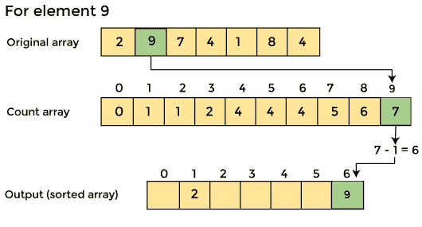
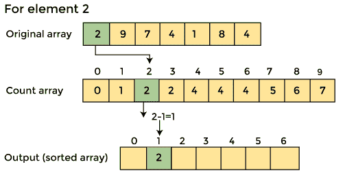

# 计数排序算法

> 原文：<https://www.javatpoint.com/counting-sort>

在本文中，我们将讨论计数排序算法。计数排序是一种基于特定范围之间的键的排序技术。在软件工程师的编码或技术面试中，排序算法被广泛询问。所以，讨论这个话题很重要。

这种排序技术不会通过比较元素来执行排序。它通过计数具有不同键值的对象来执行排序，如散列。之后，它执行一些算术运算来计算每个对象在输出序列中的索引位置。计数排序不被用作通用排序算法。

当范围不大于要排序的对象数时，计数排序有效。它可用于对负输入值进行排序。

现在，让我们看看计数排序的算法。

## 算法

```

countingSort(array, n) // 'n' is the size of array
max = find maximum element in the given array
create count array with size maximum + 1
Initialize count array with all 0's
for i = 0 to n
find the count of every unique element and 
store that count at ith position in the count array
for j = 1 to max
Now, find the cumulative sum and store it in count array
for i = n to 1
Restore the array elements
Decrease the count of every restored element by 1
end countingSort

```

## 计数排序算法的工作

现在，让我们看看计数排序算法的工作原理。

为了理解计数排序算法的工作原理，我们来看一个未排序的数组。通过例子更容易理解计数排序。

让数组的元素是-


1.从给定数组中找到最大元素。让 **max** 成为最大元素。


2.现在，初始化长度为 **max + 1** 的数组，其中包含所有 0 个元素。该数组将用于存储给定数组中元素的计数。


3.现在，我们必须将每个数组元素的计数存储在计数数组中它们对应的索引处。

元素的计数将存储为-假设数组元素“4”出现了两次，那么元素 4 的计数为 2。因此，2 被存储在计数阵列的第 4 <sup>个</sup>位置。如果数组中不存在任何元素，则放置 0，即假设数组中不存在元素“3”，因此，0 将存储在 3 <sup>第</sup>个位置。


现在，存储**计数**数组元素的累计和。这将有助于将元素放在排序数组的正确索引处。


同样，计数数组的累计计数为-


4.现在，找到原始数组中每个元素的索引



将元素放置到位后，将其计数减少 1。在放置元素 2 之前，它的计数是 2，但是在将其放置到正确的位置之后，元素 2 的新计数是 1。



同样，排序后，数组元素是-


现在，数组已完全排序。

## 计数排序复杂度

现在，让我们看看在最好的情况下，平均情况下和最坏的情况下计数排序的时间复杂性。我们还将看到计数排序的空间复杂性。

### 1.时间复杂性

| 情况 | 时间 | 复杂性 |
| **最佳情况** | O(n + k) |
| **平均情况** | O(n + k) |
| **最坏情况** | O(n + k) |

*   **最佳案例复杂度-** 当不需要排序时，即数组已经排序时出现。计数排序的最佳时间复杂度是 **O(n + k)** 。
*   **平均格复杂度-** 数组元素乱序时出现，不是适当的升序，也不是适当的降序。计数排序的平均案例时间复杂度为 **O(n + k)** 。
*   **最坏情况复杂度-** 要求数组元素逆序排序时出现。这意味着假设您必须按升序对数组元素进行排序，但是它的元素是按降序排序的。计数排序最差的时间复杂度是 **O(n + k)** 。

在上述所有情况下，计数排序的时间复杂度是相同的。这是因为算法要经过 **n+k** 次，不管元素在数组中是如何放置的。

计数排序优于基于比较的排序技术，因为在计数排序中元素之间没有比较。但是，当整数非常大时，计数排序是不好的，因为必须创建这种大小的数组。

### 2.空间复杂性

| **空间复杂度** | o(最大) |
| **稳定** | 是 |

*   计数排序的空间复杂度为 O(max)。元素范围越大，空间复杂度越大。

## 计数排序的实现

现在，让我们看看不同编程语言中的计数排序程序。

**程序:**用 C 语言编写程序实现计数排序。

```

#include int getMax(int a[], int n) {
   int max = a[0];
   for(int i = 1; i <n i="" if="">max)
         max = a[i];
   }
   return max; //maximum element from the array
}

void countSort(int a[], int n) // function to perform counting sort
{
   int output[n+1];
   int max = getMax(a, n);
   int count[max+1]; //create count array with size [max+1]

  for (int i = 0; i <= max; ++i) 
  {
    count[i] = 0; // Initialize count array with all zeros
  }

  for (int i = 0; i < n; i++) // Store the count of each element
  {
    count[a[i]]++;
  }

   for(int i = 1; i<=max; i++) 
      count[i] += count[i-1]; //find cumulative frequency

  /* This loop will find the index of each element of the original array in count array, and
   place the elements in output array*/
  for (int i = n - 1; i >= 0; i--) {
    output[count[a[i]] - 1] = a[i];
    count[a[i]]--; // decrease count for same numbers
}

   for(int i = 0; i</n>
```

**输出**

执行上述代码后，输出将是-


**程序:**用 C++编写一个实现计数排序的程序。

```

#include 

using namespace std;

int getMax(int a[], int n) {
   int max = a[0];
   for(int i = 1; i <n i="" if="">max)
         max = a[i];
   }
   return max; //maximum element from the array
}

void countSort(int a[], int n) // function to perform counting sort
{
   int output[n+1];
   int max = getMax(a, n);
   int count[max+1]; //create count array with size [max+1]

  for (int i = 0; i <= max; ++i) 
  {
    count[i] = 0; // Initialize count array with all zeros
  }

  for (int i = 0; i < n; i++) // Store the count of each element
  {
    count[a[i]]++;
  }

   for(int i = 1; i<=max; i++) 
      count[i] += count[i-1]; //find cumulative frequency

  /* This loop will find the index of each element of the original array in count array, and
   place the elements in output array*/
  for (int i = n - 1; i >= 0; i--) {
    output[count[a[i]] - 1] = a[i];
    count[a[i]]--; // decrease count for same numbers
}

   for(int i = 0; i</n>
```

**输出**

执行上述代码后，输出将是-


**程序:**用 C#编写程序实现计数排序。

```

using System;
class CountingSort {

static int getMax(int[] a, int n) {
  int max = a[0];
  for(int i = 1; i max)
         max = a[i];
  }
  return max; //maximum element from the array
}

static void countSort(int[] a, int n) // function to perform counting sort
{
   int[] output = new int [n+1];
   int max = getMax(a, n);
   int[] count = new int [max+1]; //create count array with size [max+1]

  for (int i = 0; i <= max; ++i) 
  {
    count[i] = 0; // Initialize count array with all zeros
  }

  for (int i = 0; i < n; i++) // Store the count of each element
  {
    count[a[i]]++;
  }

   for(int i = 1; i<=max; i++) 
      count[i] += count[i-1]; //find cumulative frequency

  /* This loop will find the index of each element of the original array in count array, and
   place the elements in output array*/
  for (int i = n - 1; i >= 0; i--) {
    output[count[a[i]] - 1] = a[i];
    count[a[i]]--; // decrease count for same numbers
}

   for(int i = 0; i
```

**输出**

执行上述代码后，输出将是-


**程序:**用 Java 编写一个实现计数排序的程序。

```

class CountingSort {

int getMax(int[] a, int n) {
  int max = a[0];
  for(int i = 1; i max)
         max = a[i];
  }
  return max; //maximum element from the array
}

void countSort(int[] a, int n) // function to perform counting sort
{
   int[] output = new int [n+1];
   int max = getMax(a, n);
   //int max = 42;
   int[] count = new int [max+1]; //create count array with size [max+1]

  for (int i = 0; i <= max; ++i) 
  {
    count[i] = 0; // Initialize count array with all zeros
  }

  for (int i = 0; i < n; i++) // Store the count of each element
  {
    count[a[i]]++;
  }

   for(int i = 1; i<=max; i++) 
      count[i] += count[i-1]; //find cumulative frequency

  /* This loop will find the index of each element of the original array in 

count array, and
   place the elements in output array*/
  for (int i = n - 1; i >= 0; i--) {
    output[count[a[i]] - 1] = a[i];
    count[a[i]]--; // decrease count for same numbers
}

   for(int i = 0; i
```

**输出**


**程序:**用 PHP 编写一个实现计数排序的程序。

```

<?php

function getMax($a, $n) {
  $max = $a[0];
  for($i = 1; $i < $n; $i++) {
      if($a[$i] > $max)
         $max = $a[$i];
  }
  return $max; //maximum element from the array
}

function countSort(&$a, $n) // function to perform counting sort
{
    $LeftArray = array($n + 1);
   $max = getMax($a, $n);
   $count = array($max + 1); //create count array with size [max+1]

  for ($i = 0; $i <= $max; ++$i) 
  {
    $count[$i] = 0; // Initialize count array with all zeros
  }

  for ($i = 0; $i < $n; $i++) // Store the count of each element
  {
    $count[$a[$i]]++;
  }

   for($i = 1; $i<=$max; $i++) 
      $count[$i] += $count[$i-1]; //find cumulative frequency

  /* This loop will find the index of each element of the original array in  
count array, and
   place the elements in output array*/
  for ($i = $n - 1; $i >= 0; $i--) {
    $output[$count[$a[$i]] - 1] = $a[$i];
    $count[$a[$i]]--; // decrease count for same numbers
}

   for($i = 0; $i<$n; $i++) {
      $a[$i] = $output[$i]; //store the sorted elements into main array
   }
}

/* Function to print the array elements */
function printArray($a, $n)
{
    for($i = 0; $i < $n; $i++)  
    {  
        print_r($a[$i]);  
        echo " ";  
    }      
}

	$a = array( 9, 28, 22, 5, 29, 14, 37, 28, 9 );  
	$n = count($a);
    echo "Before sorting array elements are - <br>";  
    printArray($a, $n);
	countSort($a,$n);
    echo "<br> After sorting array elements are - <br>";  
    printArray($a, $n);

?>

```

**输出**


所以，这就是文章的全部内容。希望文章对你有所帮助和启发。

这篇文章不仅仅局限于算法。我们还讨论了不同编程语言中计数排序的复杂性、工作方式和实现。

* * *