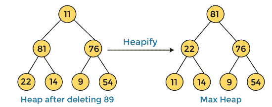
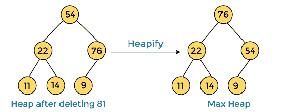
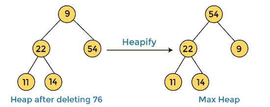
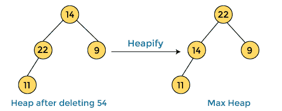

# 堆排序算法

> 原文：<https://www.javatpoint.com/heap-sort>

在本文中，我们将讨论 Heapsort 算法。堆排序通过使用给定数组的元素创建最小堆或最大堆来处理元素。最小堆或最大堆表示数组的顺序，其中根元素表示数组的最小或最大元素。

堆排序基本上递归地执行两个主要操作-

*   使用数组的元素构建一个 H 堆。
*   重复删除 1 <sup>st</sup> 阶段形成的堆的根元素。

在进一步了解堆排序之前，我们先来看一下**堆的简要描述。**

### 什么是堆？

堆是一个完整的二叉树，二叉树是节点最多可以有两个子节点的树。完全二叉树是这样一种二叉树，其中除了最后一层，即叶节点之外的所有层都应该被完全填充，并且所有节点都应该左对齐。

### 什么是堆排序？

Heapsort 是一种流行且高效的排序算法。堆排序的概念是将列表的堆部分中的元素一个个剔除，然后插入到列表的排序部分。

Heapsort 是就地排序算法。

现在，让我们看看堆排序的算法。

## 算法

```

HeapSort(arr)
BuildMaxHeap(arr)
for i = length(arr) to 2
	swap arr[1] with arr[i]
		heap_size[arr] = heap_size[arr] ? 1
		MaxHeapify(arr,1)
End

```

**建筑 max 堆(arr)**

```

BuildMaxHeap(arr)
	heap_size(arr) = length(arr)
	for i = length(arr)/2 to 1
MaxHeapify(arr,i)
End

```

**最大瘀伤（疤痕，i）**

```

MaxHeapify(arr,i)
L = left(i)
R = right(i)
if L ? heap_size[arr] and arr[L] > arr[i]
largest = L
else
largest = i
if R ? heap_size[arr] and arr[R] > arr[largest]
largest = R
if largest != i
swap arr[i] with arr[largest]
MaxHeapify(arr,largest)
End 

```

## 堆排序算法的工作

现在，让我们看看堆排序算法的工作原理。

在堆排序中，基本上，元素排序涉及两个阶段。通过使用堆排序算法，它们如下-

*   第一步包括通过调整数组元素来创建堆。
*   创建堆后，现在通过将堆的根元素移动到数组的末尾来重复移除它，然后将堆结构与剩余的元素一起存储。

现在让我们通过一个例子来详细了解堆排序的工作原理。为了更清楚地理解它，让我们取一个未排序的数组，并尝试使用堆排序对其进行排序。这将使解释更加清晰和容易。


首先，我们必须从给定的数组构造一个堆，并将其转换为最大堆。


将给定堆转换为最大堆后，数组元素是-


接下来，我们要从 max 堆中删除根元素 **(89)** 。要删除此节点，我们必须将其与最后一个节点交换，即 **(11)。**删除根元素后，我们又要对其进行堆化，转换成 max heap。



将数组元素 **89** 换成 **11、**并将堆转换成最大堆后，数组元素为-


在下一步中，我们必须再次从 max 堆中删除根元素 **(81)** 。要删除此节点，我们必须将其与最后一个节点交换，即 **(54)。**删除根元素后，我们又要对其进行堆化，转换成 max heap。



将数组元素 **81** 换成 **54** 并将堆转换成最大堆后，数组元素为-


在下一步中，我们必须再次从 max 堆中删除根元素 **(76)** 。要删除此节点，我们必须将其与最后一个节点交换，即 **(9)。**删除根元素后，我们又要对其进行堆化，转换成 max heap。



将数组元素 **76** 换成 **9** 并将堆转换成最大堆后，数组元素为-


在下一步中，我们再次必须从 max 堆中删除根元素 **(54)** 。要删除此节点，我们必须将其与最后一个节点交换，即 **(14)。**删除根元素后，我们又要对其进行堆化，转换成 max heap。



将数组元素 **54** 换成 **14** 并将堆转换成最大堆后，数组元素为-


在下一步中，我们再次必须从 max 堆中删除根元素 **(22)** 。要删除此节点，我们必须将其与最后一个节点交换，即 **(11)。**删除根元素后，我们又要对其进行堆化，转换成 max heap。


将数组元素 **22** 换成 **11** 并将堆转换成最大堆后，数组元素为-


在下一步中，我们再次必须从 max 堆中删除根元素 **(14)** 。要删除此节点，我们必须将其与最后一个节点交换，即 **(9)。**删除根元素后，我们又要对其进行堆化，转换成 max heap。


将数组元素 **14** 换成 **9** 并将堆转换成最大堆后，数组元素为-


在下一步中，我们再次必须从 max 堆中删除根元素 **(11)** 。要删除此节点，我们必须将其与最后一个节点交换，即 **(9)。**删除根元素后，我们又要对其进行堆化，转换成 max heap。


将数组元素 **11** 换成 **9 后，**数组元素为-


现在，heap 只剩下一个元素了。删除后，堆将为空。


排序完成后，数组元素为-


现在，数组已完全排序。

## 堆排序复杂性

现在，让我们看看堆排序在最佳情况、平均情况和最坏情况下的时间复杂性。我们也会看到 Heapsort 的空间复杂性。

### 1.时间复杂性

| 情况 | 时间复杂性 |
| **最佳情况** | O(n logn) |
| **平均情况** | O(n 对数 n) |
| **最坏情况** | O(n 对数 n) |

*   **最佳案例复杂度-** 当不需要排序时，即数组已经排序时出现。堆排序的最佳时间复杂度是 **O(n logn)。**
*   **平均格复杂度-** 数组元素乱序时出现，不是适当的升序，也不是适当的降序。堆排序的平均案例时间复杂度为**O(n ^ log n)。**
*   **最坏情况复杂度-** 要求数组元素逆序排序时出现。这意味着假设您必须按升序对数组元素进行排序，但是它的元素是按降序排序的。堆排序最差的时间复杂度是 **O(n log n)。**

堆排序的时间复杂度在所有三种情况下(最佳情况、平均情况和最坏情况)都是 **O(n logn)** 。有 n 个元素的完整二叉树的高度是 **logn。**

### 2.空间复杂性

| **空间复杂度** | O(1) |
| **稳定** | 不 |

*   堆排序的空间复杂度为 O(1)。

## Heapsort 的实现

现在，让我们看看不同编程语言中的堆排序程序。

**程序:**用 C 语言编写一个实现堆排序的程序。

```

#include <stdio.h>
/* function to heapify a subtree. Here 'i' is the 
index of root node in array a[], and 'n' is the size of heap. */ 
void heapify(int a[], int n, int i)
{
	int largest = i; // Initialize largest as root
	int left = 2 * i + 1; // left child
	int right = 2 * i + 2; // right child
	// If left child is larger than root
	if (left < n && a[left] > a[largest])
		largest = left;
	// If right child is larger than root
	if (right < n && a[right] > a[largest])
		largest = right;
	// If root is not largest
	if (largest != i) {
	    // swap a[i] with a[largest]
	    int temp = a[i];
	    a[i] = a[largest];
	    a[largest] = temp;

		heapify(a, n, largest);
	}
}
/*Function to implement the heap sort*/
void heapSort(int a[], int n)
{
	for (int i = n / 2 - 1; i >= 0; i--)
		heapify(a, n, i);
	// One by one extract an element from heap
	for (int i = n - 1; i >= 0; i--) {
		/* Move current root element to end*/
		// swap a[0] with a[i]
	    int temp = a[0];
	    a[0] = a[i];
	    a[i] = temp;

		heapify(a, i, 0);
	}
}
/* function to print the array elements */
void printArr(int arr[], int n)
{
	for (int i = 0; i < n; ++i)
	{
		printf("%d", arr[i]);
		printf(" ");
	}

}
int main()
{
	int a[] = {48, 10, 23, 43, 28, 26, 1};
	int n = sizeof(a) / sizeof(a[0]);
    printf("Before sorting array elements are - \n");
    printArr(a, n);
	heapSort(a, n);
    printf("\nAfter sorting array elements are - \n");  
	printArr(a, n);
	return 0;
}

```

**输出**


**程序:**写一个在 C++中实现堆排序的程序。

```

#include <iostream>
using namespace std;
/* function to heapify a subtree. Here 'i' is the 
index of root node in array a[], and 'n' is the size of heap. */ 
void heapify(int a[], int n, int i)
{
	int largest = i; // Initialize largest as root
	int left = 2 * i + 1; // left child
	int right = 2 * i + 2; // right child
	// If left child is larger than root
	if (left < n && a[left] > a[largest])
		largest = left;
	// If right child is larger than root
	if (right < n && a[right] > a[largest])
		largest = right;
	// If root is not largest
	if (largest != i) {
	    // swap a[i] with a[largest]
	    int temp = a[i];
	    a[i] = a[largest];
	    a[largest] = temp;

		heapify(a, n, largest);
	}
}
/*Function to implement the heap sort*/
void heapSort(int a[], int n)
{

	for (int i = n / 2 - 1; i >= 0; i--)
		heapify(a, n, i);
	// One by one extract an element from heap
	for (int i = n - 1; i >= 0; i--) {
		/* Move current root element to end*/
		// swap a[0] with a[i]
	    int temp = a[0];
	    a[0] = a[i];
	    a[i] = temp;

		heapify(a, i, 0);
	}
}
/* function to print the array elements */
void printArr(int a[], int n)
{
	for (int i = 0; i < n; ++i)
	{
	    cout<<a[i]<<" ";
	}

}
int main()
{
	int a[] = {47, 9, 22, 42, 27, 25, 0};
	int n = sizeof(a) / sizeof(a[0]);
    cout<<"Before sorting array elements are - \n";
    printArr(a, n);
	heapSort(a, n);
    cout<<"\nAfter sorting array elements are - \n";  
	printArr(a, n);
	return 0;
}

```

**输出**


**程序:**用 C#编写一个实现堆排序的程序。

```

using System;
class HeapSort {
/* function to heapify a subtree. Here 'i' is the 
index of root node in array a[], and 'n' is the size of heap. */ 
static void heapify(int[] a, int n, int i)
{
	int largest = i; // Initialize largest as root
	int left = 2 * i + 1; // left child
	int right = 2 * i + 2; // right child
	// If left child is larger than root
	if (left < n && a[left] > a[largest])
		largest = left;
	// If right child is larger than root
	if (right < n && a[right] > a[largest])
		largest = right;
	// If root is not largest
	if (largest != i) {
	    // swap a[i] with a[largest]
	    int temp = a[i];
	    a[i] = a[largest];
	    a[largest] = temp;

		heapify(a, n, largest);
	}
}
/*Function to implement the heap sort*/
static void heapSort(int[] a, int n)
{
	for (int i = n / 2 - 1; i >= 0; i--)
		heapify(a, n, i);

	// One by one extract an element from heap
	for (int i = n - 1; i >= 0; i--) {
		/* Move current root element to end*/
		// swap a[0] with a[i]
	    int temp = a[0];
	    a[0] = a[i];
	    a[i] = temp;

		heapify(a, i, 0);
	}
}
/* function to print the array elements */
static void printArr(int[] a, int n)
{
	for (int i = 0; i < n; ++i)
	    Console.Write(a[i] + " ");
}
static void Main() 
{
	int[] a = {46, 8, 21, 41, 26, 24, -1};
	int n = a.Length;
    Console.Write("Before sorting array elements are - \n");
    printArr(a, n);
	heapSort(a, n);
    Console.Write("\nAfter sorting array elements are - \n");
	printArr(a, n);
}
}

```

**输出**


**程序:**写一个用 Java 实现堆排序的程序。

```

class HeapSort
{
/* function to heapify a subtree. Here 'i' is the 
index of root node in array a[], and 'n' is the size of heap. */ 
static void heapify(int a[], int n, int i)
{
	int largest = i; // Initialize largest as root
	int left = 2 * i + 1; // left child
	int right = 2 * i + 2; // right child
	// If left child is larger than root
	if (left < n && a[left] > a[largest])
		largest = left;
	// If right child is larger than root
	if (right < n && a[right] > a[largest])
		largest = right;
	// If root is not largest
	if (largest != i) {
	    // swap a[i] with a[largest]
	    int temp = a[i];
	    a[i] = a[largest];
	    a[largest] = temp;

		heapify(a, n, largest);
	}
}
/*Function to implement the heap sort*/
static void heapSort(int a[], int n)
{
	for (int i = n / 2 - 1; i >= 0; i--)
		heapify(a, n, i);

	// One by one extract an element from heap
	for (int i = n - 1; i >= 0; i--) {
		/* Move current root element to end*/
		// swap a[0] with a[i]
	    int temp = a[0];
	    a[0] = a[i];
	    a[i] = temp;

		heapify(a, i, 0);
	}
}
/* function to print the array elements */
static void printArr(int a[], int n)
{
	for (int i = 0; i < n; ++i)
	    System.out.print(a[i] + " ");
}
public static void main(String args[]) 
{
	int a[] = {45, 7, 20, 40, 25, 23, -2};
	int n = a.length;
    System.out.print("Before sorting array elements are - \n");
    printArr(a, n);
	heapSort(a, n);
    System.out.print("\nAfter sorting array elements are - \n");
	printArr(a, n);
}
}

```

**输出**


所以，这就是文章的全部内容。希望文章对你有所帮助和启发。

* * *