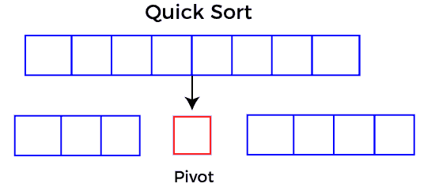
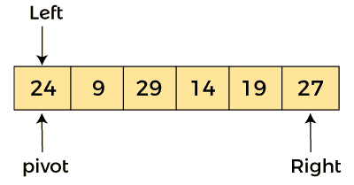
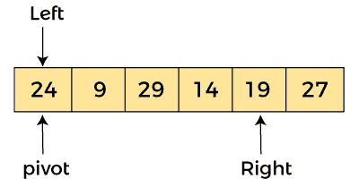
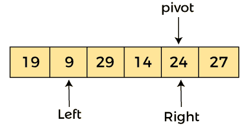
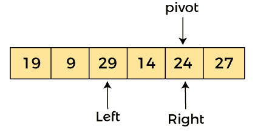
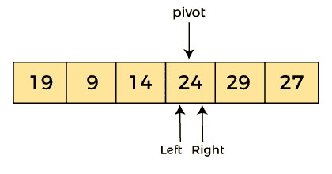

# 快速排序算法

> 原文：<https://www.javatpoint.com/quick-sort>

在本文中，我们将讨论快速排序算法。Quicksort 的工作程序也很简单。这篇文章对学生来说非常有帮助和有趣，因为他们可能会在考试中遇到快速排序的问题。所以，讨论这个话题很重要。

排序是以系统的方式排列项目的一种方式。Quicksort 是广泛使用的排序算法，在对 n 个元素的数组进行排序的平均情况下进行 **n log n** 比较。它是一种快速高效的排序算法。该算法遵循分治法。分治法是一种将算法分解为子问题，然后求解子问题，并将结果组合在一起以解决原始问题的技术。

**分割线:**在分割线中，首先拾取一个枢轴元素。之后，将数组划分或重新排列为两个子数组，使得左子数组中的每个元素小于或等于枢轴元素，右子数组中的每个元素大于枢轴元素。

**征服:**递归，用快速排序对两个子阵进行排序。

**合并:**合并已经排序的数组。

Quicksort 选取一个元素作为透视，然后围绕选取的透视元素对给定数组进行分区。在快速排序中，一个大数组被分成两个数组，其中一个保存小于指定值(透视)的值，另一个保存大于透视的值。

之后，左右子阵列也使用相同的方法进行分区。它将继续，直到单个元素保留在子数组中。



## 选择轴心

选择一个好的支点对于快速执行快速排序是必要的。然而，确定一个好的支点是很典型的。选择轴心的一些方法如下-

*   透视可以是随机的，即从给定的数组中选择随机的透视。
*   Pivot 可以是给定数组最左边元素的最右边元素。
*   选择中间作为枢轴元素。

## 算法

**算法:**

```

QUICKSORT (array A, start, end)   
{
 1 if (start < end)   
 2 {
3 p = partition(A, start, end)
4 QUICKSORT (A, start, p - 1)  
5 QUICKSORT (A, p + 1, end)  
6 } 
}

```

**划分算法:**

分区算法在一个地方重新排列子数组。

```

PARTITION (array A, start, end)   
{
 1 pivot ? A[end]   
 2 i ? start-1   
 3 for j ? start to end -1 {
 4 do if (A[j] < pivot) {  
 5 then i ? i + 1   
 6 swap A[i] with A[j] 
 7  }} 
 8 swap A[i+1] with A[end]   
 9 return i+1
}

```

## 快速排序算法的工作

现在，让我们看看快速排序算法的工作原理。

为了理解快速排序的工作原理，我们来看一个未排序的数组。这将使概念更加清晰易懂。

让数组的元素是-


在给定的数组中，我们将最左边的元素视为轴心。因此，在这种情况下，a[左] = 24，a[右] = 27，a[枢轴] = 24。

因为枢轴在左边，所以算法从右边开始，向左移动。



现在，a[枢轴]< a[右]，因此算法向左移动一个位置，即-



现在，a[左] = 24，a[右] = 19，a[枢轴] = 24。

因为，一个[枢轴]>一个[右]，所以，算法会把一个[枢轴]换成一个[右]，枢轴向右移动，就像-


现在，a[左] = 19，a[右] = 24，a[枢轴] = 24。因为枢轴在右边，所以算法从左边开始，向右移动。

作为一个[枢纽]>一个[左]，所以算法向右移动一个位置作为-



现在，a[左] = 9，a[右] = 24，a[枢轴] = 24。作为一个[枢纽]>一个[左]，所以算法向右移动一个位置作为-



现在，a[左] = 29，a[右] = 24，a[枢轴] = 24。作为一个【枢纽】


因为枢轴在左边，所以算法从右边开始，向左移动。现在，a[左] = 24，a[右] = 29，a[枢轴] = 24。作为一个[枢纽]


现在，a[枢轴] = 24，a[左] = 24，a[右] = 14。作为一个【枢纽】>一个【右】，那么，交换一个【枢纽】和一个【右】，现在枢纽在右，即-


现在，a[枢轴] = 24，a[左] = 14，a[右] = 24。Pivot 在右边，所以算法从左边开始，向右移动。



现在，a[枢轴] = 24，a[左] = 24，a[右] = 24。所以，枢轴，左和右指向同一个元素。它代表程序的终止。

作为枢轴元件的元件 24 被放置在其精确位置。

元素 24 右侧的元素比它大，元素 24 左侧的元素比它小。


现在，以类似的方式，快速排序算法被分别应用于左右子阵列。排序完成后，数组将-


## 快速排序复杂性

现在，让我们看看快速排序在最佳情况、一般情况和最坏情况下的时间复杂性。我们也会看到 quicksort 的空间复杂性。

### 1.时间复杂性

| 情况 | 时间复杂性 |
| **最佳情况** | O(n*logn) |
| **平均情况** | O(n*logn) |
| **最坏情况** | O(n <sup>2</sup> ) |

*   **最佳情况复杂度-** 在快速排序中，当枢轴元素是中间元素或靠近中间元素时，出现最佳情况。快速排序的最佳时间复杂度是**0(n * logn)**。
*   **平均格复杂度-** 数组元素乱序时出现，不是适当的升序，也不是适当的降序。快速排序的平均案例时间复杂度为 **O(n*logn)** 。
*   **最坏情况复杂度-** 在快速排序中，当枢轴元素是最大或最小元素时，会出现最坏情况。假设，如果 pivot 元素总是数组的最后一个元素，那么当给定的数组已经按照升序或降序排序时，就会出现最坏的情况。快速排序最差的时间复杂度是 **O(n <sup>2</sup> )** 。

尽管快速排序的最坏情况复杂度高于其他排序算法，如**合并排序**和**堆排序**，但实际上它还是更快。快速排序中的最坏情况很少发生，因为通过改变枢轴的选择，它可以以不同的方式实现。通过选择正确的枢轴元素，可以避免快速排序中的最坏情况。

### 2.空间复杂性

| **空间复杂度** | O(n*logn) |
| **稳定** | 不 |

*   快速排序的空间复杂度为 O(n*logn)。

## 快速排序的实现

现在，让我们看看不同编程语言的 quicksort 程序。

**程序:**用 C 语言编写一个实现快速排序的程序。

```

#include <stdio.h>
/* function that consider last element as pivot, 
place the pivot at its exact position, and place 
smaller elements to left of pivot and greater 
elements to right of pivot.  */
int partition (int a[], int start, int end)
{
	int pivot = a[end]; // pivot element
	int i = (start - 1);

	for (int j = start; j <= end - 1; j++)
	{
		// If current element is smaller than the pivot
		if (a[j] < pivot)
		{
			i++; // increment index of smaller element
			int t = a[i];
			a[i] = a[j];
			a[j] = t;
		}
	}
	int t = a[i+1];
	a[i+1] = a[end];
	a[end] = t;
	return (i + 1);
}

/* function to implement quick sort */
void quick(int a[], int start, int end) /* a[] = array to be sorted, start = Starting index, end = Ending index */
{
	if (start < end)
	{
		int p = partition(a, start, end); //p is the partitioning index
		quick(a, start, p - 1);
		quick(a, p + 1, end);
	}
}

/* function to print an array */
void printArr(int a[], int n)
{
	int i;
	for (i = 0; i < n; i++)
		printf("%d ", a[i]);
}
int main()
{
	int a[] = { 24, 9, 29, 14, 19, 27 };
	int n = sizeof(a) / sizeof(a[0]);
    printf("Before sorting array elements are - \n");
    printArr(a, n);
    quick(a, 0, n - 1);
    printf("\nAfter sorting array elements are - \n");  
    printArr(a, n);

	return 0;
}

```

**输出:**


**程序:**用 C++语言编写一个实现快速排序的程序。

```

#include <iostream>

using namespace std;

/* function that consider last element as pivot, 
place the pivot at its exact position, and place 
smaller elements to left of pivot and greater 
elements to right of pivot.  */
int partition (int a[], int start, int end)
{
	int pivot = a[end]; // pivot element
	int i = (start - 1);

	for (int j = start; j <= end - 1; j++)
	{
		// If current element is smaller than the pivot
		if (a[j] < pivot)
		{
			i++; // increment index of smaller element
			int t = a[i];
			a[i] = a[j];
			a[j] = t;
		}
	}
	int t = a[i+1];
	a[i+1] = a[end];
	a[end] = t;
	return (i + 1);
}

/* function to implement quick sort */
void quick(int a[], int start, int end) /* a[] = array to be sorted, start = Starting index, end = Ending index */
{
	if (start < end)
	{
		int p = partition(a, start, end);  //p is the partitioning index
		quick(a, start, p - 1);
		quick(a, p + 1, end);
	}
}

/* function to print an array */
void printArr(int a[], int n)
{
	int i;
	for (i = 0; i < n; i++)
	    cout<<a[i]<< " ";
}
int main()
{
	int a[] = { 23, 8, 28, 13, 18, 26 };
	int n = sizeof(a) / sizeof(a[0]);
    cout<<"Before sorting array elements are - \n";
    printArr(a, n);
    quick(a, 0, n - 1);
    cout<<"\nAfter sorting array elements are - \n";  
    printArr(a, n);

	return 0;
}

```

**输出:**


**程序:**用 python 编写一个实现快速排序的程序。

```

#function that consider last element as pivot, 
#place the pivot at its exact position, and place 
#smaller elements to left of pivot and greater 
#elements to right of pivot. 

def partition (a, start, end):
	i = (start - 1)
	pivot = a[end] # pivot element

	for j in range(start, end):
		# If current element is smaller than or equal to the pivot
		if (a[j] <= pivot):
		    i = i + 1
		    a[i], a[j] = a[j], a[i]

	a[i+1], a[end] = a[end], a[i+1]

	return (i + 1)

# function to implement quick sort 
def quick(a, start, end): # a[] = array to be sorted, start = Starting index, end = Ending index  	
	if (start < end):
		p = partition(a, start, end) # p is partitioning index
		quick(a, start, p - 1)
		quick(a, p + 1, end)

def printArr(a): # function to print the array
    for i in range(len(a)):
	    print (a[i], end = " ")

a = [68, 13, 1, 49, 58]
print("Before sorting array elements are - ")
printArr(a)
quick(a, 0, len(a)-1)
print("\nAfter sorting array elements are - ")
printArr(a)

```

**输出:**


**程序:**写一个用 Java 实现快速排序的程序。

```

public class Quick
{
    /* function that consider last element as pivot, 
place the pivot at its exact position, and place 
smaller elements to left of pivot and greater 
elements to right of pivot.  */
int partition (int a[], int start, int end)
{
	int pivot = a[end]; // pivot element
	int i = (start - 1);

	for (int j = start; j <= end - 1; j++)
	{
		// If current element is smaller than the pivot
		if (a[j] < pivot)
		{
			i++; // increment index of smaller element
			int t = a[i];
			a[i] = a[j];
			a[j] = t;
		}
	}
	int t = a[i+1];
	a[i+1] = a[end];
	a[end] = t;
	return (i + 1);
}

/* function to implement quick sort */
void quick(int a[], int start, int end) /* a[] = array to be sorted, start = Starting index, end = Ending index */
{
	if (start < end)
	{
		int p = partition(a, start, end);  //p is partitioning index
		quick(a, start, p - 1);
		quick(a, p + 1, end);
	}
}

/* function to print an array */
void printArr(int a[], int n)
{
	int i;
	for (i = 0; i < n; i++)
	    System.out.print(a[i] + " ");
}
	public static void main(String[] args) {
	int a[] = { 13, 18, 27, 2, 19, 25 };
	int n = a.length;
    System.out.println("\nBefore sorting array elements are - ");
    Quick q1 = new Quick();
    q1.printArr(a, n);
    q1.quick(a, 0, n - 1);
    System.out.println("\nAfter sorting array elements are - ");
    q1.printArr(a, n);
    System.out.println();
	}
}

```

**输出**

执行上述代码后，输出将是-


**程序:**用 php 编写程序实现快速排序。

```

<?php  
    /* function that consider last element as pivot, 
place the pivot at its exact position, and place 
smaller elements to left of pivot and greater 
elements to right of pivot.  */
function partition (&$a, $start, $end)
{
	$pivot = $a[$end]; // pivot element
	$i = ($start - 1);

	for ($j = $start; $j <= $end - 1; $j++)
	{
		// If current element is smaller than the pivot
		if ($a[$j] < $pivot)
		{
			$i++; // increment index of smaller element
			$t = $a[$i];
			$a[$i] = $a[$j];
			$a[$j] = $t;
		}
	}
	$t = $a[$i+1];
	$a[$i+1] = $a[$end];
	$a[$end] = $t;
	return ($i + 1);
}

/* function to implement quick sort */
function quick(&$a, $start, $end) /* a[] = array to be sorted, start = Starting index, end = Ending index */
{
	if ($start < $end)
	{
		$p = partition($a, $start, $end); //p is partitioning index
		quick($a, $start, $p - 1);
		quick($a, $p + 1, $end);
	}
}

    function printArray($a, $n)
    {
    for($i = 0; $i < $n; $i++)  
    {  
        print_r($a[$i]);  
        echo " ";  
    }      
    }
	$a = array( 89, 47, 2, 17, 8, 19 );  
	$n = count($a);
    echo "Before sorting array elements are - <br>";  
    printArray($a, $n);
    quick($a, 0, $n - 1);
    echo "<br> After sorting array elements are - <br>";  
    printArray($a, $n);

?>

```

**输出**

执行上述代码后，输出将是-


所以，这就是文章的全部内容。希望文章对你有所帮助和启发。

这篇文章不仅仅局限于算法。除了算法，我们还讨论了快速排序的复杂性、工作方式以及在不同编程语言中的实现。

* * *