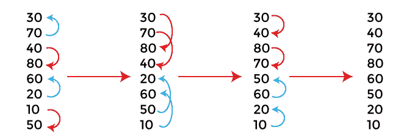
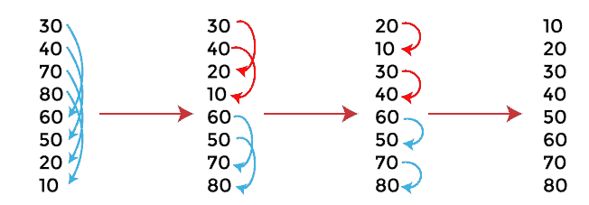

# 双音素排序算法

> 原文：<https://www.javatpoint.com/bitonic-sort>

在本文中，我们将讨论比特排序算法。二进制排序是一种并行排序算法，执行 O(n <sup>2</sup> log n)比较。虽然比较的次数比任何其他流行的排序算法都多，但它对于并行实现来说表现得更好，因为元素是以预定义的顺序进行比较的，而该顺序一定不依赖于正在排序的数据。预定义的序列称为双音素序列。

要理解双音素排序，我们首先要理解**双音素序列**。

在**双音素序列中，**元素首先以递增的顺序排列，然后在某个特定的索引之后，它们开始递减。

如果有一个索引 I，那么一个 A[0…i…n-1]的数组被称为是双调和的

```

A[0] < A[1] < A[2] .... A[i-1] < A[i] > A[i+1] > A[i+2] > A[i+3] > ... >A[n-1]

```

其中，0 ≤ i ≤ n-1。

在直接进入二进制排序算法之前，首先，了解任何随机序列到二进制序列的转换。

## 如何将随机序列转换成双音序列？

考虑序列 A[ 0...n-1]个元素。首先，使用序列的 4 个元素开始构建一个 Bitonic 序列。按照升序对前 2 个元素进行排序，按照降序对后 2 个元素进行排序，将这一对元素连接起来，形成一个包含 4 个元素的 Bitonic 序列。对剩余的元素对重复这个过程，直到我们找到一个双音素序列。

让我们通过一个例子来理解将随机序列转换成双音素序列的过程。

假设数组的元素是- **{30，70，40，80，60，20，10，50}**



转换后，我们得到的双音序列是-

**30、40、70、80、60、50、20、10**

现在，进入执行双音素排序的步骤。

### 执行双音素排序的步骤

用于执行双音素排序的步骤如下-

1.  在第一步中，我们必须从给定的随机序列中创建双离子序列，就像我们在上面所做的那样。它被认为是这个过程的第一步。在这一步之后，我们将得到一个序列，其中前半部分的元素按升序排列，而后半部分的元素按降序排列。
2.  现在，在第二步中，我们必须将前半部分的第一个元素与后半部分的第一个元素进行比较，然后将前半部分的第二个元素与后半部分的第二个元素进行比较，以此类推。在这里，如果发现后半部分的任何元素更小，我们必须交换元素。
3.  经过上面的步骤，我们得到了前半部分的所有元素比后半部分的所有元素都小。比较和交换结果为两个 n/2 长度的序列。对每个序列递归地重复第二步中执行的过程，直到我们得到一个长度为 n 的排序序列。

现在，让我们用一个例子来看看 bitonic 排序的整个过程。用一个例子来理解双音素排序会更容易，因为它使解释更清楚、更容易。

在下面的例子中，我们使用上面给出的从随机序列中创建的双音素序列。



现在，给定的数组已经完全排序。

## 双音素排序复杂性

现在，让我们看看在最好的情况下，平均情况下和最坏的情况下，双音素排序的时间复杂度。我们也将看到双离子排序的空间复杂性。

### 1.时间复杂性

| 情况 | 时间复杂性 |
| **最佳情况** | O(log <sup>2</sup> n) |
| **平均情况** | O(log <sup>2</sup> n) |
| **最坏情况** | O(log <sup>2</sup> n) |

在所有三种情况下，双音素排序的时间复杂度都是 **O(log <sup>2</sup> n)** 。

### 2.空间复杂性

| **空间复杂度** | O(n 对数 <sup>2</sup> n) |
| **稳定** | 不 |

*   双音素排序的空间复杂度为 **O(n log <sup>2</sup> n)** 。

## 双音素排序的实现

现在，让我们看看不同编程语言中的 Bitonic 排序程序。

**程序:**写一个用 C 语言实现二进制排序的程序。

```

/* This program works only when the size of input is in the power of 2\. */
#include /*In this function the parameter 'd' represents the sorting direction*/
void exchange(int a[], int i, int j, int d)  
{  
    int temp;  
    if (d==(a[i]>a[j]))  
    {  
        temp = a[i];  
        a[i] = a[j];  
        a[j] = temp;  
    }  
}  
void merge(int a[], int beg, int c, int d)  
{  
    int k, i;  
    if (c > 1)  
    {  
        k = c/2;  
        for (i = beg; i < beg+k; i++)  
            exchange(a, i, i+k, d);  
        merge(a, beg, k, d);  
        merge(a, beg+k, k, d);  
    }  
}  
void bitonicSort(int a[],int beg, int c, int d)  
{  
    int k;  
    if (c>1)  
    {  
        k = c/2;  
        bitonicSort(a, beg, k, 1);  // sort in ascending order
        bitonicSort(a, beg+k, k, 0);  // sort in descending order
        merge(a,beg, c, d);  //merge the sequence in ascending order
    }  
}  

/* function to call the bitonicSort() function to sort the given array in ascending order */
void sort(int a[], int n, int order)  
{  
    bitonicSort(a, 0, n, order);  
}  
 void print(int a[], int n) //function to print array elements
    {
    int i;
    for(i = 0; i < n; i++)  
    {  
        printf("%d ",a[i]);  
    }      
    }

int main()  
{  
    int a[]= {30, 70, 40, 80, 60, 20, 10, 50};  
    int n = sizeof(a)/sizeof(a[0]); 
    int order = 1; //It means sorting in increasing order 
    printf("Before sorting array elements are - \n");
    print(a, n);
    sort(a, n, order);  
    printf("\nAfter sorting array elements are - \n");  
    print(a, n);
    return 0;
} 
```

**输出**

执行上述代码后，输出将是-


**程序:**编写一个程序，在 C++中实现二进制排序。

```

/* This program works only when the size of input is in the power of 2\. */
#include 

using namespace std;

/*In this function the parameter 'd' represents the sorting direction*/
void exchange(int a[], int i, int j, int d)  
{  
    int temp;  
    if (d==(a[i]>a[j]))  
    {  
        temp = a[i];  
        a[i] = a[j];  
        a[j] = temp;  
    }  
}  
void merge(int a[], int beg, int c, int d)  
{  
    int k, i;  
    if (c > 1)  
    {  
        k = c/2;  
        for (i = beg; i < beg+k; i++)  
            exchange(a, i, i+k, d);  
        merge(a, beg, k, d);  
        merge(a, beg+k, k, d);  
    }  
}  
void bitonicSort(int a[],int beg, int c, int d)  
{  
    int k;  
    if (c>1)  
    {  
        k = c/2;  
        bitonicSort(a, beg, k, 1);  // sort in ascending order
        bitonicSort(a, beg+k, k, 0);  // sort in descending order
        merge(a,beg, c, d);  //merge the sequence in ascending order
    }  
}  

/* function to call the bitonicSort() function to sort the given array in ascending order */
void sort(int a[], int n, int order)  
{  
    bitonicSort(a, 0, n, order);  
}  
 void print(int a[], int n) //function to print array elements
    {
    int i;
    for(i = 0; i < n; i++)  
    {  
        cout<
```

**输出**

执行上述代码后，输出将是-


**程序:**写一个用 C#实现二进制排序的程序。

```

/* This program works only when the size of input is in the power of 2\. */
using System;
class BitonicSort {

/*In this function the parameter 'd' represents the sorting direction*/
static void exchange(int[] a, int i, int j, int d)  
{  
    int temp;  
           if ( (a[i] > a[j] && d == 1) || (a[i] < a[j] && d == 0))
    {  
        temp = a[i];  
        a[i] = a[j];  
        a[j] = temp;  
    }  
}  
static void merge(int[] a, int beg, int c, int d)  
{  
    int k, i;  
    if (c > 1)  
    {  
        k = c/2;  
        for (i = beg; i < beg+k; i++)  
            exchange(a, i, i+k, d);  
        merge(a, beg, k, d);  
        merge(a, beg+k, k, d);  
    }  
}  
static void bitonicSort(int[] a ,int beg, int c, int d)  
{  
    int k;  
    if (c>1)  
    {  
        k = c/2;  
        bitonicSort(a, beg, k, 1);  // sort in ascending order
        bitonicSort(a, beg+k, k, 0);  // sort in descending order
        merge(a,beg, c, d);  //merge the sequence in ascending order
    }  
}  

/* function to call the bitonicSort() function to sort the given array in  
ascending order */
static void sort(int[] a, int n, int order)  
{  
    bitonicSort(a, 0, n, order);  
}  
 static void print(int[] a, int n) //function to print array elements
    {
    int i;
    for(i = 0; i < n; i++)  
    {  
        Console.Write(a[i] + " ");  
    }      
    }

static void Main() { 
    int[] a= {19, 59, 29, 69, 49, 9, 4, 39};  
    int n = a.Length; 
    int order = 1; //It means sorting in increasing order 
    Console.Write("Before sorting array elements are - \n");
    print(a, n);
    sort(a, n, order);  
    Console.Write("\nAfter sorting array elements are - \n");  
    print(a, n);
}
}

```

**输出**

执行上述代码后，输出将是-


**程序:**写一个用 Java 实现二进制排序的程序。

```

/* This program works only when the size of input is in the power of 2\. */
class BitonicSort {

/*In this function the parameter 'd' represents the sorting direction*/
static void exchange(int a[], int i, int j, int d)  
{  
    int temp;  
           if ( (a[i] > a[j] && d == 1) || (a[i] < a[j] && d == 0))
    {  
        temp = a[i];  
        a[i] = a[j];  
        a[j] = temp;  
    }  
}  
static void merge(int a[], int beg, int c, int d)  
{  
    int k, i;  
    if (c > 1)  
    {  
        k = c/2;  
        for (i = beg; i < beg+k; i++)  
            exchange(a, i, i+k, d);  
        merge(a, beg, k, d);  
        merge(a, beg+k, k, d);  
    }  
}  
static void bitonicSort(int a[] ,int beg, int c, int d)  
{  
    int k;  
    if (c>1)  
    {  
        k = c/2;  
        bitonicSort(a, beg, k, 1);  // sort in ascending order
        bitonicSort(a, beg+k, k, 0);  // sort in descending order
        merge(a,beg, c, d);  //merge the sequence in ascending order
    }  
}  

/* function to call the bitonicSort() function to sort the given array in 

ascending order */
static void sort(int a[], int n, int order)  
{  
    bitonicSort(a, 0, n, order);  
}  
 static void print(int a[], int n) //function to print array elements
    {
    int i;
    for(i = 0; i < n; i++)  
    {  
        System.out.print(a[i] + " ");  
    }      
    }

public static void main(String args[]) { 
    int[] a= {20, 60, 30, 70, 50, 10, 5, 40};  
    int n = a.length; 
    int order = 1; //It means sorting in increasing order 
    System.out.print("Before sorting array elements are - \n");
    print(a, n);
    sort(a, n, order);  
    System.out.print("\nAfter sorting array elements are - \n");  
    print(a, n);
}
}

```

**输出**

执行上述代码后，输出将是-


所以，这就是文章的全部内容。希望文章对你有所帮助和启发。

* * *