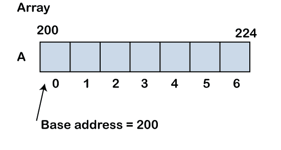
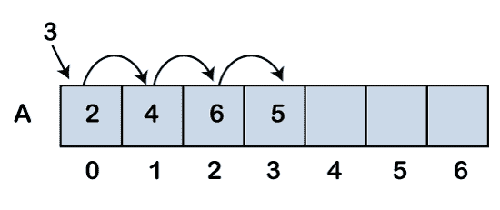
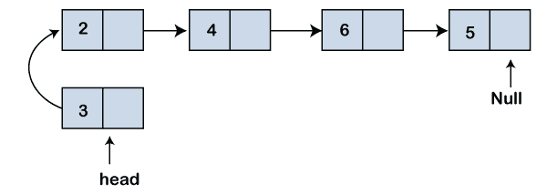
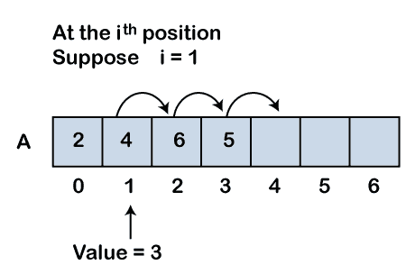
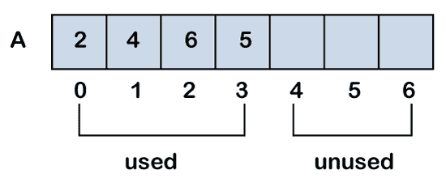

# 数组与链表

> 原文：<https://www.javatpoint.com/ds-array-vs-linked-list>

**数组**和**链表**是组织内存中数据的两种方式。在了解**数组**和**链表**的区别之前，我们先看一下**的一个数组**和**的一个链表**。

### 什么是数组？

一个[数组](https://www.javatpoint.com/data-structure-array)是一个包含相同类型元素的[数据结构](https://www.javatpoint.com/data-structure-tutorial)。数据结构是组织数据的一种方式；数组是一种数据结构，因为它按顺序组织数据。数组是一大块内存，内存被分成小块，每个块都能够存储一些值。

假设我们创建了一个由 10 个值组成的数组，那么每个块将存储一个整数类型的值。如果我们试图将该值存储在不同类型的数组中，那么它不是一个正确的数组，并且会引发编译时错误。

### 数组声明

**一个数组可以声明为:**

```

data_type name of the array[no of elements] 

```

要声明一个数组，我们首先需要指定数组的类型，然后指定数组的名称。在方括号内，我们需要指定数组应该包含的元素数量。

**我们通过一个例子来了解一下。**

```

int a[5];

```

在上面的例子中，我们已经声明了一个由 5 个元素组成的数组，数组中有一个名为**整数**的数据类型。

### 什么是链表？

链表是随机存储的节点的集合。每个节点由两个字段组成，即**数据**和**链接**。这里，数据是存储在特定节点的值，链接是保存下一个节点地址的指针。

### 数组和链表的区别


我们不能说哪个数据结构更好，即数组还是[链表](https://www.javatpoint.com/singly-linked-list)。有可能一种数据结构更适合一种需求，而另一种数据结构更适合另一种需求。有各种因素，如对数据结构执行的频繁操作或数据的大小，以及选择数据结构的其他因素。现在我们将看到数组和基于一些参数的链表之间的一些区别。

### 1.访问元素的成本

在数组的情况下，不管数组的大小如何，数组访问一个元素需要一个恒定的时间。在数组中，元素以连续的方式存储，所以如果我们知道元素的基址，那么我们就可以很容易地得到数组中任何元素的地址。我们需要执行一个简单的计算来获得数组中任何元素的地址。因此，就时间复杂度而言，访问数组中的元素是 **O(1)** 。



在链表中，元素不是以连续的方式存储的。它由多个块组成，每个块表示为一个节点。每个节点有两个字段，即一个用于数据字段，另一个存储下一个节点的地址。为了找到链表中的任何节点，我们首先需要确定第一个节点，称为头节点。如果我们必须找到列表中的第二个节点，那么我们需要从第一个节点开始遍历，在最坏的情况下，为了找到最后一个节点，我们将遍历所有节点。访问元素的平均情况是 O(n)。

我们得出结论，访问数组中的元素的成本低于链表。因此，如果我们对访问元素有任何要求，那么数组是更好的选择。

### 2.插入元素的成本

**插入可以有三种情况:**

*   **在开头插入元素:**要在开头插入新元素，我们首先需要向右移动元素，在第一个位置创建一个空格。因此，时间复杂度将与列表的大小成正比。如果 n 是数组的大小，时间复杂度就是 O(n)。



在链表的情况下，为了在链表的开头插入一个元素，我们将创建一个新节点，第一个节点的地址被添加到新节点中。这样，新节点就成为第一个节点。因此，时间复杂度与列表的大小不成正比。时间复杂度将是恒定的，即 0(1)。



*   **在末端插入一个元素**

如果数组没有满，那么我们可以通过索引直接添加新元素。在这种情况下，时间复杂度将是常数，即 O(1)。如果数组已满，我们首先需要将数组复制到另一个数组中，并添加一个新元素。在这种情况下，时间复杂度为 0(n)。

为了在链表的末尾插入一个元素，我们必须遍历整个链表。如果链表由 n 个元素组成，那么时间复杂度就是 O(n)。

*   **在中间插入一个元素**

假设我们想在数组的第 i <sup>个</sup>位置插入元素；我们需要向右移动 n/2 元素。因此，时间复杂度与元素数量成正比。对于一般情况，时间复杂度为 0(n)。



在链表的情况下，我们必须遍历到插入新元素的位置。尽管如此，我们不必执行任何类型的移动，但是我们必须遍历到 n/2 位置。所花费的时间与 n 个元素成正比，平均情况下的时间复杂度为 O(n)。


**结果链表为:**


*   **易用性**

与链表相比，数组的实现很容易。使用链表创建程序时，程序更容易出现错误，如分段错误或内存泄漏。因此，在链表中创建程序时需要非常小心。

*   **大小动态**

链表的大小是动态的，而数组是静态的。这里，静态并不意味着我们不能在运行时决定大小，但是一旦决定了大小，我们就不能改变它。

### 3.内存需求

由于数组中的元素存储在一个连续的内存块中，因此数组的大小是固定的。假设我们有一个大小为 7 的数组，并且该数组由 4 个元素组成，那么剩余的空间是未使用的。7 个元素占用的内存:



**内存空间= 7*4 = 28 字节**

其中 7 是数组中的元素数，4 是整数类型的字节数。

在链表的情况下，没有未使用的内存，但是额外的内存被指针变量占用。如果数据是整数类型，则一个节点占用的总内存为 8 字节，即数据为 4 字节，指针变量为 4 字节。如果链表由 4 个元素组成，那么链表占用的内存空间将是:

**内存空间= 8*4 = 32 字节**

如果数据部分的大小较大，链表将是更好的选择。假设数据是 16 字节。数组占用的内存空间是 16*7=112 字节，而链表占用 20*4=80 字节，这里我们指定 20 字节为数据大小的 16 字节加上指针变量的 4 字节。如果我们选择较大的数据，那么链表将消耗较少的内存；否则，这取决于我们用来确定规模的因素。

**我们用表格的形式来看看数组和链表的区别。**

| 排列 | 合框架 |
| 数组是类似数据类型的元素的集合。 | 链表是被称为节点的对象的集合，其中节点由两部分组成，即数据和地址。 |
| 数组元素存储在一个连续的内存位置。 | 链表元素可以存储在内存中的任何地方，也可以随机存储。 |
| 数组使用静态内存。这里静态内存意味着内存大小是固定的，在运行时不能改变。 | 链表使用动态内存。在这里，动态内存意味着可以根据我们的要求在运行时更改内存大小。 |
| 数组元素相互独立。 | 链表元素相互依赖。由于每个节点都包含下一个节点的地址，因此要访问下一个节点，我们需要访问它的前一个节点。 |
| 数组在执行插入、删除等操作时需要更多的时间。 | 在执行插入、删除等操作时，链表花费的时间更少。 |
| 访问数组中的任何元素都更快，因为可以通过索引直接访问数组中的元素。 | 从链表的第一个元素开始遍历，访问链表中的一个元素会比较慢。 |
| 就数组而言，内存是在编译时分配的。 | 对于链表，内存是在运行时分配的。 |
| 阵列中的内存利用率很低。例如，如果数组的大小是 6，并且数组只包含 3 个元素，那么剩余的空间将不会被使用。 | 在链表的情况下，内存利用率是有效的，因为内存可以根据我们的要求在运行时分配或释放。 |

* * *