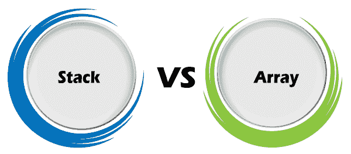

# 堆栈与阵列

> 原文：<https://www.javatpoint.com/ds-stack-vs-array>

数据结构是一种组织数据并以规定的格式存储数据的方式，以便能够以有效的方式访问和修改数据。数据结构基本上提供了存储数据的逻辑表示，以便可以对数据执行各种操作。存储和检索数据有多种方式，但堆栈和数组是存储数据的两种最常见方式。虽然堆栈可以借助数组来实现，但这两者是有区别的。主要的区别是访问。

**我们先分别了解这两种数据结构，然后再来看看这两种数据结构的区别。**

### 什么是 Stack？

一个[栈](https://www.javatpoint.com/data-structure-stack)是一个线性列表[数据结构](https://www.javatpoint.com/data-structure-tutorial)有一个元素的顺序集合，其中元素被添加在栈顶，像一堆堆的书，等等。可以添加新项目，也可以仅从堆栈顶部移除现有项目。堆栈被视为动态数据结构，因为堆栈的大小可以在运行时更改。这两个操作可以在堆栈上执行，即推送和弹出。这里，push 操作意味着一个新的项目被插入到堆栈中，而 pop 操作意味着现有的项目被从堆栈中移除。严格遵循 ***后进先出*** (后进先出)原则，最近增加的项目先移除，最先增加的项目最后移除。

**堆栈的表示如下:**

### 什么是数组？

[数组](https://www.javatpoint.com/data-structure-array)是一种线性数据结构，包含相似数据类型的元素集合。数组的大小是预先决定的，存储值的位置称为值的索引。它是一种静态数据结构，因为内存是在编译时分配的，并且在整个程序中是固定的。这是存储属于同一数据类型的多个元素的有效方法之一。它用于存储多个相同类型的值，我们可以通过索引来访问它们。它提供随机访问，其中所有元素都是线性存储的，并且直接通过索引访问。

### 堆栈和数组的区别

**以下是堆栈和数组的区别:**

*   **定义**
    Stack 是一种线性数据结构，可以定义为以书堆形式排列的项目集合。它是元素的顺序集合，排列方式使得元素只能从一端添加和移除，即堆叠顶部的**。相比之下，数组是一种随机存取数据结构，用于存储相似数据类型的多个元素，以降低程序的复杂性。在数组中，我们可以通过索引直接访问任何元素，所有的元素都被一个接一个地存储起来，以实现高效的内存管理。**
***   **数据类型**
    Stack 是一种抽象数据类型，是可以存储异构数据的对象的顺序集合。在这里，异构数据意味着各种类型的数据可以存储在堆栈中。这是一种有限访问的数据结构，意味着可以按照特定的顺序插入或移除元素。换句话说，我们可以说只有栈顶元素可以被访问。相比之下，数组是一种存储同类数据的线性数据结构。同构数据意味着相似类型的数据只能存储在数组中。在数组中，访问不受限制，因为我们可以通过索引访问任何元素。*   **工作原理**
    栈是遵循**后进先出**(后进先出)的线性数据结构。LIFO 这个名字本身就暗示着最后添加的元素会先被移除，或者换句话说，我们可以说最先插入的元素会最后被移除。相比之下，在数组中，无论元素的顺序如何，都可以随时访问任何元素。*   **大小**
    堆栈是一种动态数据结构，意味着堆栈的大小可以在运行时增长或收缩。相比之下，数组的大小是固定的，不能在运行时修改。**

 ****我们用表格的形式来看看堆栈和数组的区别。**

| 排列 | 堆 |
| 它是一种数据结构，由通过索引标识的元素集合组成，其中第一个索引在索引 0 处可用。 | 它是一种抽象数据类型，由实现后进先出原则的元素集合组成。 |
| 它是相同数据类型的元素的集合。 | 它是不同数据类型元素的集合。 |
| 它提供随机访问，即通过索引对任何位置的任何元素执行读写操作。 | 因为它实现了后进先出法，所以它的访问是有限的。我们可以使用 push 和 pop 操作访问堆栈的唯一顶部元素。 |
| 它有丰富的方法或操作，如排序、遍历、反向、推送、弹出等。 | 有限的操作可以在堆栈上执行，如推送、弹出、查看等。 |
| 它是一种数据类型。它是一种抽象数据类型。 |
| 当我们知道要处理的所有数据，并且需要在任何元素上不断变化时，就会用到它。 | 有动态过程的时候用就好。当我们不知道需要多少数据时，它是有用的。 |

* * ***