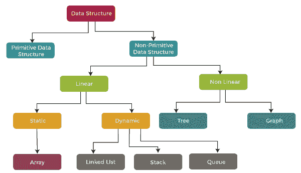
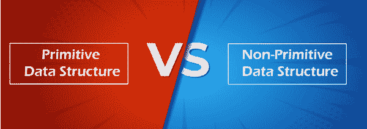

# 原始与非原始数据结构

> 原文：<https://www.javatpoint.com/primitive-vs-non-primitive-data-structure>

数据结构意味着组织内存中的数据。数据可以以两种方式组织，线性或非线性方式。

有两种类型的数据结构可用于编程目的:

*   原始数据结构
*   非原始数据结构

原始数据结构是一种基本类型的数据结构，它只存储一种类型的数据，而非原始数据结构是一种用户定义的数据结构，它将不同类型的数据存储在单个实体中。



在上图中，我们可以观察到数据结构的分类。[数据结构](https://www.javatpoint.com/data-structure-tutorial)分为两种类型，即原始数据结构和非原始数据结构。在原始数据结构的情况下，它包含基本数据类型，如整数、浮点、字符、指针，这些基本数据类型可以保存单一类型的值。例如，整数变量可以保存整数类型的值，浮点变量可以保存浮点类型的值，字符变量可以保存字符类型的值，而指针变量可以保存指针类型的值。

在非原始数据结构的情况下，它分为线性数据结构和非线性数据结构两部分。线性数据结构是一种顺序类型的数据结构，这里的顺序意味着存储器中的所有元素都以顺序的方式存储；例如，存储在第二个元素之后的元素将是第三个元素，存储在第三个元素之后的元素将是第四个元素，以此类推。我们有不同的线性数据结构保存顺序值，如[数组](https://www.javatpoint.com/data-structure-array)、[链表](https://www.javatpoint.com/ds-linked-list)、[堆栈](https://www.javatpoint.com/data-structure-stack)、[队列](https://www.javatpoint.com/data-structure-queue)。

非线性数据结构是一种随机类型的数据结构。非线性数据结构是树和图。

**我们来了解一下原语和非原语数据结构的区别。**



| 原始数据结构 | 非原始数据结构 |
| 原始数据结构是一种只存储一种类型的数据的数据结构。 | 非原始数据结构是一种可以存储多种类型数据的数据结构。 |
| 原始数据结构的例子有整数、字符、浮点。 | 非原始数据结构的例子有数组、链表、栈。 |
| 原始数据结构将包含一些值，即它不能为空。 | 非原始数据结构可以由空值组成。 |
| 大小取决于数据结构的类型。 | 在非原始数据结构的情况下，大小不是固定的。 |
| 它以小写字符开头。 | 它以大写字符开头。 |
| 原始数据结构可用于调用方法。 | 非基元数据结构不能用于调用方法。 |

### 原始数据结构

原始数据结构是可以在特定位置保存单个值的数据结构，而非线性数据结构可以在连续位置或随机位置保存多个值

原始数据结构的例子有浮点、字符、整数和指针。原始数据结构的值由程序员提供。以下是四种基本数据结构:

*   **整数:**整数数据类型包含数值。它包含可以是负数或正数的整数。当整数数据类型的范围不够大时，那么在这种情况下，我们可以使用 long。
*   **Float:**Float 是一种可以保存十进制值的数据类型。当十进制值的精度增加时，则使用双精度数据类型。
*   **布尔值:**它是一种可以保存真值或假值的数据类型。它主要用于检查状况。
*   **字符:**它是一种既可以保存单个字符值又可以保存大小写字母的数据类型，如“A”或“A”。

### 非原始数据结构

非原始数据结构是一种可以在连续或随机位置保存多个值的数据结构。非原始数据类型由程序员定义。非原始数据结构进一步分为两类，即线性和非线性数据结构。

在线性数据结构的情况下，数据按顺序存储，即一个数据接一个数据。当我们从线性数据结构中访问数据时，我们只需要从一个地方开始，就会发现序列中的其他数据。

**以下是线性数据结构的类型:**

*   **数组:**数组是一种可以容纳相同类型元素的数据结构。它不能包含不同类型的元素，如带字符的整数。数组中常用的操作是插入、删除、遍历、搜索。

**例如:**

int a[6] = {1，2，3，4，5，6 }；

上面的示例是一个数组，其中包含以连续方式存储的整数类型元素。

*   **字符串:**字符串定义为字符数组。字符数组和字符串的区别在于，字符串数据结构以“空”字符结束，并表示为“\0”。

**字符串数据结构:**

```

char name[100] = "Hello javaTpoint"; 

```

在上面的例子中，字符串的长度是 17，因为最后一个字符是空字符，表示字符串的结束。

**字符表示:**

```

char name[100] = {'H', 'e', 'l','l','o',' ', 'j', 'a', 'v', 'a', 't','p', 'o', 'i', 'n', 't' } 

```

在上面的例子中，字符串的长度是 16，因为它没有任何空字符作为表示终止的最后一个字符。

*   **栈:**栈是遵循**后进先出**原则的数据结构。栈上的所有操作都是从栈顶执行的，比如 PUSH 和 POP 操作。推送操作是将元素插入堆栈的过程，而弹出操作是从堆栈中移除元素的过程。堆栈数据结构可以通过使用数组或链表来实现。
*   **队列:**队列是可以用数组实现的数据结构。堆栈和队列数据结构的区别在于，队列中的元素从后端插入，而队列中的元素从前端移除。

* * *