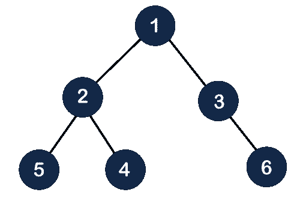
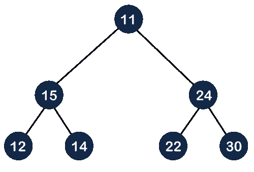
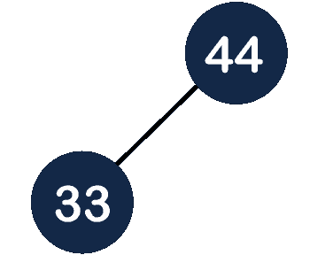
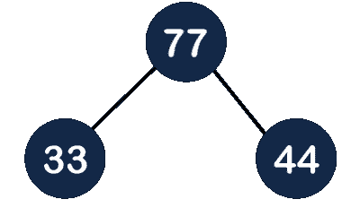
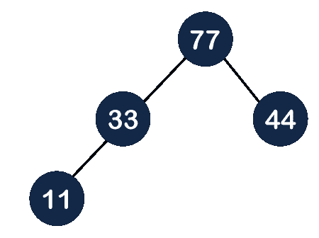
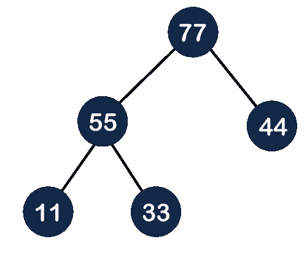
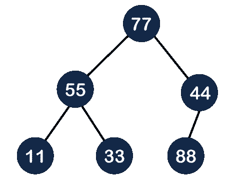

# 堆数据结构

> 原文：<https://www.javatpoint.com/heap-data-structure>

### 什么是堆？

堆是一个完整的二叉树，二叉树是一个节点最多可以有两个子节点的树。在进一步了解堆[数据结构](https://www.javatpoint.com/data-structure-tutorial)之前，我们应该了解完整的二叉树。

### 什么是完全二叉树？

一棵完整的二叉树是一棵[二叉树](https://www.javatpoint.com/binary-tree)，其中除了最后一级，即叶节点之外的所有级别都应该完全填充，所有节点都应该左对齐。

**我们通过一个例子来了解一下。**


在上图中，我们可以观察到，除了叶节点之外，所有的内部节点都被完全填充；因此，我们可以说上面的树是一棵完整的二叉树。



上图显示，除叶节点外，所有内部节点都被完全填充，但叶节点添加在右边部分；因此，上面的树不是一个完整的二叉树。

#### 注意:堆树是一种特殊的平衡二叉树数据结构，其中根节点与其子节点进行比较并相应地排列。

### 我们如何排列树中的节点？

堆有两种类型:

*   最小堆
*   最大堆

**最小堆:**父节点的值应小于或等于其子节点的值。

或者

换句话说，最小堆可以定义为，对于每个节点 I，节点 I 的值大于或等于其父值，根节点除外。数学上，它可以定义为:

**A【家长(I)】<= A【I】**

**我们通过一个例子来理解 min-heap。**



在上图中，11 是根节点，根节点的值小于所有其他节点(左子节点或右子节点)的值。

**最大堆:**父节点的值大于或等于其子节点。

或者

换句话说，最大堆可以定义为每个节点 I；除根节点外，节点 I 的值小于或等于其父值。数学上，它可以定义为:

**A【家长(I)】>= A【I】**


上面的树是最大堆树，因为它满足最大堆的属性。现在，让我们看看最大堆的数组表示。

**最大堆中的时间复杂度**

最大堆中所需的比较总数取决于树的高度。完全二叉树的高度总是 logn 因此，时间复杂度也将是 0(logn)。

**最大堆中插入操作的算法。**

```

// algorithm to insert an element in the max heap.
insertHeap(A, n, value)
{
n=n+1; // n is incremented to insert the new element
A[n]=value; // assign new value at the nth position
i = n; // assign the value of n to i
// loop will be executed until i becomes 1\. 
while(i>1) 
{
parent= floor value of i/2; // Calculating the floor value of i/2
// Condition to check whether the value of parent is less than the given node or not 
if(A[parent]
```

**我们通过一个例子**来了解最大堆。

在上图中，55 是父节点，它大于它的两个子节点，11 是 9 和 8 的父节点，所以 11 也大于它的两个子节点。因此，我们可以说上面的树是一个最大堆树。

**插入堆树**

**44、33、77、11、55、88、66**

假设我们想要创建最大堆树。要创建最大堆树，我们需要考虑以下两种情况:

*   首先，我们必须以这样一种方式插入元素，即必须保持完整二叉树的属性。
*   其次，父节点的值应该大于其子节点的值。

**步骤 1:** 首先我们在树中添加 44 元素，如下所示:


**第二步:**下一个元素是 33。我们知道，二叉树中的插入总是从左侧开始，因此 44 将被添加到 33 的左侧，如下所示:



**第三步:**下一个元素是 77，它将被添加到 44 的右边，如下所示:


正如我们在上面的树中可以观察到的，它不满足最大堆属性，即父节点 44 小于子节点 77。因此，我们将交换这两个值，如下所示:



**第四步:**下一个元素是 11。节点 11 被添加到 33 的左侧，如下所示:



**第五步:**下一个元素是 55。为了使它成为一个完整的二叉树，我们将在 33 的右边添加节点 55，如下所示:


从上图中我们可以看到，它不满足 max 堆的属性，因为 33<55，所以我们将交换这两个值，如下所示:



**第六步:**下一个元素是 88。左边的子树完成了，所以我们将在 44 的左边添加 88，如下所示:



从上图中我们可以看到，它不满足 max heap 的属性，因为 44<88，所以我们将交换这两个值，如下所示:

同样，它违反了 max heap 属性，因为 88>77，所以我们将交换这两个值，如下所示:

**第七步:**下一个元素是 66。为了创建一个完整的二叉树，我们将在 77 的右侧添加 66 元素，如下所示:

在上图中，我们可以观察到树满足 max heap 的性质；因此，它是一个堆树。

**堆树中的删除**

在堆树的删除中，根节点总是被删除，并用最后一个元素替换。

**我们通过一个例子来理解删除。**

**第一步**:在上面的树中，从树中删除前 30 个节点，并替换为 15 个元素，如下图所示:

现在我们要把树堆起来。我们将检查 15 是否大于它的任何一个子级。15 小于 20，因此我们将交换这两个值，如下所示:

同样，我们将把 15 和它的孩子进行比较。因为 15 大于 10，所以不会发生交换。

**堆积树的算法**

```

MaxHeapify(A, n, i)
{
int largest =i;
int l= 2i;
int r= 2i+1;
while(l<=n && A[l]>A[largest])
{
largest=l;
}
while(r<=n && A[r]>A[largest])
{
largest=r;
} 
if(largest!=i)
{
swap(A[largest], A[i]);
heapify(A, n, largest);
}}

```

* * *