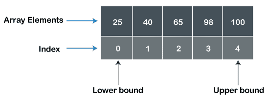
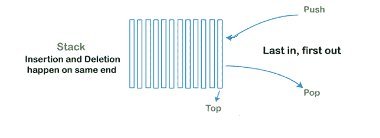
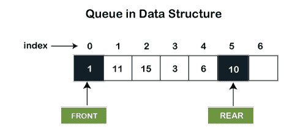
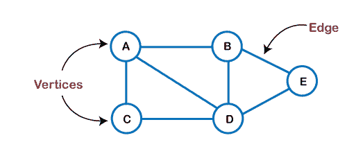
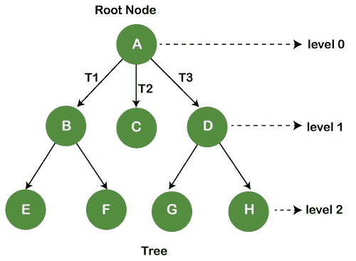
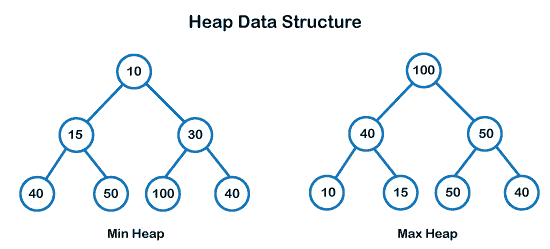
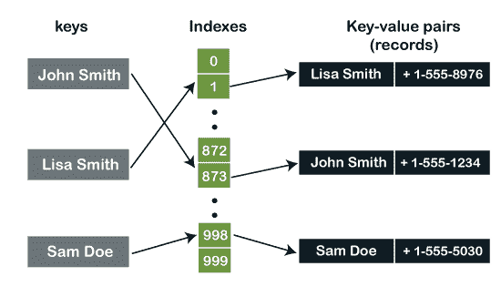

# 数据结构的基础

> 原文：<https://www.javatpoint.com/fundamental-of-the-data-structure>

数据结构是一种专门的数据格式，用于排列和存储数据，以便任何用户都可以轻松地访问和处理适当的数据，从而高效地运行程序。计算机内存数据可以用逻辑或数学方法组织，这个过程被称为**数据结构**。一般来说，选择特定的数据格式取决于两个因素。数据必须足够丰富，以满足现实世界中数据的真实关系。另一方面，[数据结构](https://www.javatpoint.com/data-structure-tutorial)应该非常简单，在需要使用的时候可以轻松处理数据。

### 数据结构的特征

数据结构的特征如下:

1.  **Linear:** 一个 Linear 描述数据项是否像数组一样按顺序排列的数据特征。
2.  **非线性:**非线性数据结构描述了不像树、图那样以顺序形式出现的数据项的特征。
3.  **Static:** 它是一种静态数据结构，描述了在编译时与固定的内存位置相关联的数据项集合的大小和结构。示例-数组。
4.  **同质:**是表示所有元素的数据类型是否相同的数据结构的特征。示例-数组。
5.  **非同质性:**它是数据结构的一个特征，表示数据类型元素是否相同。
6.  **Dynamic:** 它是一种动态数据结构，定义了数据项在运行时或程序执行时的收缩和扩展。它还与内存位置的利用率有关，内存位置可以在程序运行时更改。示例:链表。
7.  它有一些定义数据项如何相互关联的规则。
8.  它定义了一些规则来显示数据项之间的关系以及它们之间的交互方式。
9.  它有一些用于对数据项执行的操作，如插入、搜索、删除等。
10.  它有助于减少内存资源的使用。
11.  **时间复杂度:**数据结构中程序的执行时间应该尽可能的最短。
12.  **空间复杂度:**数据结构中所有数据项的内存使用应该是比较少的。

### 数据结构的基本操作

一些基本功能是根据数据结构中出现的所有类型的数据来选择的。

1.  **遍历:**用于访问每个变量一次。它也被称为数据结构中的访问元素。
2.  **搜索:**用于查找给定元素在整个数据结构中的位置。例如，一个数组。
3.  **插入:**用于在数据元素中的指定位置插入元素。
4.  **删除:**删除操作用于从指定位置删除元素。
5.  **排序:**用于对数据元素进行升序或降序排列或排序。但是，数据项是以某种逻辑顺序排列的，如名称关键字、帐号等。
6.  **合并:**合并操作用于将两个或多个排序后的数据元素连接到一个数据结构中。

### 数据结构的需求

数据是用于计算或操作的基本事实或实体信息。数据结构中使用两种类型的数据，如数字数据和字母数字数据。这些数据结构指定了经历某种功能的数据项的性质。整数和浮点是数字数据类型的类型。数据可以是单一的，也可以是以特定方式组织的一组值。数据组织导致在数据项之间创建逻辑关系的内存，并使得使用数据结构成为必要。

### 数据结构的优势

数据结构有一些优点:

1.  **效率**:程序的效率和组织取决于选择正确的数据结构。假设我们想从一组数据记录中搜索一个特定的项目。在这种情况下，我们的数据应该被组织在**线性**中，就像一个有助于执行顺序搜索的数组，比如一个元素接一个元素。然而，它是高效的，但更耗费**时间**，因为我们需要排列所有元素，然后搜索每个元素。因此，我们在数据结构中选择了一个更好的选项，使搜索过程更加高效，就像二叉查找树、选择或哈希表一样。
2.  **可重用性**:在数据结构中，很多操作使得程序可重用。例如，当我们编写程序或实现特定的数据结构时，我们可以从任何源位置或地方使用它来获得相同的结果。
3.  **抽象**:数据结构由 ADT 维护，提供不同层次的抽象。客户端只能通过接口与数据结构进行交互。
4.  数据结构有助于简化通过软件系统收集数据的过程。
5.  它用于将采集数据存储在计算机上，供各种程序使用。

### 数据结构的缺点

1.  对数据结构的功能有深入了解的用户可以对其进行更改。
2.  如果数据结构有错误，专家可以检测出 bug 原始用户无法帮助自己解决问题并修复它。

以下是数据结构，其用途如下:

**[数组](https://www.javatpoint.com/data-structure-array) :** 数组数据结构是用于将数据存储在连续内存位置的相同数据类型元素的集合。它有一个固定大小的数据元素集合，在程序运行时不能更改。它主要用于计算机程序中组织数据，以便在系统中可以方便地搜索或排序相关的项目或值。

**[链表](https://www.javatpoint.com/singly-linked-list) :** 它是称为节点的数据链路的集合，其中每个节点包含一个数据值和下一个链路的地址。链表的所有元素不存储在相邻的存储单元中。简而言之，它是通过链接连接的一系列数据节点。**列表的每个**节点由两项组成:在数据结构中使用链表的基本思想是，结构中的每个节点都包括一个数据部分，我们在其中存储值，指针指示可以找到下一个节点。链表的起点表示列表的**头**，端点表示节点的**尾**。

**[栈](https://www.javatpoint.com/data-structure-stack) :** 它是一种线性数据结构，能够从一端插入和删除元素，称为**栈顶** (TOS)。堆栈数据结构跟随后进先出(LIFO)操作，从堆栈列表中插入和移除元素。这是一种抽象数据类型，有两种可能的操作来插入和删除堆栈中的元素:**推送**和**弹出**。堆栈中使用**推送**操作在列表顶部插入元素，隐藏列表中已经可用的元素，或者如果堆栈为空，则初始化堆栈。栈数据结构中使用**弹出**操作从列表顶部删除数据项。

**[队列](https://www.javatpoint.com/data-structure-queue) :** 它是一种线性数据结构，能够在列表的一端插入，称为**后**，而元素的删除发生在列表的另一端，称为**前**。它是基于**先进先出**(先进先出)数据结构的数据元素的顺序集合，这意味着队列中最先插入的元素将首先从队列列表中移除。

这些队列操作描述如下:

1.  **Enqueue()** :是一个队列操作，用于向列表中插入一个元素。
2.  **出列()**:是用于从列表中删除一个项目的队列操作。
3.  **Peek()** :用于获取队列列表的第一个元素，不移除。
4.  **IsFull()** :是 IsFull 操作，表示列表是否已满。
5.  **IsEmpty()** :是一个 IsEmpty 操作，表示列表是否为空。

**[图形](https://www.javatpoint.com/ds-graph) :** 图形是由有限组顶点(**节点**)和**边**组成的非线性数据结构，用于创建一组对象的图解表示。这些边和节点通过图中的任意两个节点连接。连通节点可以表示为有向图或无向图。在**有向**图中，每个节点只与一个方向的边直接相连。在**无向图**中，每个节点都与所有方向的边相连。因此，它也被称为双向节点。

**[树木](https://www.javatpoint.com/tree) :** 是一种[非线性](https://www.javatpoint.com/linear-vs-non-linear-data-structure)数据结构，表示**分层**数据。它是一组有限的元素，其中一个节点或元素被称为**根**节点，数据结构的其余元素由一个名为**子树**的值组成。树的每个节点都保持着父子关系，其中只有一个**父**节点，树中剩下的节点就是**子**节点。一个节点可以有多个子节点，但只有一个父节点。有一些类型的树，如二叉树、二叉查找树树、表达式树、 [AVL 树](https://www.javatpoint.com/avl-tree)和 [B 树](https://www.javatpoint.com/b-tree)。

**堆:** A [堆](https://www.javatpoint.com/heap-sort)数据结构是一种特殊类型的完全二叉树，它满足堆的属性，并以特定的顺序排列元素。**最大**和**最小**堆是堆数据结构的类型。在最大堆中，根节点的值总是高于或等于堆树中所有现有子节点的值。而在最小堆中，根节点/元素的值总是比堆节点的现有元素短。最小堆中每个子节点的值等于或大于父节点的值。

**哈希表:**它是一种非线性类型的数据结构，以键值对的形式保存和组织数据，以访问特定的键/数据元素。键是映射或链接到元素的空值。在对各种数据元素执行插入和搜索操作时，无论数据大小如何，哈希都可以使我们的数据结构变得更加简单和快速。

**字典:**字典是一种将数据元素保存在一组对象中的数据结构，类似于哈希表，只是它是键值对中数据元素的有序或无序集合。每个键都与一个值相关联。当我们检索一个关键字时，字典将返回一个关键字的相关值。

例如，学生= {'James' = 25，' Jasmine' = '17 '，' Rosy = '19 '，' Margret' = '24 '，' Price' = '28'}

* * *