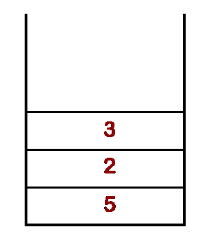
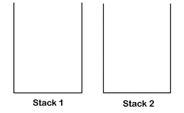
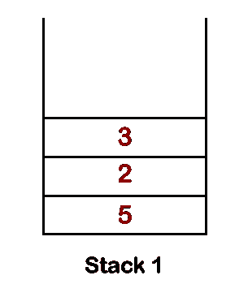
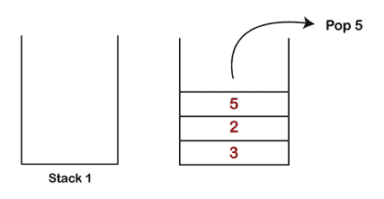
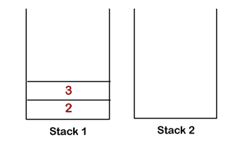
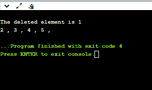

# 使用堆栈实现队列

> 原文：<https://www.javatpoint.com/implementation-of-queue-using-stacks>

[队列](https://www.javatpoint.com/data-structure-queue)是遵循 FIFO ( ***【先进先出】*** )原理的线性数据结构，从后端进行插入，从前端进行删除。堆栈是一种线性的[数据结构](https://www.javatpoint.com/data-structure-tutorial)，遵循后进先出(LIFO)原则，其中插入和删除都是从堆栈顶部执行的。

**我们来了解一下使用栈实现 Queue。**

**假设我们有一个如下所示的队列:**

**现在我们将执行如下所示的三个入队操作:**

**入队(5)；**

**入队(2)；**

**入队(3)；**

执行上述三个入队操作后，队列看起来像:



在上面的[栈](https://www.javatpoint.com/data-structure-stack)中，我们可以观察到最上面的元素是 3。如果我们在上面的堆栈中执行删除操作，那么元素 3 将从堆栈中删除。另一方面，队列中的删除是从前端执行的，前端元素是 5。为了使用堆栈实现队列，我们需要考虑两个堆栈。

假设我们有两个名为 **Stack1** 和 **Stack2** 的堆栈，如下所示:



正如我们可以观察到的，上面的堆栈是空的。现在，我们将对 Stack1 执行推送操作。首先，我们将推 5，然后推 2，最后我们将推元素 3，如下所示:



现在我们将逐个弹出堆栈 1 中的元素，并将它们推入堆栈 2，如下所示:


一旦元素被插入堆栈 2，最上面的元素是 5，因此它将从堆栈 2 中弹出，如下所示:



一旦最上面的元素从堆栈 2 中弹出，所有元素都会从堆栈 2 移回堆栈 1，如下所示:



使用堆栈实现队列有两种方法:

*   使得出列操作代价高昂
*   使得入队操作成本很高

**第一种方法:使出列操作代价高昂**

如果我们通过使出列操作代价高昂来使用 Stack 实现 Queue，则意味着入列操作的时间复杂度将是 ***O(1)*** ，出列操作的时间复杂度将是 ***O(n)*** 。

在这种情况下，当我们在堆栈中插入元素时，这些元素被添加到堆栈的顶部，因此需要 O(1)个时间。

在出列操作的情况下，我们需要考虑两个名为 Stack1 和 Stack2 的堆栈。首先，我们在堆栈中插入元素，然后从堆栈中移除所有元素。一旦所有元素从堆栈中弹出，它们就会被添加到堆栈中。最上面的元素将从 Stack2 中弹出，然后 Stack2 中的所有元素都被移回 Stack1。这里，对数据执行两次出列操作，因此时间复杂度为 O(n)。

C 语言中的实现

```

// Program to implement Queue using Stack in C.
#include #define N 5
int stack1[5], stack2[5]; // declaration of two stacks
// declaration of top variables.
int top1=-1, top2=-1; 
int count=0;
// inserting the elements in stack1.
void push1(int data)
{
// Condition to check whether the stack1 is full or not.  
 if(top1==N-1)
{
   printf("\n Stack is overflow...");
}
else
{
   top1++;   // Incrementing the value of top1
   stack1[top1]=data;  // pushing the data into stack1
}
}
// Removing the elements from the stack1.
int pop1()
{
// Condition to check whether the stack1 is empty or not.  
if(top1==-1)
{
   printf("\nStack is empty..");
}
else
{
   int a=stack1[top1];  // Assigning the topmost value of stack1 to 'a' variable. 
   top1--;  // decrementing the value of top1.
   return a; 
}
} 
// pushing the data into the stack2.
void push2(int x)
{
//  Condition to check whether the stack2 is full or not
if(top2==N-1)
{
   printf("\nStack is full..");
}
else
{
    top2++;   // incrementing the value of top2.
    stack2[top2]=x;  // assigning the 'x' value to the Stack2

}
} 
// Removing the elements from the Stack2
int pop2()
{
   int element = stack2[top2];  // assigning the topmost value to element
   top2--;  // decrement the value of top2
   return element;
} 
void enqueue(int x)
{
    push1(x);
    count++;
}
void dequeue()
{
   if((top1==-1) && (top2==-1))
{
   printf("\nQueue is empty");
}
else
{
  for(int i=0;i
```

**输出**


**第二种方法:使排队操作代价高昂。**

如果我们通过使入队操作代价高昂来使用 Stack 实现 Queue，这意味着入队操作的时间复杂度将是 ***O(n)*** ，出队操作的时间复杂度将是 ***O(1)*** 。

首先，我们将考虑两个名为 **stack1** 和 **stack2** 的堆栈。在入队操作的情况下，首先从堆栈中弹出所有元素，并将其推入堆栈 2。一旦堆栈 k1 中的所有元素都被推入堆栈 k2，那么新元素就会被添加到堆栈 k1 中。在 stack1 中添加新元素后，所有元素都将从 stack1 移回 stack2。这里，入队操作的时间复杂度为 0(n)。

在堆栈 1 中，最旧的元素将位于堆栈的顶部，因此执行出列操作所需的时间为 0(1)。

**在 C** 中实现

```

#include #define N 5
int stack1[5], stack2[5]; // declaration of two stacks
// declaration of top variables.
int top1=-1, top2=-1; 
int count=0;
// inserting the elements in stack1.
void push1(int data)
{
// Condition to check whether the stack1 is full or not.  
 if(top1==N-1)
{
   printf("\n Stack is overflow...");
}
else
{
   top1++;   // Incrementing the value of top1
   stack1[top1]=data;  // pushing the data into stack1
}
}
// Removing the elements from the stack1.
int pop1()
{
// Condition to check whether the stack1 is empty or not.  
if(top1==-1)
{
   printf("\nStack is empty..");
}
else
{
   int a=stack1[top1];  // Assigning the topmost value of stack1 to 'a' variable. 
   top1--;  // decrementing the value of top1.
   return a; 
}
} 
// pushing the data into the stack2.
void push2(int x)
{
//  Condition to check whether the stack2 is full or not
if(top2==N-1)
{
   printf("\nStack is full..");
}
else
{
    top2++;   // incrementing the value of top2.
    stack2[top2]=x;  // assigning the 'x' value to the Stack2

}
} 
// Removing the elements from the Stack2
int pop2()
{
   int element = stack2[top2];  // assigning the topmost value to element
   top2--;  // decrement the value of top2
   return element;
} 
// inserting the data into the Queue
void enqueue(int x)
{

        while(top1!=-1)
        {
            push2(pop1());
        }
        push1(x);
         while(top2!=-1)
        {
            push1(pop2());
        }

}
// deleting the data from the Queue
int dequeue()
{
    int element = stack1[top1];
    top1--;
    return element;
 } 
// displaying the data of the Queue
void display()
{
    printf("\n");
   for(int i=top1; i>=0;i--)
  {
     printf("%d , ", stack1[i]);
  }
}
void main()
{
   enqueue(1);
enqueue(2);
   enqueue(3);
   int d  = dequeue();
   printf("\nThe deleted element is %d", d);
   enqueue(4);
  enqueue(5);
  display();
} 
```

**输出**



* * *