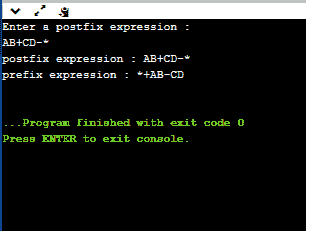

# 后缀到前缀表达式的转换

> 原文：<https://www.javatpoint.com/conversion-of-postfix-to-prefix-expression>

### 什么是后缀表达式？

后缀表达式被称为运算符出现在操作数之后的表达式。它可以写成:

**(操作数)(操作数)(运算符)**

**例如:**

如果表达式为:

(甲+乙)*(丙+丁)

首先，运算符优先级规则将应用于上述表达式。因为括号的优先级高于乘法运算符；因此将首先解析“+”，并且+运算符将出现在 AB 和 CD 之后，如下所示:

(AB+) * (CD+)

现在，乘法运算符将在 CD+之后移动，如下所示:

AB+ CD+*

### 什么是前缀表达式？

前缀表达式被称为运算符出现在操作数之前的表达式。

**例如:**

**如果表达式为:**

**(A+B) * (C+D)**

首先，运算符优先级规则将应用于上述表达式。因为括号的优先级高于乘法运算符；因此，将首先解析“+”运算符，并且“+”运算符将移动到操作数 AB 和 CD 之前，如下所示:

(+AB) * (+CD)

现在，乘法运算符将移动到+AB 之前，如下所示:

*+AB+CD

### 后缀到前缀表达式的转换

**将后缀转换为前缀表达式有两种方式:**

1.  手动将后缀转换为前缀表达式。
2.  使用堆栈将后缀转换为前缀表达式。

**后缀到前缀表达式的手动转换**

**以下是将后缀转换为前缀表达式所需的步骤:**

*   从左到右扫描后缀表达式。
*   从表达式中选择前两个操作数，后跟一个运算符。
*   将其转换为前缀格式。
*   用一个临时变量替换前缀子表达式
*   重复此过程，直到整个后缀表达式转换为前缀表达式。

**我们通过一个例子来了解一下。**

**a b - c +**

首先，我们从左到右扫描表达式。我们将在操作数 ab 之前移动“-”运算符。

-abc+

下一个运算符“+”移动到操作数-abc 之前，如下所示:

+-abc

**使用堆栈将后缀转换为前缀表达式**

以下是使用堆栈将后缀转换为前缀表达式的步骤:

*   从左到右扫描后缀表达式。
*   如果该元素是操作数，则将它推入堆栈。
*   如果元素是运算符，则从堆栈中弹出两个操作数。

通过连接两个操作数并在操作数前添加运算符来创建表达式。

将结果推回到堆栈。

*   重复以上步骤，直到我们到达后缀表达式的末尾。

### 后缀转换为前缀的伪代码

```

Function PostfixToPrefix(string postfix)
1.	Stack s
2.	Loop: i = 0 to postfix.length
2.1 if postfix[i] is operand ->
s.push(postfix[i])

2.2	else if postfix[i] is operator->
op1 = s.top()
s.pop()
op2 = s.top()
s.pop()
expression = postfix[i] + op2 + op1
s.push(expression)
          end loop
         return s.top

```

**我们来了解一下使用堆栈将后缀转换为前缀表达式。**

**如果后缀表达式为:**

**AB + CD - ***

| 符号扫描 | 行动 | 堆 | 描述 |
| A | 将 A 推入堆栈 | A |  |
| B | 将 B 推入堆栈 | AB 型血 |  |
| + | 从堆栈中弹出 B
从堆栈中弹出 A
将+AB 推入堆栈。 | +AB | 从堆栈中弹出两个操作数，即 A 和 b，在操作数 AB 之前加上'+'运算符，即+AB。 |
| C | 将 C 推入堆栈 | +ABC |  |
| D | 将 D 推入堆栈 | +ABCD |  |
| - | 从堆栈中弹出 D。
从堆栈中弹出 C。
将光盘推入堆栈 | +AB -CD | 从堆栈中弹出两个操作数，即 D 和 c。在操作数 CD 之前添加'-'运算符，即-CD。 |
| * | 从堆栈中弹出光盘。
从堆栈中弹出+AB。
将*+AB -CD 推入堆栈。 | *+AB - CD | 从堆栈中弹出两个操作数，即-CD 和+AB。在+AB 之前添加' * '运算符，则表达式将变成*+AB-CD。 |

以上后缀表达式的前缀表达式为*+AB-CD。

### C++中后缀到前缀转换的实现

```

// C++ program to convert postfix to prefix expression.
#include 
#include <stack>using namespace std;
// Checking whether the symbol is operand or not..
bool isOperand(char c)
{
    if((c>='a' && c<='z') || (c>='A' && c<='Z'))
    {
        return true;
    }
    else
    {
        return false;
    }
}
// Converting postfix to prefix expression in C++
string postfixtoprefix(string postfix)
{
    stack <string>s;  // using predefined stack data structure in stl library
   //  executing the loop from 0 till the length of the expression..
   for(int i=0; i< postfix.length(); i++)
    {
        if(isOperand(postfix[i]))  // calling the isOperand() function
        {
            string op(1, postfix[i]);  // converting the char type variable into string type.
            s.push(op);  // Pushing the operand into the stack..
        }
        else
        {
            string op1 = s.top();  // declaration of op1 variable of type string.
            s.pop(); // pop the operand from the stack.
            string op2 = s.top(); // declaration of op2 variable of type string
            s.pop(); // pop the operand from the stack.
            string expression = postfix[i] + op2 + op1;  // concatenating the operands and operator
            s.push(expression); // push the expression into the stack.

        }

    }
    return s.top(); // returning the top of the stack.
}
int main()
{
    string postfix, prefix; // declaration of two variables of type string
    std::cout << "Enter a postfix expression :" << std::endl;
    std::cin >> postfix;
    std::cout << "postfix expression : " << postfix<<:endl prefix="postfixtoprefix(postfix);" calling="" the="" postfixtoprefix="" function="" std::cout="" expression="" :="" std::endl="" return=""/></string></stack>
```

**输出**



* * *