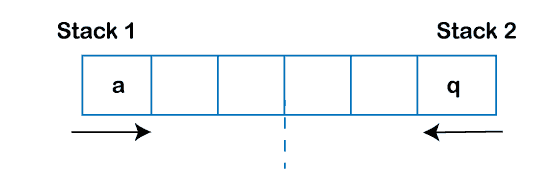
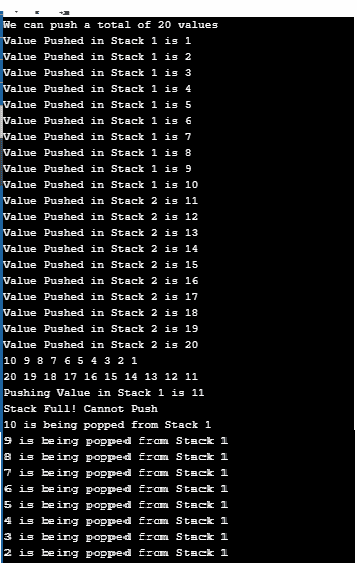

# 在数组中实现两个堆栈

> 原文：<https://www.javatpoint.com/implement-two-stacks-in-an-array>

这里，我们将创建两个堆栈，并且我们将仅使用一个数组来实现这两个堆栈，即两个堆栈将使用相同的数组来存储元素。

**使用一个数组实现两个堆栈有两种方法:**

**第一次进场**

首先，我们将数组分成两个子数组。数组将被分成两个相等的部分。首先，子阵列将被视为堆栈 1，另一个子阵列将被视为堆栈 2。

例如，如果我们有一个 n 等于 8 个元素的数组。该阵列将被分成两个相等的部分，即 4 个大小，如下所示:


第一个子阵列是名为 st1 的堆栈 1，第二个子阵列是名为 st2 的堆栈 2。在 st1 上，我们将执行 push1()和 pop1()操作，而在 st2 上，我们将执行 push2()和 pop2()操作。stack1 从 0 到 n/2，stack2 从 n/2 到 n-1。

如果数组的大小是奇数。例如，一个阵列的大小为 9，那么左子阵列的大小为 4，右子阵列的大小为 5，如下所示:


**使用这种方法的缺点**

即使数组中有空间，也会出现堆栈溢出情况。在上面的例子中，如果我们对 stack1 执行 push1()操作。一旦元素被插入到 3 <sup>rd</sup> 索引处，如果我们试图插入更多的元素，那么即使数组中还有空间，也会导致溢出错误。

**第二次进场**

在这种方法中，我们有一个名为“a”的数组。在这种情况下，stack1 从 0 开始，而 stack2 从 n-1 开始。两个堆栈都从最角落开始，即 Stack1 从最左边的角落开始(索引 0 处)，Stack2 从最右边的角落开始(索引 n-1 处)。Stack1 向右延伸，stack2 向左延伸，如下图所示:

如果我们将“a”推入堆栈 1，将“q”推入堆栈 2，如下所示:



因此，我们可以说这种方法克服了第一种方法的问题。在这种情况下，只有当 **top1 + 1 = top2** 时，才会出现堆栈溢出的情况。这种方法提供了一种节省空间的实现方式，即当数组已满时，只有它会显示溢出错误。相反，第一种方法显示了溢出错误，即使数组没有满。

**在 C** 中实现

**//使用单个数组实现两个堆栈的 C 程序&检查溢出&下溢**

```

#include <stdio.h>
#define SIZE 20
 int array[SIZE];  // declaration of array type variable.
int top1 = -1;
int top2 = SIZE;

//Function to push data into stack1
void push1 (int data)
{
// checking the overflow condition
  if (top1 < top2 - 1)
  {
      top1++;
    array[top1] = data;
  }
  else
  {
    printf ("Stack is full");
  }
}
// Function to push data into stack2
void push2 (int data)
{
// checking overflow condition  
if (top1 < top2 - 1)
  {
    top2--;
    array[top2] = data; 
  }
  else
  {
    printf ("Stack is full..\n");
  }
}

//Function to pop data from the Stack1
void pop1 ()
{
// Checking the underflow condition 
 if (top1 >= 0)
  {
    int popped_element = array[top1];
    top1--;

    printf ("%d is being popped from Stack 1\n", popped_element);
  }
  else
  {
    printf ("Stack is Empty \n");
  }
}
// Function to remove the element from the Stack2
void pop2 ()
{
// Checking underflow condition  
if (top2 < SIZE)
  {
      int popped_element = array[top2];
    top2--;

    printf ("%d is being popped from Stack 1\n", popped_element);
  }
  else
  {
    printf ("Stack is Empty!\n");
  }
}

//Functions to Print the values of Stack1
void display_stack1 ()
{
  int i;
  for (i = top1; i >= 0; --i)
  {
    printf ("%d ", array[i]);
  }
  printf ("\n");
}
// Function to print the values of Stack2
void display_stack2 ()
{
  int i;
  for (i = top2; i < SIZE; ++i)
  {
    printf ("%d ", array[i]);
  }
  printf ("\n");
}

int main()
{
  int ar[SIZE];
  int i;
  int num_of_ele;

  printf ("We can push a total of 20 values\n");

  //Number of elements pushed in stack 1 is 10
  //Number of elements pushed in stack 2 is 10

// loop to insert the elements into Stack1  
for (i = 1; i <= 10; ++i)
  {
    push1(i);
    printf ("Value Pushed in Stack 1 is %d\n", i);
  }
// loop to insert the elements into Stack2\.  
for (i = 11; i <= 20; ++i)
  {
    push2(i);
    printf ("Value Pushed in Stack 2 is %d\n", i);
  }

  //Print Both Stacks
  display_stack1 ();
 display_stack2 ();

  //Pushing on Stack Full
  printf ("Pushing Value in Stack 1 is %d\n", 11);
  push1 (11);

  //Popping All Elements from Stack 1
  num_of_ele = top1 + 1;
  while (num_of_ele)
  {
    pop1 ();
    --num_of_ele;
  }

  // Trying to Pop the element From the Empty Stack
  pop1 ();

  return 0;
}

```

**输出**



* * *