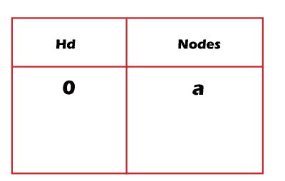
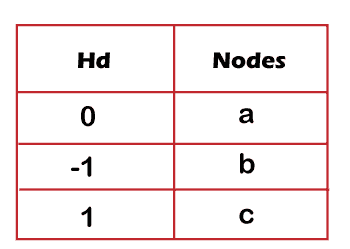
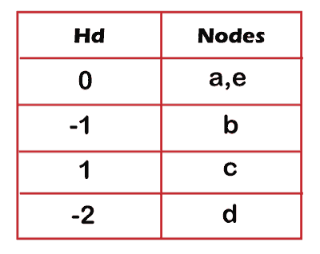
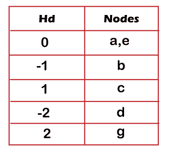
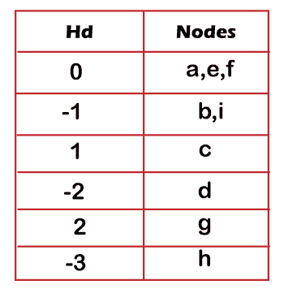
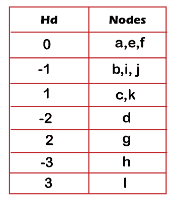

# 二叉树的垂直遍历

> 原文：<https://www.javatpoint.com/vertical-traversal-of-a-binary-tree>

在本主题中，我们将看到二叉树的垂直遍历。对于垂直遍历，我们将计算水平距离。我们将为每个节点分配水平距离，水平距离可以是从树的任何一边。在这种情况下，我们将从树的左侧开始计算水平距离。

为了给所有节点分配水平距离，我们将使用以下规则:

*   对于根节点，H d 的值等于 0，即**HdT5】= 0。**
*   对于左子节点，H d 的值等于父节点的 H d 减 1，即**HdT7】= Hd-1。**
*   对于右边的子节点，H d 的值等于父节点的 H d 加 1，即**HdT7】= Hd+1。**

## 考虑下面的树:

在上面的树中，‘a’是根节点，所以我们将值 **H d** 赋给该节点为 0。由于“b”是节点“a”的左子节点，因此规则编号 2 将应用于节点“b”。节点“b”的 **H d** 值等于 0 减 1(0-1)，即节点“b”的 **H d** 等于-1。节点“c”是节点“a”的右子节点，因此规则编号 3 将应用于节点“c”。节点“c”的 **H d** 值等于 0 加 1 (0+1)，即节点“c”的 **H d** 等于 1。节点‘d’是节点‘b’的左子节点，因此节点‘d’的 **H d** 值等于其父节点的 **H d** 值减 1；因此， **H d** = -1-1 = -2。节点“e”是节点“b”的右子节点，因此规则编号 3 将应用于此节点。‘e’的**HdT35】值等于其父代的 H d 值加 1；因此，H d = -1 +1 = 0。节点“f”是节点“c”的左子节点；因此，“f”的 H d 值等于(1-1)零。节点“g”是节点“c”的右子节点；因此，节点“g”的 H d 值等于(1+1) = 2。节点“h”是节点“d”的左子节点；因此，节点“H”的 H d 值等于(-2-1) = -3。节点“I”是节点“d”的右子节点；因此，节点“I”的 H d 值等于-1。节点“j”是节点“e”的左子节点；因此，节点“j”的 H d 值等于-1。节点“k”是节点“e”的右子节点；因此，节点“k”的 H d 值等于 1。节点“l”是节点“g”的左子节点；因此，节点“l”的 H d 值等于(2-1) = 1。节点“m”是节点“g”的右子节点；因此，节点‘m’的 H <u>d</u> 值等于(2+1) = 3。**

水平距离值最小的节点为‘h’，即-3，水平距离值最大的节点为‘m’，即 3。具有相同水平距离值的节点将存在于相同的垂直线中。

**现在我们将创建垂直线。**

*   值为-3 的节点是“h”，因此存在一条穿过节点“h”的垂直线，如下所示:
*   值为-2 的节点是“d”，因此存在一条穿过节点“d”的垂直线，如下所示:
*   对于 **H d = -1** ，存在三个节点，即‘b’、‘I’和‘j’，因此将创建一条穿过这三个节点的垂直线，如下所示:
*   对于 **H d = 0** ，存在“a”、“e”和“f”两个节点，因此会创建一条穿过这三个节点的垂直线，如下所示:
*   对于 **H d = 1** ，存在三个节点，即‘c’、‘k’和‘l’，因此会创建一条穿过这三个节点的垂直线，如下所示:
*   对于 **H d = 2** ，存在单个节点，即“g”，因此一条垂直线穿过节点“g”，如下图所示:
*   对于 **H d = 3** ，存在单个节点，即‘m’，因此一条垂直线穿过节点‘m’，如下图所示:

**实现二叉树垂直遍历的算法**

该算法是层次顺序遍历和哈希表的结合。以下是垂直遍历[二叉树](https://www.javatpoint.com/binary-tree)所需的步骤:

**步骤 1:** 入队根。

**第 2 步:**将根的 H d 距离更新为 0。

**步骤 3:** 在哈希表中添加 H d 为 0，根为值。

**第 4 步:**首先执行出列操作，然后执行以下步骤:

*   检查左右子，然后在哈希表中更新**HdT3。**
*   将左右子对象排队

## 考虑下面的树:

我们将使用两种数据结构，如队列和哈希表来实现垂直遍历，

*   我们首先将节点“a”插入队列，并将节点“a”的水平距离值更新为 0。我们还将添加节点“a”的 H d 以及哈希表中的值，如下所示:

根据算法中指定的步骤 4，元素“a”从队列中出列，并用节点“a”的左右子节点的 Hd 值更新哈希表，如下所示:

哈希表更新后，我们将节点“a”的左右子节点排入队列，如下所示:

第 4 步是循环的，它将重复进行，直到队列不再为空。

*   检查队列是否为空。队列不是空的，所以从队列中取出元素“b”，并检查“b”节点的左右子节点。由于节点“b”有左右子节点，因此我们将使用节点“d”和“e”的 Hd 值更新哈希表，如下所示:

哈希表更新后，将节点“d”和“e”排入队列，如下所示:

*   检查队列是否为空。队列不是空的，所以从队列中取出元素“c ”,并检查“c”节点的左右子节点。由于节点“c”有左右子节点，因此我们将使用节点“f”和“g”的 Hd 值更新哈希表，如下所示:

哈希表更新后，将节点“f”和“g”排入队列，如下所示:

*   再次检查队列是否为空。队列不是空的，因此从队列中取出元素“d”，并检查节点“d”的左右子节点。由于节点“d”有左右子节点，因此我们将使用 Hd 值“h”和“I”更新哈希表，如下所示:

哈希表更新后，将节点“h”和“I”排入队列，如下所示:

*   再次检查队列是否为空。队列不是空的，因此从队列中取出元素“e”，并检查节点“e”的左右子节点。由于节点“e”没有任何左右子节点，因此哈希表中不会有任何更新:
*   我们将再次检查队列是否为空。队列不是空的，所以从队列中取出元素“f”，并检查节点“f”的左右。由于节点“f”既有左子节点，也有右子节点，因此我们将使用“j”和“k”的 Hd 值更新哈希表。

哈希表更新后，将节点“j”和“k”排入队列，如下所示:

*   我们将再次检查队列是否为空。队列不是空的，因此从队列中取出元素“g”，并检查节点“l”的左侧和右侧。由于节点“g”有唯一正确的子节点，我们将使用“l”的 Hd 值更新哈希表。

哈希表更新后，将节点“g”排入队列，如下所示:

*   再次检查队列是否为空。队列不是空的，所以从队列中取出元素“h”，并检查节点“h”的左右子节点。由于节点“h”没有任何左右子节点，因此哈希表中不会有任何更新:

*   我们将再次检查队列是否为空。队列不是空的，因此从队列中取出元素“I”，并检查节点“I”的左侧和右侧。由于节点“I”有左右子节点，因此我们将使用 Hd 值“m”和“n”更新哈希表。

哈希表更新后，将节点“m”和“n”排入队列，如下所示:

*   再次检查队列是否为空。队列不是空的，因此从队列中取出元素“j”，并检查节点“j”的左右子节点。由于节点“j”没有任何左右子节点，因此哈希表中不会有任何更新:

*   再次检查队列是否为空。队列不是空的，因此从队列中取出元素“k”，并检查节点“k”的左右子节点。由于节点“k”有左右子节点，因此我们将使用“p”和“q”的 Hd 值更新哈希表。

哈希表更新后，将节点“p”和“q”排入队列，如下所示:

*   再次检查队列是否为空。队列不是空的，所以从队列中取出元素“l”，并检查节点“l”的左右子节点。由于节点“l”没有任何左右子节点，因此哈希表中不会有任何更新:

*   再次检查队列是否为空。队列不是空的，因此从队列中取出元素“m”，并检查节点“m”的左右子节点。由于节点“m”没有任何左右子节点，因此哈希表中不会有任何更新:

*   再次检查队列是否为空。队列不是空的，因此从队列中取出元素“n”，并检查节点“n”的左右子节点。由于节点“n”没有任何左右子节点，因此哈希表中不会有任何更新:

*   再次检查队列是否为空。队列不是空的，因此从队列中取出元素“p”，并检查节点“p”的左右子节点。由于节点“p”没有任何左右子节点，因此哈希表中不会有任何更新:

*   再次检查队列是否为空。队列不是空的，因此从队列中取出元素“q”，并检查节点“q”的左右子节点。由于节点“q”没有任何左右子节点，因此哈希表中不会有任何更新:

* * *