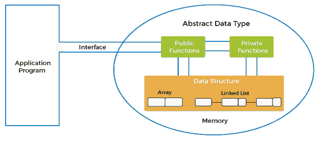

# 数据结构中的抽象数据类型

> 原文：<https://www.javatpoint.com/abstract-data-type-in-data-structure>

在了解抽象数据类型之前，我们应该了解什么是数据结构。

### 什么是数据结构？

数据结构是一种组织数据以便有效利用数据的技术。查看数据结构有两种方式:

*   **数学/逻辑/抽象模型/视图:**数据结构是组织需要一些协议或规则的数据的方式。这些规则需要在逻辑/抽象模型下建模。
*   **实现:**第二部分是实现部分。这些规则必须使用某种编程语言来实现。

### 为什么是数据结构？

**以下是使用数据结构的优势:**

*   这些是用于创建快速而强大的算法的基本要素。
*   它们帮助我们管理和组织数据。
*   数据结构使代码更清晰，更容易理解。

### 什么是抽象数据类型？

抽象数据类型是数据结构的抽象，它只提供数据结构必须遵守的接口。该接口没有给出关于应该实现什么或者用什么编程语言实现什么的任何具体细节。

换句话说，我们可以说抽象数据类型是数据和操作的定义，但没有实现细节的实体。在这种情况下，我们知道正在存储的数据以及可以对数据执行的操作，但是不知道实现细节。没有实现细节的原因是每种编程语言都有不同的实现策略；C 数据结构是使用结构实现的，而 C++数据结构是使用对象和类实现的。

**例如，**列表是使用动态数组和链表实现的抽象数据类型。队列使用基于链表的队列、基于数组的队列和基于堆栈的队列来实现。使用树映射、散列映射或散列表来实现映射。

### 抽象数据类型模型

在了解抽象数据类型模型之前，我们应该了解抽象和封装。

抽象:它是一种对用户隐藏内部细节，只向用户显示必要细节的技术。

封装:它是一种将数据和成员函数组合在一个单元中的技术，称为封装。



上图显示了 ADT 模型。ADT 模型中有两种类型的模型，即公共函数和私有函数。ADT 模型还包含我们在程序中使用的数据结构。在这个模型中，首先进行封装，即所有数据都封装在一个单元中，即 ADT。然后，执行抽象意味着显示可以对数据结构执行的操作，以及我们在程序中使用的数据结构。

**我们用一个真实的例子来理解抽象数据类型。**

如果我们考虑智能手机。我们关注智能手机的高规格，例如:

*   4 GB RAM
*   骁龙 2.2ghz 处理器
*   5 英寸液晶显示屏
*   双摄像头
*   安卓 8.0

智能手机的以上规格就是数据，我们还可以在智能手机上进行以下操作:

*   **call():** 我们可以通过智能手机通话。
*   **text():** 我们可以发短信。
*   **照片():**我们可以点击一张照片。
*   **视频():**我们也可以做一个视频。

智能手机是一个实体，其数据或规格和操作在上面给出。抽象/逻辑视图和操作是智能手机的抽象或逻辑视图。

### 上述抽象/逻辑视图的实现视图如下:

```

class Smartphone
{
   private:
   int ramSize;
   string processorName;
   float screenSize;
   int cameraCount;
   string androidVersion;
   public:
     void call();
     void text();
     void photo();
     void video();
} 

```

以上代码是可以在智能手机上执行的规范和操作的实现。实现视图可能不同，因为编程语言的语法不同，但是数据结构的抽象/逻辑视图将保持不变。因此，我们可以说抽象/逻辑视图独立于实现视图。

#### 注意:我们知道可以对诸如 int、float、char 等预定义数据类型执行的操作。，但是我们不知道数据类型的实现细节。因此，我们可以说抽象数据类型被认为是隐藏数据类型所有内部细节的隐藏框。

### 数据结构示例

假设我们有一个大小为 4 的索引数组。我们有一个从 0，1，2，3 开始的索引位置。数组是一种数据结构，其中元素存储在一个连续的位置。第一个元素的内存地址是 1000，第二个元素是 1004，第三个元素是 1008，第四个元素是 1012。因为它是整数类型，所以它将占用 4 个字节，并且每个元素的地址之差是 4 个字节。存储在数组中的值是 10、20、30 和 40。这些值、索引位置和内存地址就是实现。

**整数数组的抽象或逻辑视图可以表述为:**

*   它存储一组整数类型的元素。
*   它按位置读取元素，即索引。
*   它通过索引修改元素
*   它执行排序

**整数数组的实现视图:**

```

a[4] = {10, 20, 30, 40}
cout<< a[2]
a[3] = 50

```

* * *