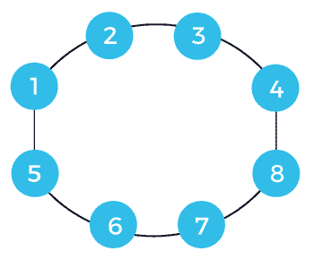
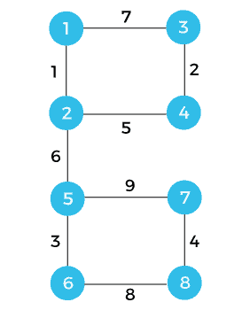
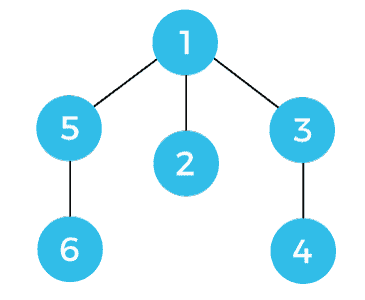
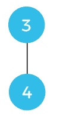
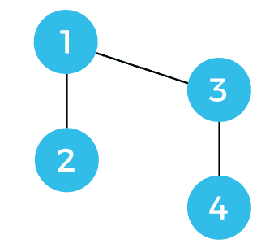
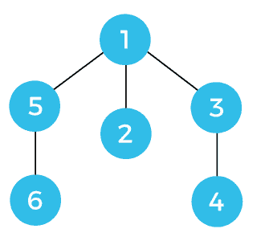
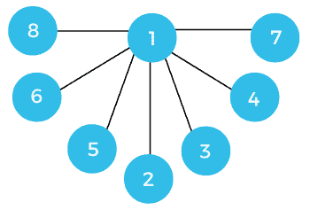

# 不相交集合数据结构

> 原文：<https://www.javatpoint.com/disjoint-set-data-structure>

不相交集合数据结构也称为联合查找数据结构和合并查找集合。它是一种包含不相交或不重叠集合的数据结构。不相交集合意味着当集合被划分为不相交子集时。可以对不相交的子集执行各种操作。在这种情况下，我们可以添加新的集合，我们可以合并集合，我们也可以找到一个集合的代表成员。它还可以有效地找出两个元素是否在同一个集合中。

不相交集可以定义为两个集之间没有公共元素的子集。让我们通过一个例子来理解不相交的集合。

**s1 = {1，2，3，4}**

**s2 = {5，6，7，8}**

我们有两个子集，名为 s1 和 s2。s1 子集包含元素 1、2、3、4，而 s2 包含元素 5、6、7、8。由于这两个集合之间没有共同的元素，如果我们考虑这两个集合之间的交集，我们将不会得到任何东西。这也称为不相交集，其中没有公共元素。现在问题来了，我们如何对它们进行操作。我们只能执行两个操作，即查找和联合。

在查找操作的情况下，我们必须检查元素存在于哪个集合中。下面显示了两个名为 s1 和 s2 的集合:

假设我们想要对这两个集合执行联合操作。首先，我们必须检查在其上执行联合操作的元素是属于不同的还是相同的集合。如果它们属于不同的集合，那么我们可以执行并集操作；否则，不会。例如，我们希望在 4 和 8 之间执行联合操作。由于 4 和 8 属于不同的集合，所以我们应用联合运算。执行并集操作后，将在 4 和 8 之间添加边，如下所示:

当应用联合操作时，集合将表示为:

**s1Us2 = {1，2，3，4，5，6，7，8}**

假设我们在 1 和 5 之间再加一条边。现在，最终集合可以表示为:

**s3 = {1，2，3，4，5，6，7，8}**

如果我们考虑上面集合中的任何元素，那么所有的元素都属于同一个集合；这意味着循环存在于图形中。

### 我们如何检测图形中的循环？

我们将通过一个例子来理解这个概念。考虑下面的例子，通过使用不相交集来检测一个循环。

**U = {1，2，3，4，5，6，7，8}**

每个顶点都标有一定的权重。有一个 8 个顶点的泛集。我们将逐一考虑每条边并形成集合。

首先，我们考虑顶点 1 和 2。两者都属于泛集合；我们在元素 1 和 2 之间执行联合操作。我们将在集合 s 1 中添加元素 1 和 2，并从如下所示的通用集合中移除这两个元素:

**s1 = {1，2}**

我们现在考虑的顶点是 3 和 4。两个顶点都属于泛集；我们在元素 3 和 4 之间执行联合操作。我们将形成具有元素 3 和 4 的集合 s3，并从通用集合中移除元素，如下所示:

**s2 = {3，4}**

我们现在考虑的顶点是 5 和 6。这两个顶点都属于通用集合，因此我们执行元素 5 和 6 之间的并集操作。我们将形成具有元素 5 和 6 的集合 s3，并将从通用集合中移除这些元素，如下所示:

**s3 = {5，6}**

我们现在考虑的顶点是 7 和 8。这两个顶点都属于通用集合，因此我们执行元素 7 和 8 之间的并集操作。我们将形成具有元素 7 和 8 的集合 s4，并将从通用集合中移除这些元素，如下所示:

**s4 = {7，8}**

下一条边是(2，4)。顶点 2 在集合 1 中，顶点 4 在集合 2 中，因此两个顶点都在不同的集合中。当我们应用联合操作时，它将形成如下所示的新集合:

**s5 = {1，2，3，4}**

我们考虑的下一条边是(2，5)。顶点 2 在集合 5 中，顶点 5 在集合 s3 中，因此两个顶点都在不同的集合中。当我们应用联合操作时，它将形成如下所示的新集合:

**s6 = {1，2，3，4，5，6}**

现在，剩下两套，如下所示:

**s4 = {7，8}**

**s6 = {1，2，3，4，5，6}**

下一条边是(1，3)。由于两个顶点，即 1 和 3 属于同一个集合，所以它形成一个循环。我们不会考虑这个顶点。

下一条边是(6，8)。由于顶点 6 和 8 都属于不同的顶点 s4 和 s 6，我们将执行并集操作。联合操作将形成如下所示的新集合:

**s7 = {1，2，3，4，5，6，7，8}**

最后一条边是左边的，也就是(5，7)。由于两个顶点都属于名为 s7 的同一个集合，因此形成了一个循环。

### 我们如何用图形表示集合？

我们有一个通用集合，如下所示:

**U = {1，2，3，4，5，6，7，8}**

我们将逐一考虑每条边，以图形表示。

首先，我们考虑顶点 1 和 2，即(1，2)，并通过如下图形表示它们:

在上图中，顶点 1 是顶点 2 的父顶点。

现在我们考虑顶点 3 和 4，即(3，4)，并用图形表示它们，如下所示:

在上图中，顶点 3 是顶点 4 的父顶点。

考虑顶点 5 和 6，即(5，6)，并用图形表示它们，如下所示:

在上图中，顶点 5 是顶点 6 的父顶点。

现在，我们考虑顶点 7 和 8，即(7，8)，并通过如下图形表示它们:

在上图中，顶点 7 是顶点 8 的父顶点。

现在我们考虑边(2，4)。由于 2 和 4 属于不同的集合，所以我们需要执行并集操作。在上面的例子中，我们观察到 1 是顶点 2 的父，而顶点 3 是顶点 4 的父。当我们对两个集合(即 s1 和 s2)执行并集操作时，1 个顶点将是顶点 3 的父顶点，如下所示:

下一个边是权重为 6 的(2，5)。因为 2 和 5 在两个不同的集合中，所以我们将执行联合操作。我们将顶点 5 作为顶点 1 的子顶点，如下所示:

我们选择顶点 5 作为顶点 1 的子顶点，因为具有父 1 的图的顶点比具有父 5 的图的顶点多。

下一条边是权重为 7 的(1，3)。顶点 1 和 3 都在同一个集合中，因此不需要执行任何并集操作。因为两个顶点属于同一个集合；因此，有一个循环。我们已经检测到一个循环，所以我们将进一步考虑边缘。

### 如何借助数组检测周期？

考虑下图:

上图包含 8 个顶点。因此，我们在一个数组中表示所有这 8 个顶点。这里，索引代表 8 个顶点。每个索引包含一个-1 值。-1 值表示顶点是其自身的父顶点。

**现在我们将看到如何表示数组中的集合。**

首先，我们考虑边(1，2)。当我们在一个数组中找到 1 时，我们观察到 1 是自身的父元素。类似地，顶点 2 是其自身的父，所以我们将顶点 2 作为顶点 1 的子。我们在索引 2 处加上 1，因为 2 是 1 的子代。我们在索引 1 处加上-2，其中‘-’表示顶点 1 是其自身的父顶点，2 表示一个集合中的顶点数。

下一条边是(3，4)。当我们在数组中找到 3 和 4 时；我们观察到两个顶点都是自身的父顶点。我们将顶点 4 作为顶点 3 的子顶点，因此我们在数组的索引 4 处添加 3。我们在索引 3 处添加-2，如下所示:

下一条边是(5，6)。当我们在一个数组中找到 5 和 6 时；我们观察到两个顶点都是自身的父顶点。我们将 6 作为顶点 5 的子顶点，因此我们在数组的索引 6 处添加 5。我们在索引 5 处添加-2，如下所示:

下一条边是(7，8)。由于两个顶点都是自身的父顶点，所以我们将顶点 8 作为顶点 7 的子顶点。我们在索引 8 处添加 7，在索引 7 处添加-2，如下所示:

下一条边是(2，4)。顶点 2 的父项是 1，顶点的父项是 3。由于两个顶点有不同的父顶点，所以我们将顶点 3 作为顶点 1 的子顶点。我们在指数 3 上加 1。我们在索引 1 处添加-4，因为它包含 4 个顶点。

从图形上看，它可以表示为

下一条边是(2，5)。当我们在一个数组中找到顶点 2 时，我们观察到 1 是顶点 2 的父节点，而顶点 1 是其自身的父节点。当我们在一个数组中找到 5 时，我们找到-2 值，这意味着顶点 5 是其自身的父。现在我们必须决定是顶点 1 还是顶点 5 会成为父顶点。由于顶点 1，即-4 的权重大于顶点 5，即-2 的权重，因此当我们应用并集运算时，顶点 5 将成为顶点 1 的子顶点，如下所示:

在一个数组中，1 将被添加到索引 5，因为顶点 1 现在成为顶点 5 的父节点。我们在索引 1 处添加-6，因为节点 1 上又添加了两个节点。

下一条边是(1，3)。当我们在一个数组中找到顶点 1 时，我们观察到 1 是其自身的父元素。当我们在一个数组中找到 3 时，我们观察到 1 是顶点 3 的父点。因此，两个顶点的父顶点是相同的；因此，如果我们包括边(1，3)，我们可以说有一个循环的形成。

下一条边是(6，8)。当我们在一个数组中找到顶点 6 时，我们观察到顶点 5 是顶点 6 的父级，而顶点 1 是顶点 5 的父级。当我们在一个数组中找到 8 时，我们观察到顶点 7 是顶点 8 的父项，而 7 是其自身的父项。由于顶点 1，即-6 的权重大于顶点 7，即-2，因此我们将顶点 7 作为顶点的子节点，可以如下图所示进行图形化表示:

我们在索引 7 处加 1，因为 7 成为顶点 1 的子。我们在索引 1 处加上-8，因为图的权重现在变成了 8。

要包括的最后一条边是(5，7)。当我们在数组中找到顶点 5 时，我们观察到顶点 1 是顶点 5 的父顶点。类似地，当我们在数组中找到顶点 7 时，我们观察到顶点 1 是顶点 7 的父顶点。因此，我们可以说两个顶点的父顶点是相同的，即 1。这意味着包含(5，7)边将形成一个循环。

到目前为止，我们已经学习了加权并集，其中我们根据顶点的权重执行并集操作。较高权重的顶点成为父顶点，较低权重的顶点成为子顶点。使用这种方法的缺点是一些节点需要更多的时间才能到达其父节点。例如，在上面的图中，如果我们想要找到顶点 6 的父项，顶点 5 是顶点 6 的父项，因此我们移动到顶点 5，顶点 1 是顶点 5 的父项。为了克服这样的问题，我们使用了“折叠查找”的概念。

### 折叠查找技术是如何工作的？

考虑上面的例子。一旦我们知道顶点 6 的父顶点是 1，那么我们就直接把顶点 6 加到顶点 1 上。我们还将更新阵列。在数组中，在索引 6 处添加 1，因为 6 的父级现在是 1。将节点直接链接到集合的直接父节点的过程称为折叠查找。类似地，我们可以将节点 8 和 4 链接到节点 1。

* * *