# 数据结构中的图形类型

> 原文：<https://www.javatpoint.com/types-of-graph-in-data-structure>

图形数据结构用于存储计算中所需的数据，以解决许多计算机编程问题。图形用于解决现实世界中的问题，其中问题区域被表示为网络，例如 ***电话网络、电路网络、领英、脸书*** 等。

在计算机科学中，图是一种抽象数据类型，用于实现数学中图论的无向图和有向图概念。

图形数据结构由有限且可能可变的顶点集(也称为节点或点)以及无向图的一组无序对或有向图的一组有序对组成。这些线对被认为是有向图中的边、链接或线，但也称为箭头或弧。顶点可以是内部图形元素或由整数索引或引用表示的外部项目。

因此，根据这些节点和顶点的位置，有不同类型的图形，例如:

*   零图
*   平凡图
*   无向图
*   有向图
*   连通图
*   不连通图
*   正则图
*   完全图
*   循环图
*   循环图
*   无圈图
*   有限图
*   无限图
*   偶图
*   平面图
*   简单图形
*   多图
*   伪图
*   欧拉图
*   哈密顿图

### 零图

空图也称为零阶图。术语“ ***【空图】*** 是指具有空边集的图。换句话说，空图没有边，空图在图中只有孤立的顶点。

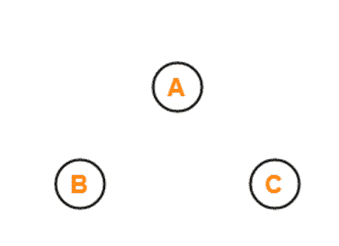

上面显示的图像是空图或零图，因为它在图的三个顶点之间没有边。

### 平凡图

如果一个图中只有一个顶点，则称它为平凡图。平凡图是可以用最少的顶点数(只有一个顶点)创建的最小可能图。

上面是一个普通图的例子，在整个图中只有一个顶点叫做顶点 a。

### 无向图

如果任何图节点之间的所有边都是无向的，则称该图为无向图。无向边是指不能从它开始的节点和它结束的节点来确定的图的边。一个图的所有边都需要是非定向的，才能称之为非定向图。无向图的所有边都没有方向。

上面显示的图表是一个断开图表的示例。这个图被称为断开图，因为有四个顶点，分别叫做顶点 A、顶点 B、顶点 C 和顶点 d。图的这些顶点之间也正好有四条边。并且存在于图的不同节点之间的所有顶点都没有方向，这意味着边没有任何特定的方向。

例如，顶点 A 和顶点 B 之间的边没有任何方向，因此我们无法确定顶点 A 和顶点 B 之间的边是从顶点 A 还是从顶点 B 开始，同样，我们也无法确定这些节点之间这条边的结束顶点。

### 有向图

有向图的另一个名字是有向图。如果图的任何顶点或节点之间的所有边都是有向的或有一个定义的方向，则称该图为有向图或有向图。所谓有向边，是指图的边有一个方向来决定它从哪个节点开始，在哪个节点结束。

图的所有边都需要有向，才能称之为有向图或有向图。有向图或有向图的所有边都有一个从一个顶点开始到另一个顶点结束的方向。

上面显示的图表是一个连通图的示例。这个图被称为连通图，因为图中有四个顶点，分别是顶点 A、顶点 B、顶点 C 和顶点 d。图的这些顶点之间也正好有四条边，并且存在于图的不同节点之间的所有顶点都是有向的(或指向某些顶点)，这意味着这些边都有一个指定给它们的特定方向。

例如，考虑顶点 D 和顶点 A 之间的边。这条边显示一个箭头指向顶点 A，这意味着这条边从顶点 D 开始，到顶点 A 结束

### 连通图

要将一个图标记为连通图，该图的每对顶点之间必须至少有一条路径。换句话说，我们可以说，如果我们从一个顶点开始，我们应该能够移动到该特定图中存在的任何顶点，这意味着在该图的所有顶点之间至少存在一条路径。

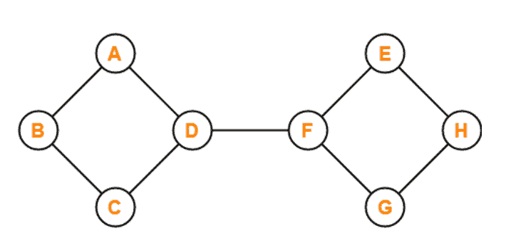

上面显示的图是一个连通图的例子，因为我们从图的任何一个顶点开始，并开始向图的任何其他剩余顶点移动。至少有一条路径用于遍历该图。

例如，如果我们从顶点 B 开始，遍历到顶点 H，有各种各样的遍历路径。其中一条路径是

Vertice B -> vertice C -> vertice D -> vertice F -> vertice E -> vertice H.

类似地，从顶点 B 到顶点 h 有其他遍历图的路径。在所有图节点之间至少有一条路径。换句话说，我们可以说图的所有顶点或节点都是通过边或边的数量相互连接的。

### 不连通图

一个图被认为是一个断开的图，其中在至少一对顶点之间不存在任何路径。换句话说，我们可以说，如果我们从图的任何一个顶点开始，并试图移动到图的剩余当前顶点，并且甚至不存在移动到该顶点的单一路径，那么这就是断开图的情况。如果这样一对顶点中的任何一个顶点之间没有路径，则称之为 ***断开图*** 。

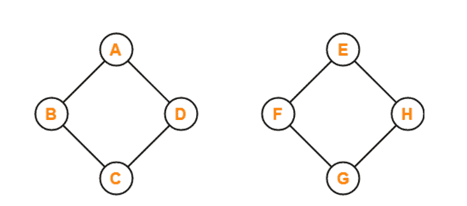

上面显示的图表是一个断开的图表。上面的图被称为断开图，因为至少有一对顶点没有从任一节点开始遍历的路径。

例如，如果我们想从顶点 A 遍历到顶点 g，两个顶点之间不存在单一路径，换句话说，我们可以说图的所有顶点或节点都不是通过边或边的数量相互连接的，因此它们可以被遍历。

### 正则图

对于一个被称为正则的图，它应该满足一个主要条件:所有图的顶点应该具有相同的度。通过顶点的度，我们意味着与特定顶点相关联的节点的数量。如果所有的图节点都有相同的度值，那么这个图就叫做 ***正则图*** 。如果一个图的所有顶点的度值都是 6，那么这个图叫做 6 正则图。如果一个图中的所有顶点都是 k 度，那么这个图就叫做“ ***k 正则图*** ”。

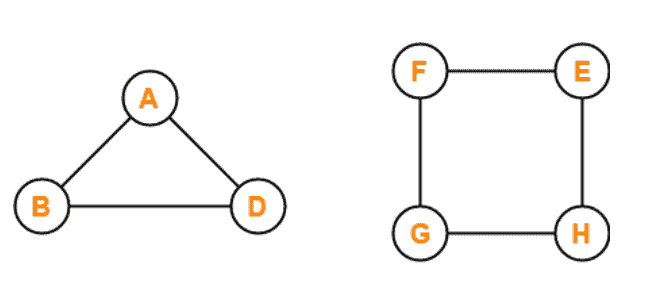

上面显示的图形是常规图形。在图 1 中，有三个顶点，称为顶点 A、顶点 B 和顶点 C，图 1 中的所有顶点，每个节点的度都为 2。每个顶点的度数是通过计算连接到该特定顶点的边的数量来计算的。

对于图 1 中的顶点 A，有两条边与顶点 A 相关联，一条边来自顶点 B，另一条边来自顶点 d。因此，图 1 的顶点 A 的度数是 2。类似地，对于图的其他顶点，每个顶点只关联两条边，即顶点 B 和顶点 D，因此，顶点 B 和顶点 D 都是 2。因为图的三个节点的度数都是一样的，那就是 2。因此，这个图被称为 2 正则图。

同样，对于上面显示的第二个图，有四个顶点，分别叫做顶点 E、顶点 F、顶点 G 和顶点 F。这个图的所有四个顶点的度数都是 2。图的每个顶点都是 2，因为只有两条边与图的所有顶点相关联。由于该图的所有节点都具有相同的 2 度，因此该图被称为 ***正则图*** 。

### 完全图

如果图的所有顶点在每对顶点之间都有一条边，则称该图为完全图。换句话说，我们可以说所有的顶点都与图中所有顶点的其余部分相连。‘n’个顶点的完全图恰好包含 nC2 条边，而‘n’个顶点的完全图表示为 Kn。

上图中显示了两个名为 K3 和 K4 的图，这两个图都是完全图。图 K3 有三个顶点，每个顶点与其余顶点至少有一条边。类似地，对于图 K4，有四个名为顶点 E、顶点 F、顶点 G 和顶点 h 的节点。例如，顶点 F 有三条边连接到它，以将其连接到图的相应剩余三个顶点。同样，对于其他三个铰孔顶点，有三条边与它们中的每一个相关联。由于该图的所有顶点都有一条独立于其他顶点的边，因此称为 ***完全图*** 。

### 循环图

如果一个图有许多大于 3 的顶点和边形成一个循环，那么这个图叫做 ***循环图*** 。在循环类型的图中，循环图的所有顶点的度数都是 2。

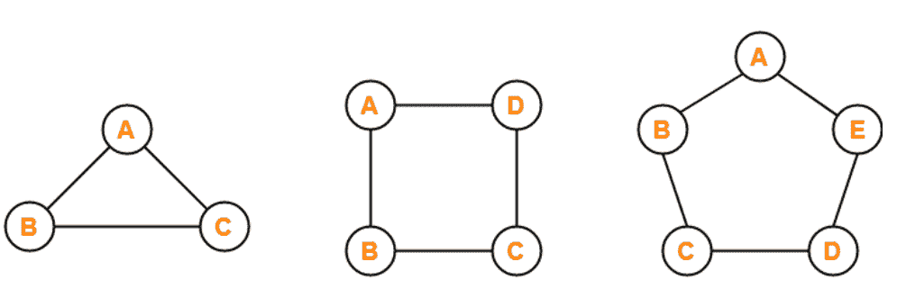

上图中显示了三个图，它们都是循环图的例子，因为所有这些图的节点数都大于 2，并且所有这些图的所有顶点的度数都正好是 2。

### 循环图

对于一个称为循环图的图，它应该至少包含一个循环。如果一个图至少有一个循环，它被称为循环图。

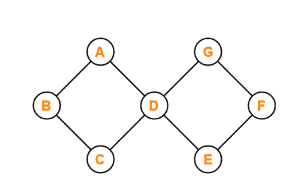

图中所示的图形存在两个循环，满足图形循环的必要条件，从而使其成为循环图形。

### 无圈图

如果存在零个循环，则称一个图为非循环图，而非循环图与循环图完全相反。

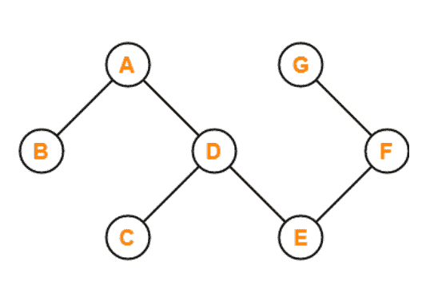

上图中显示的图形是无循环的，因为其中存在零个循环。这意味着，如果我们从顶点 B 开始遍历图，那么不存在一条路径会遍历所有顶点，并在顶点 B 的同一个顶点结束。

### 有限图

如果图中存在的顶点数和边数是有限的，那么这个图叫做有限图。

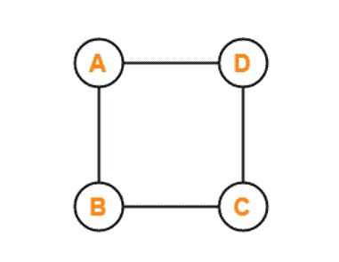

上图所示的图形是有限图形。有四个顶点，分别叫做顶点 A、顶点 B、顶点 C 和顶点 D，这个图中的边数也是四个，因为这个图的节点数和顶点数都是有限的，所以叫做有限图。

### 无限图

如果图中的顶点数和图中的边数是无限的，这意味着图的顶点和边不能被计数，那么该图被称为无限图。

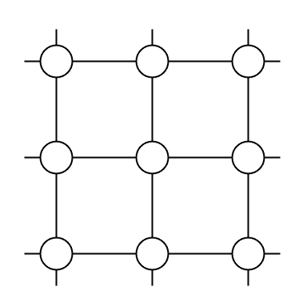

上图我们可以看到，图中的顶点数和图中的边数都是无限的，所以这个图叫做无限图。

### 偶图

一个图要成为二部图，它需要满足一些基本的前提条件。这些条件是:

*   图的所有顶点都应该分成两组不同的顶点 X 和 y
*   存在于集合 X 中的所有顶点应该只连接到存在于集合 Y 中的具有一些边的顶点。这意味着一个集合中的顶点不应该与同一个集合中的顶点相连。
*   创建的两个集合应该是不同的，这意味着两个集合中不应该有相同的顶点。

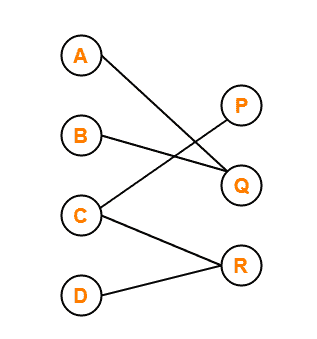

上图所示的图形分为两个顶点，分别命名为集合 X 和集合 y，这两个集合的内容是，

Set X = {vertex A, vertex B, vertex C, vertex D}
Set Y = {vertex P, vertex Q, vertex R}

集合 X 的顶点 A 与集合 Y 的顶点 Q 相关联，而顶点 B 也连接到顶点 Q，集合 X 的顶点 C 连接到集合 Y 的两个顶点，称为顶点 P 和顶点 r，集合 X 的顶点 D 与集合 r 的顶点 Q 相关联

类似地，集合 Y 中存在的所有顶点仅连接到集合 X 中的顶点。集合 X 和集合 Y 都具有不重复或不同的元素。上图所示的图满足二部图的所有条件，因此它是一个二部图。

### 平面图

如果一个图可以画在一个平面上，其中任意两条边相交，那么这个图就叫做平面图。

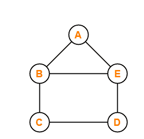

上图所示的图形可以画在任意两条边相交的单一平面上。因此它是一个平面图。

### 简单图形

如果一个图不是由图中没有自环和平行边组成的，那么这个图就是一个简单的图。

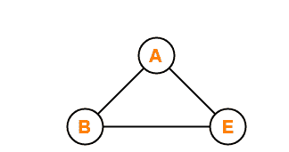

对于上图所示的图形，我们有三个顶点和三条边。这个图没有自环，也没有平行边；因此，它被称为简单图。

### 多图

如果一个图不包含任何自循环，但图中有平行边，则称该图为多重图。如果在两个顶点之间存在一条以上的边，那么这一对顶点被称为具有平行边。

对于上图所示的图形，我们有三个顶点和三条边。没有自循环，但是两条边在图的顶点 A 和顶点 E 之间连接这两个顶点。换句话说，我们可以说，如果一个图的两个顶点与一个图中的一条以上的边相连，那么它被称为具有平行边，从而使它成为一个多重图。

### 伪图

如果一个图没有平行边，但是图中存在自循环，那么它被称为伪图。自循环的意思是，图中存在一条从图的一个顶点开始的边，如果这条边在同一个顶点结束，那么它被称为伪图。

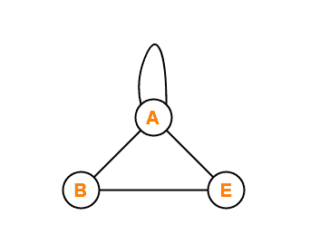

上图所示的图有顶点 A、顶点 B 和顶点 e，这个图有四条边，有三条边与顶点 A 相关联，在这三条边中，有一条边是自循环的。在这四条边中，没有平行边。由于上面显示的图有一个自循环，其中没有平行边，因此它是一个伪图。

### 欧拉图

如果一个图中所有的顶点都有偶数度，那么这个图就叫做欧拉图。我们所说的顶点度数是指与一个顶点相关联的边的数量。所以一个图要成为欧拉图，要求图中的所有顶点都要与偶数条边相关联。

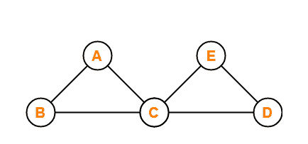

在上图所示的图中，我们有五个顶点，分别命名为顶点 A、顶点 B、顶点 C、顶点 D 和顶点 e，除了顶点 C 之外的所有顶点都有 2 度，这意味着它们与每个顶点的两条边相关联。同时，顶点 C 与四条边相关联，从而使其为 4 度。顶点 C 和其他顶点的度数分别是 4 和 2，都是偶数。因此，上面显示的图形是欧拉图形。

### 汉密尔顿图

假设在连通图中有一个封闭行走，它只访问图的每个顶点一次(除了起始顶点)，而不重复边。这样的图叫做 ***哈密顿图*** ，这样的走叫做 ***哈密顿路径*** 。哈密顿回路也称为哈密顿圈。

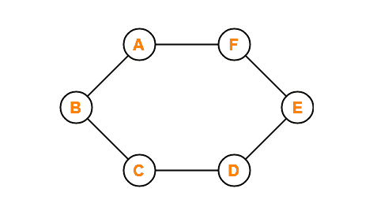

换句话说，在同一顶点开始和结束的哈密顿路径称为哈密顿回路。每个包含哈密顿回路的图也包含哈密顿路径，但反之则不然。图中可能存在多个哈密顿路径和哈密顿回路。

上图所示的图由一条封闭路径 ABCDEFA 组成，该路径从顶点 A 开始，遍历所有其他顶点或节点，除了遍历路径中的顶点 A 之外，没有遍历任何节点两次。因此，上图所示的图形是汉密尔顿图。

* * *