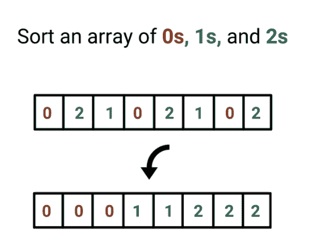
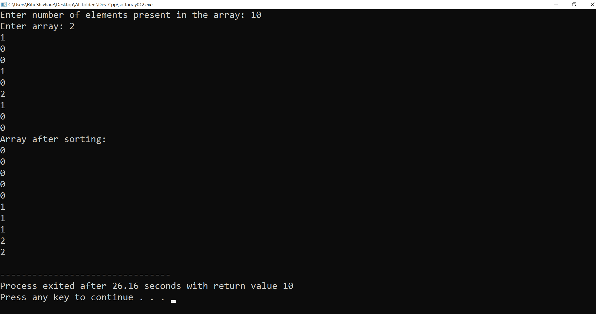
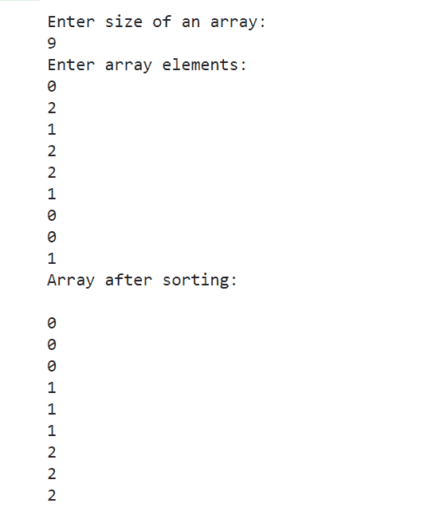
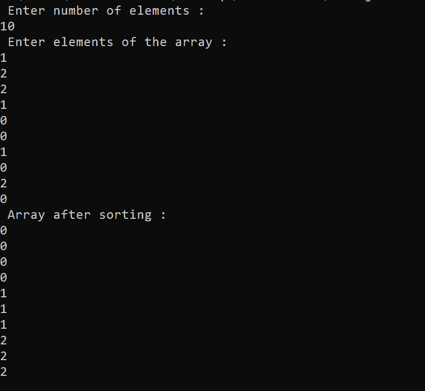

# 对 0、1 和 2 的数组进行排序

> 原文：<https://www.javatpoint.com/sort-an-array-of-0s-1s-and-2s>

数组是一种线性数据结构，包含相邻内存位置的元素。它主要将相同数据类型的元素一起存储在这些位置。这些连续内存位置之间的差异取决于我们正在使用的数据类型，**是 int、float、double、char、long、**等。存在于连续存储位置的元素使我们更容易跟踪这些元素。与其他数据结构如**链表、队列、堆栈、**和**非线性数据结构如树和图相比，它还降低了我们搜索元素的复杂性。**

人们可以很容易地选择数组的基索引。通常，允许基于 n 的索引的编程语言也允许负索引值，其他标量数据类型(如枚举或字符)可以用作数组索引。数组包含索引，索引从 0 开始，到数组大小减 1 结束。如果我们有一个由 12 个元素组成的数组，那么数组的索引将从 0 开始，到索引号 11 结束。

对数组进行排序意味着数组中的元素必须以特定的顺序出现，无论是升序还是降序。例如，如果我们将 5 个元素的数组取为- 4，2，3，10，5。现在，如果我希望这个数组按顺序排序，那么默认情况下它将按升序排列，结果将是- 2，3，4，5，10。我们将使用各种排序方法对数组的元素进行排序，如**冒泡排序、插入排序、快速排序和合并排序**。在这些复杂性中，快速排序和合并排序在排序方法中起着非常重要的作用。

## 0、1 和 2 的数组是什么？

正如我们已经看到的，该数组是一个线性数据结构，包含出现在连续存储位置的相同数据类型的数据。在这个 0、1 和 2s 数组中，我们将只存储 0、1 和 2s 形式的数据。例如，一个包含 11 个元素的数组，这些元素如下- 0，1，1，2，2，1，0，2，1，0，0。

如果说对包含 0、1、2s 形式元素的数组进行排序，那就是**按照升序或降序排列数组的元素**。这里，我们将把升序视为默认情况。让我们取一个由 10 个元素组成的新数组，它包含 0、1 和 2 中的元素。

我们需要执行的主要任务是对一个数组进行排序，使所有的 0 在所有的 1 之前，所有的 1 在所有的 2 之前，最后，所有的 2 将填充剩余的数组。

**A = { 0，1，2，2，0，1，0，2，1，0 }**

数组的排序版本 **A = { 0，0，0，0，1，1，1，2，2，2 }**

**B = { 0，1，2，1，0，1，0，2，1，0 }**

数组的排序版本 **B = { 0，0，0，0，1，1，1，2，2 }**

## 0、1 和 2 数组的排序方法-

1.  通过**蛮力**法使用双遍历。
2.  使用一种有效的方法，该方法使用一种称为**三向分区**的单一遍历方法

让我们开始使用这些方法对数组进行排序-

### 方法# 1 -使用双重遍历的强力方法

使用这种方法，我们需要按升序对包含 0、1 和 2 的数组进行排序。但是，它取决于程序员是按升序还是降序对数组进行排序；我们将在默认情况下对数组进行排序，即升序。



我们将推导出“n”个元素的算法，但我们将采用一个随机数组，并用它进行实验，以获得对概念的基本理解。

**A = { 0，1，0，2，1，1，0，2，2，0，1 }**

**程序步骤-**

1.  首先，统计给定数组中元素的总数；这里，我们给出了 11 个元素的数组。
2.  从左到右扫描数组的元素，并逐个跟踪元素。
3.  然后计算数组中 0 的计数，并将其存储在变量中。
4.  同样，用这种方法，计算数组中 1 的个数，并将它们存储在另一个变量中。
5.  最后，对数组中所有 2 的数字进行计数，并将计数存储在另一个变量中。或者，要知道数组中存在的 2 的数量，可以从数组中存在的元素总数中减去 0 和 1 的计数。
6.  在这个例子中，您可以执行标准，只是因为我们已经知道数组，但是如果用户在运行时输入数组的元素。用户输入的值不一定都是 0、1 和 2 的形式，直到用户被该条件约束为只以 0、1 和 2 的形式输入值。
7.  在上面的例子中，我们有 4 个 0，4 个 1，3 个 2。
8.  在对数组中出现的几个 0、1 和 2 进行计数后，在数组 a 中再次逐个复制这些值
9.  为了复制值，开始一个循环，最初指向数组的第 0 <sup>个</sup>索引；首先，复制数组中所有 0 的数字，同时增加索引值。所有 0 都将被复制到索引号 3。
10.  然后为了复制所有 2 的数字，开始指向索引 4 的指针，因为在索引 0 到 3，我们有所有的 0。现在，复制数组中所有的 1，同时逐个增加索引。我们已经在上面的例子中；4 个 1 的数字；因此，在复制所有 1 之后，我们的指数将达到 7。
11.  为了复制数组中所有 2 的数字，从 8 开始索引，因为直到索引 7，我们都有 0 的数字，之后我们都有 1 的数字。现在复制数组中所有 2 的数字，同时逐个增加索引。我们已经在上面的例子中；3 个 2 的数字；因此，复制所有二进制后，我们的索引将达到 10。
12.  因此，最终，我们成功地以升序复制了数组中所有 0、1 和 2 的数字。

**使用计数方法，即方法# 1，对包含 0、1 和 2 形式元素的数组进行升序排序的算法。**

**步骤 1 -** 考虑一个 n 元素的数组，所有元素都是 0，1，2 的形式。

**步骤 2 -** 构造一个 0，1，2s 排序数组的函数。

**步骤 3 -** 从主函数中传递数组和排序函数中的元素总数作为参数。

**步骤 4 -** 在排序函数中，声明三个变量，分别为零计数、一计数和两计数。

**第 5 步-** 变量零计数将主函数传递的数组中出现的所有零的计数存储为参数。

**步骤 6 -** 变量 onecount 将主函数传递的数组中存在的所有计数存储为参数。

**步骤 7 -** 变量 twocount 将主函数传递的数组中所有二进制数的计数存储为参数。

**步骤 8 -** 在对数组中的所有 0、1 和 2s 进行计数后，将所有值重新插入给定的主数组，因为我们需要对数组进行排序。

**步骤 9 -** 最初，将所有的 0 放回数组中，在主函数中作为参数传递。

**步骤 10 -** 将连续索引号中的所有 0 放回后，将所有 1 重新插入数组。

**步骤 11 -** 同样，最后，将所有二进制数放回剩余索引的数组中。

**步骤 12 -** 最后，在主功能中，打印排序后的数组。

现在让我们执行上面的方法 1，即 C、C++和 Python 中的暴力双遍历方法。

### 用 C 语言中的方法 1 对包含 0、1 和 2 的数组进行排序的程序

```

//  To sort an array of 0's, 1's, and 2's

#include void sort_array_0_1_2 ( int A[ ] , int n )  
{
	int i = 0 ,  countzero = 0 , countone = 0 ,  counttwo = 0 ;
	while ( i < n )
	{
		if ( A [ i ] == 0 )
		{
			countzero = countzero + 1 ;
		}
		else if ( A [ i ] == 1 )
		{
			countone = countone + 1 ;
		}
		else
		{
			counttwo = counttwo + 2 ;
		}
		i = i + 1 ;
	}
	for  ( i = 0 ; i < countzero ; i++ )
	{
		A [ i ] = 0 ;
	}
	for ( i = countzero ; i < countzero + countone ; i++ )
	{
		A [ i ] = 1 ;
	}
	for ( i = countzero + countone ; i < n ; i++ )
	{
		A [ i ] = 2 ;
	}
}
void main()
{
	int i ,  A[ 100 ] , n;
	printf ( " Enter number of elements present in the array: " ) ;
	scanf ( " %d " , &n) ;
	printf ( " Enter array:  \n " ) ;
	for ( i = 0 ; i < n ; i++ )
	{
		scanf ( " %d " , &A[ i ] ) ;
	}
	printf  ( " Array after sorting : \n " ) ;
	sort_array_0_1_2 ( A , n ) ;
	for ( i = 0 ; i < n ; i++ )
	{
		printf ( " %d \n " , A [ i ] ) ;
	}

} 
```

**使用方法# 1** 对 0、1 和 2 的数组进行排序的以下 C 程序的输出


### 使用 C++编程语言中的方法 1 对包含 0、1 和 2 的数组进行排序的程序-

```

//  To sort an array of 0's, 1's, and 2's

#include using namespace std;
void sort_array_0_1_2( int A[ ] , int n )  
{
	int i = 0 ,  countzero = 0 , countone = 0 ,  counttwo = 0 ;
	while ( i < n )
	{
		if ( A [ i ] == 0 )
		{
			countzero = countzero + 1 ;
		}
		else if ( A [ i ] == 1 )
		{
			countone = countone + 1 ;
		}
		else
		{
			counttwo = counttwo + 2 ;
		}
		i = i + 1 ;
	}
	for  ( i = 0 ; i < countzero ; i++ )
	{
		A [ i ] = 0 ;
	}
	for ( i = countzero ; i < countzero + countone ; i++ )
	{
		A [ i ] = 1 ;
	}
            for ( i = countzero + countone ; i < n ; i++ )
	{
		A [ i ] = 2 ;
	}
}
int main()
{
	int  i ,  A[ 100 ] , n ;
	cout << " Enter number of elements present in the array: " << endl ;
	cin >> n ;
	cout << " Enter array:  "  <<  endl ;
	for ( i = 0 ; i < n ; i++ )
	{
		cin >> A [  i  ] ;
	}
	cout << " Array after sorting : \n " << endl ;
	sort_array_0_1_2 ( A , n ) ;
	for ( i = 0 ; i < n ; i++ )
	{
		cout <<  A  [  i  ] << endl ;
	}
	return 0;

} 
```

**以下 C++程序的输出，用于使用方法# 1** 对 0、1 和 2 的数组进行排序



### 使用 Python 编程语言中的方法 1 对包含 0、1 和 2 的数组进行排序的程序-

```

#  To sort an array of 0's, 1's, and 2's

def sort_array_0s_1s_2s(A,n):
  i=0
  countzero=0
  countone=0
  counttwo=0
  while(i
```

**以下 Python 程序的输出，用于使用方法# 1** 对 0、1 和 2 的数组进行排序



### 使用 Java 编程语言中的方法 1 对包含 0、1 和 2 的数组进行排序的程序-

```

//  To sort an array of 0's, 1's, and 2's

import java.util.Scanner ;  
class Array 
{  
static void sortarray ( int [] array , int n )
{
	int countzero = 0 ;
	int countone = 0 ;
	int counttwo = 0 ;
	int i = 0 ;
	while ( i < n )
	{
		if ( array [ i ] == 0 )
		{
			countzero = countzero + 1 ;
		}
		if ( array[ i ] == 1 )
		{
			countone = countone + 1 ;
		}
                       if ( array[ i ] == 2 )
		{
			counttwo = counttwo + 1 ;
		}
		i = i + 1 ;
	}
	i = 0 ;
	while ( i < countzero )
	{
		array[ i ] = 0 ;
		i = i + 1 ;
	}
	while ( i < countone + countzero )
	{
		array[ i ] = 1 ;
		i = i + 1 ;
	}
	while ( i < counttwo + countone + countzero )
	{
		array[ i ] = 2 ;
		i = i + 1 ;
	}
}
public static void main ( String args[] )  
{  
 int n ;
 Scanner sc = new Scanner ( System.in ) ;
 System.out.println ( " Enter number of elements :  " ) ;
 n = sc.nextInt() ;
 int [] array = new int[ 100 ] ;
 System.out.println ( " Enter elements of the array :  " ) ;
 for ( int i = 0 ; i < n ; i++ )
 {
	 array[ i ] = sc.nextInt() ;
 }
 sortarray( array , n ) ;
 System.out.println ( " Array after sorting : " ) ;
  for ( int i = 0 ; i < n ; i++ )
 {
	 System.out.println ( array[ i ] ) ;
 }
}  
}  

```

**以下 JAVA 程序的输出，用于使用方法# 1** 对 0、1 和 2 的数组进行排序


在用特定的编程语言成功执行程序并使用双遍历方法遵循暴力算法后，我们将得到正确的结果，即**按升序排序一个数组**。

现在，让我们通过在方法# 1 中找到算法的时间复杂度和空间复杂度，来分析我们应用于按升序排序数组的算法的运行时间和性能。

**方法# 1 的时间复杂度-**

为了找到时间复杂度，我们需要观察算法并分析特定行执行所花费的时间。我们可以观察到，我们需要遍历数组两次；一次遍历统计 0、1、2 的个数，计数后进行第二次遍历，复制回数组中的排序值，为此，我们需要复制 n 个元素。因此时间复杂度将会是-

T ( n ) = O ( n ) + O ( n)

**T ( n ) = O ( n )**

因此，时间复杂度将是 O ( n)，正如我们所做的渐近粗略的想法，我们需要“n”个时间来解决“n”个元素的问题。

**方法# 1 的空间复杂度-**

为了找到空间复杂性，我们需要观察程序并分析存储所有变量所需的空间。当我们注意到程序时，我们会发现不需要额外的空间来存储元素。

**S ( n ) = O ( 1 )**

因此，上述方法# 1 的空间复杂度将是恒定的。

### 方法 2 -通过应用一个使用单遍历的三向分区的优化方法

通过使用这种方法，我们需要按升序对包含 0、1 和 2 的数组进行排序；然而，这取决于程序员是想按升序还是降序对数组进行排序；我们将在这里对默认情况下的数组进行排序，即升序。

首先，在每个程序员心中，方法 1 的方法来了，我们将首先遍历数组，然后在单次遍历中从数组中给定的元素中计算 0、1 和 2 的数量。我们将再次遍历数组，并按顺序复制数组中的元素。最后，正如我们在上面已经看到的，我们需要对给定的进行两次遍历，以便对数组的元素进行排序。


在这种三向分区方法中，我们只需要遍历一次，而在这种遍历中，我们将按升序对整个数组进行排序。这种方法将使用三个指针将数组分成四个部分，即**低，**中，**高**。

**四个指针如下-**

1.  **第 1 部分-** 在 Low 指针之前，即 0 到 low - 1，我们有数组的特定部分，其中我们有所有值为 0 的元素。
2.  **第 2 部分-** 在低之后和中之前，即低到中 1，我们有数组的另一个特定部分，其中我们有所有元素，其值为 1。
3.  **第 3 部分-** 在中间之后和高之前，即从中间到高- 1，我们有数组的另一个部分，其中我们有未知值的所有元素，因此有我们无法预测的值。
4.  **第 4 部分-** 在高之后，它将达到 n - 1，意味着直到给定数组的最后一个索引，即高到 n-1，我们有数组的最后一个特定部分，其中我们有所有元素，其值为 2。

在对每个部分进行分区之前，考虑一件事，分区是基于特定的标准进行的，也就是说，让我们取第 1 部分；在第 1 节中，我们需要将数组划分为一个从索引 0 开始的部分，它的结尾太低了-1。我们可以将它的范围定义为-**【0，低】**，这意味着我们不包括**第 1 节中的指数**【低】**。**

同样，在**第 2 节**中，我们可以定义从低到中 1 的范围，即**【低，中】**，这意味着我们不能包含数字为**【中】**的指数。

同样，我们有**第 3 节的范围，**即**【中，高】**，这意味着我们不能包括有数字**【高】**的指数。

最后，我们可以定义最后**第 4 节的范围，**即**【高，n】**，这意味着我们不能包含编号为**‘n’**的指数。

我们将推导出“n”个元素的算法，但我们将采用一个随机数组，并对其进行实验，以获得对概念的基本理解。

**A = { 0，1，0，2，1，1，0，2，2，0，1 }**

**程序步骤-**

1.  首先，统计给定数组中元素的总数；这里，我们给出了 11 个元素的数组。
2.  我们需要将数组分成四个部分的三个指针，正如我们在上面看到的四个部分的机制。
3.  在起点，我们无法区分哪个部分包含全零，哪个包含全一，只有二。
4.  因此，最初，我们将以这样的方式从索引 0 开始两个指针:low = 0 和 mid = 0。
5.  对于 high，我们从给定数组的最后一个索引开始指向它，即 high = 11 - 1 = 10。
6.  之后，我们将运行循环，从中到高，从 0 到 10，如上例所示。
7.  我们将在这个循环中检查指向给定数组中特定索引的中间指针。
8.  如果中间指针指向值 0，我们将首先交换指针中间的值和指针低的值。之后，我们将指针低 1，中 1 递增，继续循环。
9.  如果 mid 指针指向值 1，我们将 mid 增加 1 并继续循环。
10.  如果中间指针指向值 2，我们将首先交换指针中间的值和指针高的值。之后，我们将指针递减 1 并继续循环。
11.  这个循环将一直进行到中间达到指针高。
12.  因此最后，我们会找到排序后的数组。

**使用计数方法，即方法# 2，对包含 0、1 和 2 形式元素的数组进行升序排序的算法。**

**步骤 1 -** 考虑一个 n 元素的数组，所有元素都是 0，1，2 的形式。

**步骤 2 -** 构造一个 0，1，2s 排序数组的函数。

**步骤 3 -** 从主函数中传递数组和排序函数中的元素总数作为参数。

**第 4 步-** 在排序函数中，声明三个名为 low、mid 和 high 的变量。

**步骤 5 -** 将这些变量初始化为低= 0，中= 0，高= n - 1。

**第 6 步-** 运行循环直到中间<=高。

**第 7 步-** 如果 A [ mid ] == 0，那么我们确实交换了出现在索引低的元素和出现在索引中的元素，然后将低增加 1 作为低=低+ 1，将中增加 1 作为，中=中+ 1。

**第 8 步-** 继续。

**步骤 9 -** 如果 A [ mid ] == 1，那么我们确实将 mid 增加 1，因为 mid = mid + 1。

**步骤 10 -** 继续

**步骤 11 -** 如果 A [ mid ] == 2，我们将出现在 index mid 的元素与出现在 index high 的元素交换，然后将 high 递减 1 作为 high = high - 1。

**步骤 12 -** 继续。

**步骤 13 -** 最后，在主功能中最终打印排序后的数组。

现在让我们执行上面的方法 1，即 C、C++和 Python 中的暴力双遍历方法。

### 使用 C 语言中的方法 2 对包含 0、1 和 2 的数组进行排序的程序-

```

//  To sort an array of 0's, 1's, and 2's

#include void swap ( int *x , int *y )
{
	int temp ;
	temp = *x ;
	*x = *y ;
	*y = temp;	
}
void sort_array_0_1_2 ( int A[ ] , int n )  
{
	int low = 0 , mid = 0 ,  high = n - 1 ;
	while ( mid <= high )
	{
		if ( A [ mid ] == 0 )
		{
			swap ( &A [ low ] , &A [ mid ] ) ;
			low = low + 1 ;
			mid = mid + 1 ;
		}
		else if ( A [ mid ] == 1 )
		{
			mid = mid + 1 ;
		}
		else 
		{
			swap ( &A [ high ] , &A [ mid ] ) ;
			high = high - 1  ;	
		}
	}
}
void main()
{
	int i ,  A[ 100 ] , n;
	printf ( " Enter number of elements present in the array: " ) ;
	scanf ( " %d " , &n) ;
	printf ( " Enter array:  \n " ) ;
	for ( i = 0 ; i < n ; i++ )
	{
		scanf ( " %d " , &A[ i ] ) ;
	}
	printf  ( " Array after sorting : \n " ) ;
	sort_array_0_1_2 ( A , n ) ;
	for ( i = 0 ; i < n ; i++ )
	{
		printf ( " %d \n " , A [ i ] ) ;
	}

} 
```

**使用方法# 2** 对 0、1 和 2 的数组进行排序的以下 C 程序的输出


### 使用 C++编程语言中的方法 2 对包含 0、1 和 2 的数组进行排序的程序-

```

//  To sort an array of 0's, 1's, and 2's

#include using namespace std;
void swap ( int *x  , int *y )
{
	int temp ;
	temp = *x ;
	*x = *y ;
	*y = temp;	
}
void sort_array_0_1_2 ( int A[ ] , int n )  
{
	int low = 0 , mid = 0 ,  high = n - 1 ;
	while ( mid <= high )
	{
		if ( A [ mid ] == 0 )
		{
			swap ( &A [ low ] , &A [ mid ] ) ;
			low = low + 1 ;
			mid = mid + 1 ;

		}
		else if ( A [ mid ] == 1 )
		{
			mid = mid + 1 ;
		}
		else 
		{
			swap ( &A [ high ] , &A [ mid ] ) ;
			high = high - 1 ;	
		}
	}
}
int main()
{
	int i ,  A[ 100 ] , n;
	cout << " Enter number of elements present in the array: " << endl;
	cin >> n;
	cout << " Enter array:  " << endl;
	for ( i = 0 ; i < n ; i++ )
	{
		cin >> A [ i ];
	}
	cout << " Array after sorting : \n " << endl ;
	sort_array_0_1_2 ( A , n ) ;
	for ( i = 0 ; i < n ; i++ )
	{
		cout << A [ i ] << endl ;
	}
	return 0 ;
} 
```

**以下 C++程序的输出，用于使用方法# 2** 对 0、1 和 2 的数组进行排序


### 使用 Python 编程语言中的方法 1 对包含 0、1 和 2 的数组进行排序的程序-

```

#  To sort an array of 0's, 1's, and 2's

def sort_array_0s_1s_2s(A,n):
  i=0
  low = 0
  mid = 0
  high = n-1
  while (mid<=high):
    if (A[mid]==0):
      temp=A[mid]
      A[mid]=A[low]
      A[low]=temp
      low = low + 1
      mid = mid + 1
    elif (A[mid]==1):
      mid = mid + 1
    else:
      temp=A[mid]
      A[mid]=A[high]
      A[high]=temp
      high = high - 1

print("Enter size of an array: ")
n=int(input())
print("Enter array elements: \n")
i=0
A=[]
while(i
```

**以下 Python 程序的输出，用于使用方法# 2** 对 0、1 和 2 的数组进行排序


### 使用 Java 编程语言中的方法 2 对包含 0、1 和 2 的数组进行排序的程序-

```

//  To sort an array of 0's, 1's, and 2's

import java.util.Scanner ;  
class Array 
{  
static void sortarray ( int [] A , int n )
{
	int low = 0 ;
	int mid = 0 ;
	int high = n - 1 ;
	while ( mid <= high )
	{
		if ( A [ mid ] == 0 )
		{
			int temp = A [ mid ] ;
			A [ mid ] = A [ low ];
			A [ low ] = temp ;
			low = low + 1 ;
			mid = mid + 1 ;

		}
		else if ( A [ mid ] == 1 )
		{
			mid = mid + 1 ;
		}
		else 
		{
			int temp = A [ mid ] ;
			A [ mid ] = A [ high ] ;
			A [ high ] = temp ;
			high = high - 1 ;

		}
	}	
}
public static void main ( String args[] )  
{  
 int n ;
 Scanner sc = new Scanner ( System.in ) ;
 System.out.println ( " Enter number of elements :  " ) ;
 n = sc.nextInt() ;
 int [] array = new int[ 100 ] ;
 System.out.println ( " Enter elements of the array :  " ) ;
 for ( int i = 0 ; i < n ; i++ )
 {
	 array[ i ] = sc.nextInt() ;
 }
 sortarray( array , n ) ;
 System.out.println ( " Array after sorting : " ) ;
  for ( int i = 0 ; i < n ; i++ )
 {
	 System.out.println ( array[ i ] ) ;
 }
}  
}  

```

**以下 JAVA 程序的输出，用于使用方法# 2** 对 0、1 和 2 的数组进行排序



在用特定的编程语言成功执行程序并使用单遍历方法遵循优化的三向分区算法后，我们将获得正确的结果，即按升序对数组进行排序。

现在，让我们通过在方法# 1 中找到算法的时间复杂度和空间复杂度，来分析我们应用于按升序排序数组的算法的运行时间和性能。

**方法# 2 的时间复杂度-**

为了找到时间复杂度，我们需要观察算法并分析特定行执行所花费的时间。我们可以观察到，我们只需要遍历数组一次，就可以将索引 mid 处的值与 0、1 和 2 进行比较。我们将对上述条件进行必要的操作。遍历完成后，我们将得到排序后的数组。因此时间复杂度将会是-

T ( n ) = C + O ( n)

**T ( n ) = O ( n )**

这里的“C”是交换和赋值变量所用的任何恒定时间。

因此，时间复杂度将是 O ( n)，正如我们所做的渐近粗略的想法，我们需要“n”个时间来解决“n”个元素的问题。

**方法# 2 的空间复杂度-**

要找到空间复杂度，需要观察程序，分析存储所有变量所需的空间；当我们注意到程序时，我们会发现不需要额外的空间来存储元素。

**S ( n ) = O ( 1 )**

因此，上述方法# 2 的空间复杂度将是恒定的。

* * *