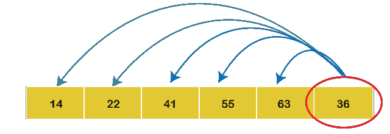

# 插入排序

> 原文：<https://www.javatpoint.com/daa-insertion-sort>

插入排序是最简单的排序算法之一，因为它在特定实例中对单个元素进行排序。就性能而言，它不是最好的排序算法，但在实际场景中比[选择排序](https://www.javatpoint.com/daa-selection-sort)和[冒泡排序](https://www.javatpoint.com/daa-bubble-sort)效率略高。这是一种直观的排序技术。

让我们考虑卡片的例子，以便更好地理解插入排序背后的逻辑。

假设我们手里有一套牌，这样我们就想按升序排列这些牌。要对这些卡片进行分类，我们有许多直观的方法。

我们可以做的一件事是，最初我们可以把所有的牌都放在左手，然后我们可以从左手开始一张接一张地拿牌，接着在右手建立一个有序的排列。

假设第一张牌已经排序，我们将选择下一张未排序的牌。如果发现未排序的牌比选中的牌大，我们将简单地把它放在右边，否则放在左边。在整个过程的任何阶段，左手都将被排序，右手将被排序。

同样，我们将把剩下的未排序的卡片放在正确的位置上进行排序。在每次迭代中，插入算法都会将一个未排序的元素放在正确的位置。

## 算法:插入排序(一)

```

1\. for j = 2 to A.length 
2\. 	key = A[j]
3\. 	// Insert A[j] into the sorted sequence A[1.. j - 1]
4.	i = j - 1
5\. 	while i > 0 and A[i] > key
6\. 		A[i + 1] = A[i]
7.		i = i -1
8.	A[i + 1] = key

```

## 插入排序的工作原理

1.我们将从假设数组的第一个元素已经排序开始。在**键**里面，我们会存储第二个元素。

接下来，我们将第一个元素与**键**进行比较，这样如果**键**被发现比第一个元素小，我们将交换它们的索引或将键放在第一个索引处。这样做之后，我们会注意到前两个元素被排序了。

2.现在，我们将继续讨论第三个元素，并将其与左侧元素进行比较。如果它是最小的元素，那么我们将把第三个元素放在第一个索引处。

否则如果它比第一个元素大，比第二个元素小，那么我们就把它的位置和第三个元素互换，放在第一个元素之后。这样做之后，我们将以有序的方式拥有前三个元素。

3.同样，我们将对其余的元素进行排序，并将它们放置在正确的位置。

考虑下面这个未排序数组的例子，我们将在插入排序算法的帮助下进行排序。

A = (41，22，63，14，55，36)

最初，


1 <sup>st</sup> 迭代:

设置键= 22

比较 a1 和 a0


既然 a0 > a1，就两者互换。


2 <sup>次</sup>迭代:

设置键= 63

将 a2 与 a1 和 a0 进行比较


因为 a2 > a1 > a0，所以保持数组不变。


3 <sup>次</sup>迭代:

设置键= 14

将 a3 与 a2、a1 和 a0 进行比较


因为 a3 是左侧所有元素中最小的，所以将 a3 放在数组的开头。


4 <sup>次</sup>迭代:

设置键= 55

将 a4 与 a3、a2、a1 和 a0 进行比较。


作为 a4 < a3，交换两者。


第 5 次<sup>迭代:</sup>

设置键= 36

将 a5 与 a4、a3、a2、a1 和 a0 进行比较。



因为 a5 < a2，所以我们将元素放在正确的位置。


因此，数组是按升序排列的，因此不需要更多的交换。

## 插入排序的复杂性分析

**输入:**给定 n 个输入元素。

**输出:**对列表进行排序的步骤数。

**逻辑:**如果给我们 **n** 个元素，那么在第一遍中，会做 **n-1** 个比较；第二遍会做**n-2**；第三关，它会做 **n-3** 等等。因此，比较的总数可以通过以下方式找到:

```
Output; 
(n-1) + (n-2) + (n-3) + (n-4) + ...... + 1
Sum= 
i.e., O(n2)

```

因此，插入排序算法包含时间复杂度为 **O(n <sup>2</sup> )** 和空间复杂度为 **O(1)** ，因为它需要一些额外的存储空间用于**键**变量来执行交换。

### 时间复杂性:

*   **最佳情况复杂度:**对于已经排序的数组，插入排序算法的最佳情况时间复杂度为 **O(n)** ，因为这里只有外循环运行 n 次，而内循环保持不动。
*   **平均案例复杂度:**插入排序算法的平均案例时间复杂度为 **O(n <sup>2</sup> )** ，这是在现有元素乱序时产生的，即既不按升序也不按降序。
*   **最差情况复杂度:**最差情况时间复杂度也是 **O(n <sup>2</sup> )** ，发生在我们把一个数组的升序排序成降序的时候。
    在该算法中，将每个单独的元素与其余的元素进行比较，因此每第 n 个<sup>元素进行 n-1 次比较。</sup>

强烈建议使用插入排序算法，尤其是当剩下几个元素要排序时，或者当数组包含几个元素时。

### 空间复杂性

由于使用了额外的变量**键**，插入排序包含了**0(1)**的空间复杂度。

## 插入排序应用程序

插入排序算法用于以下情况:

*   当数组只包含几个元素时。
*   当几乎没有要排序的元素时。

## 插入排序的优点

1.  实现起来很简单。
2.  它在小数据集上是有效的。
3.  它是稳定的(不改变具有相等键的元素的相对顺序)
4.  它是就地的(只需要恒定的 O (1)额外内存空间)。
5.  它是一种在线算法，可以在收到列表时对其进行排序。

* * *