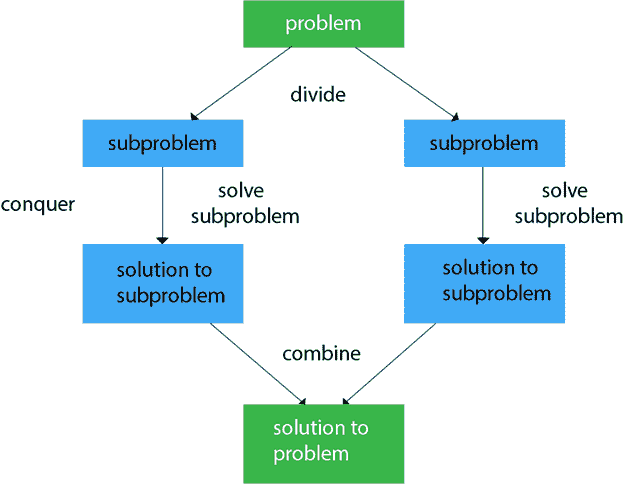

# 分而治之游戏攻略

> 原文：<https://www.javatpoint.com/divide-and-conquer-introduction>

分而治之是一种算法模式。在算法方法中，设计是对一个巨大的输入进行争议，将输入分成小块，在每个小块上决定问题，然后将分段解合并成全局解。这种解决问题的机制被称为分治策略。

分治算法由使用以下三个步骤的争议组成。

1.  **将**原问题划分为一组子问题。
2.  **征服:**逐个递归求解每个子问题。
3.  **组合:**把子问题的解放在一起，得到整个问题的解。

一般我们可以按照**各个击破**的方式分三步走。

**示例:**具体的计算机算法基于&分治法:

1.  最大最小问题
2.  二进位检索
3.  排序(合并排序、快速排序)
4.  河内塔。

## 分而治之战略的基础:

分治策略有两个基本原则:

1.  关系公式
2.  停止条件

**1。关系式:**是我们根据给定的技巧生成的公式。在生成公式后，我们应用 D & C 策略，即我们递归地分解问题&来解决分解的子问题。

**2。停止条件:**当我们使用分而治之&征服策略破解问题时，那么我们需要知道需要应用分而治之&征服多少时间。所以需要停止我们的递归步骤的条件叫做停止条件。

## 分治法的应用:

以下算法基于分而治之技术的概念:

1.  **二分搜索法:**二分搜索法算法是一种搜索算法，也叫半区间搜索或对数搜索。它的工作原理是将目标值与排序数组中的中间元素进行比较。在进行比较之后，如果值不同，那么不能包含目标的那一半将最终消除，然后在另一半上继续搜索。我们将再次考虑中间元素，并将其与目标值进行比较。这个过程不断重复，直到达到目标值。如果我们在结束搜索后发现另一半是空的，那么可以断定目标不在数组中。
2.  **Quicksort:** 是最高效的排序算法，也称为分区交换排序。它首先从一个数组中选择一个透视值，然后将其余的数组元素分成两个子数组。通过将每个元素与透视值进行比较来进行划分。它比较元素的值是大于还是小于透视值，然后对数组进行递归排序。
3.  **合并排序:**是一种通过比较对数组进行排序的排序算法。它首先将一个数组分成子数组，然后递归地对每个子数组进行排序。排序完成后，它会将它们合并回来。
4.  **最近点对:**这是计算几何的问题。该算法强调在给定 n 个点的情况下，找出度量空间中最接近的点对，使得点对之间的距离最小。
5.  **Strassen 的算法:**是一种矩阵乘法的算法，以 Volker Strassen 命名。事实证明，在处理大矩阵时，它比传统算法快得多。
6.  **库利-图基快速傅里叶变换(FFT)算法:**快速傅里叶变换算法以 J. W .库利和约翰·土耳其命名。它遵循分而治之的方法，并强加了 O(nlogn)的复杂性。
7.  **快速乘法的 Karatsuba 算法:**是传统时间最快的乘法算法之一，由 Anatoly Karatsuba 于 1960 年末发明，1962 年问世。它将两个 n 位数字相乘，最多减少到一位数。

## 分而治之的优势

*   分而治之往往能成功解决最大的问题之一，比如数学难题河内塔。解决你没有基本概念的复杂问题是有挑战性的，但是在分治法的帮助下，它减少了努力，因为它把主要问题分成两半，然后递归地解决它们。这个算法比其他算法快得多。
*   它高效地使用高速缓存，而不占用太多空间，因为它解决了高速缓存内存中的简单子问题，而不是访问较慢的主内存。
*   它比它的对手蛮力技术更熟练。
*   由于这些算法抑制了并行性，因此它不涉及任何修改，而是由包含并行处理的系统来处理。

## 分而治之的弊端

*   因为它的大多数算法都是通过引入递归来设计的，所以它需要高内存管理。
*   显式堆栈可能会过度使用空间。
*   如果递归执行得比中央处理器中的堆栈更严格，甚至可能导致系统崩溃。

* * *