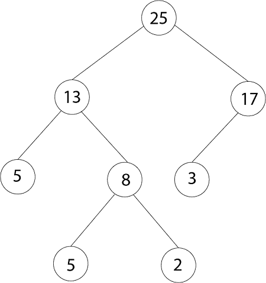
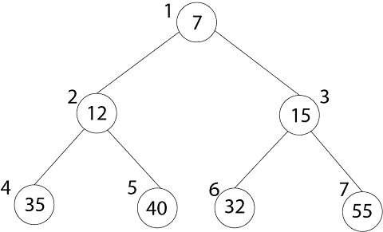
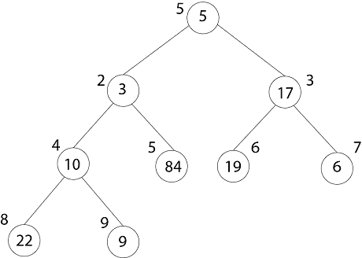
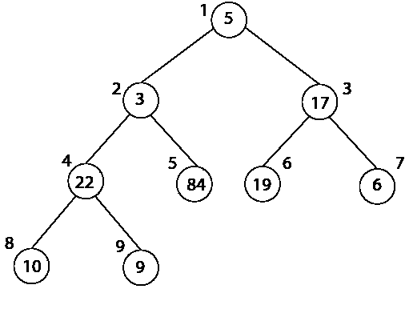
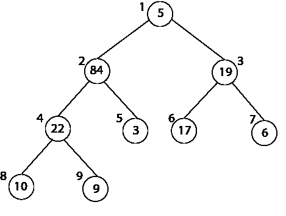
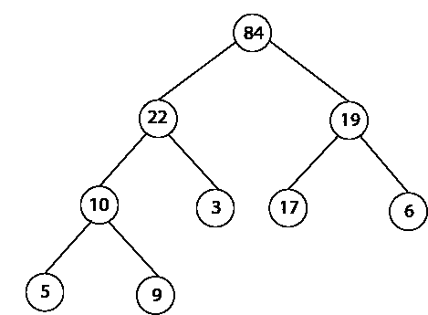
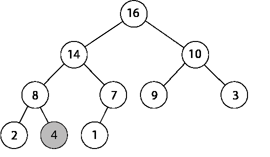
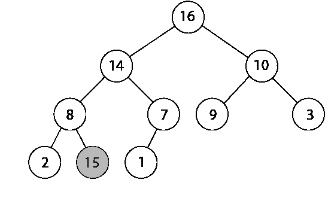
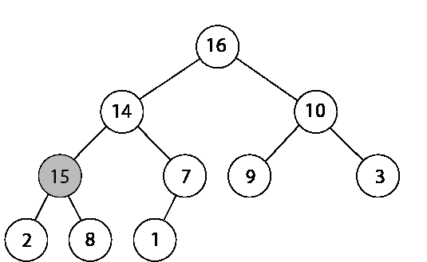

# 堆排序

> 原文：<https://www.javatpoint.com/daa-binary-heap-sort>

## 二进制堆:

二进制堆是一个数组对象，可以看作是完整的二叉树。二叉树的每个节点对应于数组中的一个元素。

1.  长度[A]，数组中的元素数
2.  堆大小[A]，数组 A 中存储的堆中的元素数

树 A [1]的根，并给出一个节点的索引“I ”,可以计算它的父节点、左节点和右节点的索引。

```

PARENT (i)
	Return floor (i/2)
LEFT (i)
	Return 2i
RIGHT (i)
	Return 2i+1

```


**上图的数组表示如下:**


20 的指数是 1

为了找到左边孩子的指数，我们计算 1*2=2

这将我们(正确地)带到 14。

现在，我们向右走，所以我们计算 2*2+1=5

这将我们(再次，正确地)带到 6。

现在，4 的指数是 7，我们想去父级，所以我们计算 7/2 =3，这将我们带到 17。

## 堆属性:

二进制堆可以分为最大堆或最小堆

**1。最大堆:**在二进制堆中，对于根以外的每个节点 I，该节点的值都大于或等于其最高子节点的值

```

A [PARENT (i) ≥A[i]

```

因此，堆中最高的元素存储在根。下面是一个最大堆的例子



**2。最小堆:**在最小堆中，节点的值小于或等于其最低子节点的值。

```

A [PARENT (i) ≤A[i]

```



## 健康方法:

**1。维护堆属性:**堆是一个操作堆数据结构的过程。给它一个数组 A 和数组的索引 I。以 A [i]的子树为根的子树是堆，但是节点 A [i]本身可能违反堆属性，即 A [i] < A [2i]或 A [2i+1]。过程“Heapify”操作以 A [i]为根的树，使其成为一个堆。

```
MAX-HEAPIFY (A, i)
 1\. l ← left [i]
 2\. r ← right [i]
 3\. if l≤ heap-size [A] and A[l] > A [i]
 4\. then largest ← l
 5\. Else largest ← i
 6\. If r≤ heap-size [A] and A [r] > A[largest]
 7\. Then largest ← r
 8\. If largest ≠ i
 9\. Then exchange A [i]    A [largest]
 10\. MAX-HEAPIFY (A, largest)

```

### 分析:

元素可以向上移动的最大级别是θ(log n)级别。在每一个层次上，我们做简单的比较哪个 O (1)。因此，健康的总时间为 0(对数 n)。

## 建立一个堆:

```
BUILDHEAP (array A, int n)
 1 for i ← n/2 down to 1
 2 do
 3 HEAPIFY (A, i, n)

```

## 堆排序算法:

```
HEAP-SORT (A)
 1\. BUILD-MAX-HEAP (A)
 2\. For I ← length[A] down to Z
 3\. Do exchange A [1] ←→ A [i]
 4\. Heap-size [A] ← heap-size [A]-1
 5\. MAX-HEAPIFY (A,1)

```

**分析:**构建最大堆需要 O (n)个运行时间。堆排序算法调用“构建最大堆”，我们花费 0(n)次&调用最大堆的每(n-1)次来修复一个新的堆。我们知道“最大健康”需要时间

**堆排序的总运行时间为 O (n log n)。**

**示例:**说明数组上 BUILD-MAX-HEAP 的操作。

```
    A = (5, 3, 17, 10, 84, 19, 6, 22, 9)

```

**解决方案:原:**

```

Heap-Size (A) =9, so first we call MAX-HEAPIFY (A, 4)
And I = 4.5= 4 to 1

```



```

After MAX-HEAPIFY (A, 4) and i=4
 L ← 8, r ← 9
 l≤ heap-size[A] and A [l] >A [i]
 8 ≤9 and 22>10
 Then Largest ← 8
 If r≤ heap-size [A] and A [r] > A [largest]
  9≤9 and 9>22
 If largest (8) ≠4
 Then exchange A [4] ←→ A [8]
 MAX-HEAPIFY (A, 8)

```



```

After MAX-HEAPIFY (A, 3) and i=3
l← 6, r ← 7
l≤ heap-size[A] and A [l] >A [i]
6≤ 9 and 19>17
Largest ← 6
If r≤ heap-size [A] and A [r] > A [largest]
7≤9 and 6>19
If largest (6) ≠3
Then Exchange A [3] ←→ A [6]
MAX-HEAPIFY (A, 6)

```


```

After MAX-HEAPIFY (A, 2) and i=2
l ← 4, r ← 5
l≤ heap-size[A] and A [l] >A [i]
4≤9 and 22>3
Largest ← 4
If r≤ heap-size [A] and A [r] > A [largest]
5≤9 and 84>22
Largest ← 5
If largest (4) ≠2
Then Exchange A [2] ←→ A [5]
MAX-HEAPIFY (A, 5)

```



```

After MAX-HEAPIFY (A, 1) and i=1
l ← 2, r ← 3
l≤ heap-size[A] and A [l] >A [i]
2≤9 and 84>5
Largest ← 2
If r≤ heap-size [A] and A [r] > A [largest]
3≤9 and 19<84
If largest (2) ≠1
Then Exchange A [1] ←→ A [2]
MAX-HEAPIFY (A, 2)

```



## 优先级队列:

与堆一样，优先级队列以两种形式出现:最高优先级队列和最低优先级队列。

优先级队列是一种用于维护一组元素的数据结构，每个元素都有一个称为键的组合值。最高优先级队列指导以下操作:

**INSERT(S，x):** 将元素 x 插入到集合 S 中，与操作 S = S∪x 成正比。

**max(S)**返回 S 的最高键的元素。

**EXTRACT-MAX (S)** 移除并返回 S 中具有最高键的元素。

**INDEX-Key(S，x，k)** 将元素 x 的 key 值增加到新值 k，这个值被认为至少和 x 当前的 KEY 值一样大。

让我们讨论如何实现最大优先级队列的操作。过程 HEAP-MANUMENT 考虑θ (1)时间内的最大操作。

## 堆最大值

1.返回 A [1]

过程 HEAP-EXTRACT-MAX 实现了提取-MAX 操作。它类似于堆排序过程的 for 循环。

```
HEAP-EXTRACT-MAX (A)
 1 if A. heap-size < 1
 2 error "heap underflow"
 3 max ← A [1]
 4 A [1] ← A [heap-size [A]]
 5 heap-size [A] ← heap-size [A]-1
 6 MAX-HEAPIFY (A, 1)
 7 return max

```

过程堆增加键实现增加键操作。数组中的索引 I 标识我们希望增加其关键字的优先级队列元素。

```
HEAP-INCREASE-KEY.A, i, key)
 1 if key < A[i]
 2 errors "new key is smaller than current key"
 3 A[i] = key 
 4 while i>1 and A [Parent (i)] < A[i] 
 5 exchange A [i] with A [Parent (i)] 
 6 i =Parent [i]

```

由于从第 3 行更新的节点到根的路径长度为 0(log n)，所以 n 元素堆上的 HEAP-ADOW-KEY 的运行时间为 0(log n)。

最大堆插入过程实现了插入操作。该过程首先通过向树中计算一个键为- ∞的新叶来扩展最大堆。然后它调用 HEAP-address-KEY 将这个新节点的键设置为正确的值，并维护 max-heap 属性

```
MAX-HEAP-INSERT (A, key)
 1 A. heap-size = A. heap-size + 1 
 2 A [A. heap-size] = - ∞
 3 HEAP-INCREASE-KEY (A, A. heap-size, key)

```

**MAX-HEAP-INSERT 在 n 元素堆上的运行时间为 O (log n)。**

**示例:**说明堆上 HEAP-EXTRACT-MAX 的操作

```

 A= (15,13,9,5,12,8,7,4,0,6,2,1)

```

**图:**堆增加键的操作



**图:(a)**

在此图中，索引为“I”节点的最大堆阴影较重



**图:(b)**

在这个图中，这个节点的键增加到了 15。



**图:(c)**

在第 4-6 行的 while 循环的一次迭代之后，节点和它的父节点交换了密钥，索引 I 向上移动到父节点。


**图:(d)**

while 循环再一次迭代后的最大堆，最大堆属性的 A [PARENT (i) ≥A (i)]现在保持不变，过程终止。

## 堆-删除:

Heap-DELETE (A，I)是从堆 A 中删除节点“I”中的项目的过程，对于 n 元素最大堆，Heap-DELETE 在 O (log n)时间内运行。

```
HEAP-DELETE (A, i)
 1\. A [i] ← A [heap-size [A]]
 2\. Heap-size [A] ← heap-size [A]-1
 3\. MAX-HEAPIFY (A, i)

```

* * *