# 最长递增子序列

> 原文：<https://www.javatpoint.com/longest-increasing-subsequence>

在本主题中，我们将学习如何使用动态编程找到数组中最长的递增子序列。最长递增子序列是一个问题，用来从给定的子序列中找出最长子序列的长度，其中所有元素都按递增顺序排序。

**我们通过一个例子来了解一下。**

考虑下面给出的一个数组:

**数组:0、4、12、2、10、6、9、13、3、11、7、15**

**以下是可以由上述数组组成的子序列:**

**Sub1: 8、20、40、60、70**

**Sub2: 9、21、32、49、60、70**

同样，一个数组中可以有更多的子序列。sub2 的长度是所有子序列中最大的。子序列中的元素在原始数组中不应该是连续的。现在让我们看看如何直接说 sub2 是最大的子序列。我们可以使用动态规划来找到最长的子序列。

通过使用动态编程方法，我们将在每个位置跟踪原始数组。我们将检查数组的每个索引是否适合最长的递增子序列。

首先，我们考虑两个变量，I 和 j，其中“I”变量将指向数组的每个位置，对于每个“I”，“j”将从头开始。我们将考虑两个名为“长度”和“子序列”的数组，其中长度数组将存储每个子序列的长度，子序列将存储子序列的元素。

动态编程的基本条件是我们用下面显示的 1 个值初始化每个数组单元。我们考虑数组中的每个元素都是长度为 1 的最长递增子序列。

**在 i=0 时**

现在我们将找到长度大于 1 的子序列。如果我们从 i=0 开始；[0]包含 1 值，这是迄今为止最大的递增子序列，并且已经找到。所以，我们从索引 i=1 开始，对于‘I’的每一个增量，‘j’将再次从头开始。

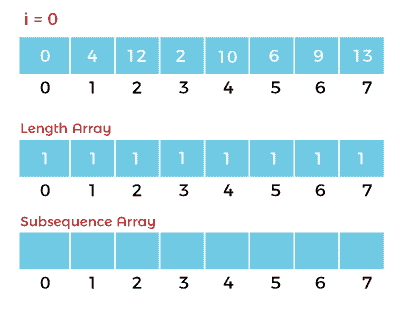

**在指数 i=1 时，j=0**

因为 a[i]>a[j]，即 4>0 意味着元素按递增顺序排列。索引“I”处的长度等于索引“j”处的长度加上 1，即 1+1 = 2。值 2 将在长度数组的索引 1 处相加，如下所示:

“I”的前一个索引将被添加到子序列数组中的位置“1”，如下所示:

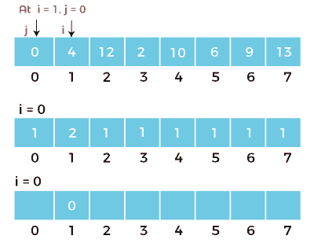

因为“j”达到了“I”，所以“I”将递增；“I”的值变为 2，而“j”的值将再次从头开始，即 0。

**在指数 i=2 时，j=0**

现在我们将比较 a[i]和 a[j]。由于 a[i]大于 a[j]，即 12>0 意味着元素按递增顺序排列。索引“I”处的长度等于索引“j”处的长度加上 1，即 1+1 = 2。值 2 将在长度数组的索引 2 处相加，并且“j”将如下所示递增:

**在 i=2，j=1 时**

由于 a[i]大于 a[j]，即 12>4 意味着元素的顺序是递增的。索引“I”处的长度等于索引“j”处的长度加上 1，即 2+1 = 3。我们将计算值与索引 I 处的先前存储值进行比较。由于 3>2，因此长度数组中索引“I”处的值 3 将取代 2，如下所示:

“I”的前一个索引将被添加到子序列数组中的索引 2 处，如下所示:

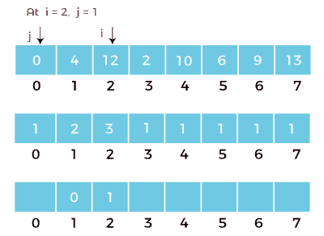

因为“j”达到了“I”，所以“I”将递增；“I”的值变为 3，“j”的值将再次从头开始，即 0。

**在指数 i=3 时，j=0**

现在我们将比较 a[i]和 a[j]。由于 a[i]大于 a[j]，即 2>0 意味着元素按递增顺序排列。索引 i=3 处的长度等于索引“j”处的长度加上 1，即 1+1 = 2。值 2 将在长度数组的索引 3 处相加，并且“j”将如下所示递增:

在“j”递增之前，“j”指向索引 0。值“0”将位于子序列数组中的索引 3 处，如下所示。由于“j”没有达到“I”，因此值 0 在子序列数组的索引 3 处不固定。

**在 j=1 时**

现在，j 指向指数 1。a[j]处的值为 4，a[i]为 2 意味着 a[i]

**在 j=2 时**

当‘j’递增时，我们将比较 a[i]和 a[j]。因为 a[j]大于 a[i]，即 12>2 意味着没有上升。现在，“j”将递增，“j”的值将等于“I”，因此没有范围来递增“j”的值。

因为“j”达到了“I”，所以“I”将递增；“I”的值变为 4，“j”的值将再次从头开始，即 0。

**在指数 i=4 时，j=0**

现在我们将比较 a[i]和 a[j]。由于 a[i]大于 a[j]，即 10>0 意味着元素按递增顺序排列。索引 i=4 处的长度等于索引“j”处的长度加上 1，即 1+1 = 2。值 2 将在长度数组的索引 4 处相加，并且“j”将如下所示递增:

在“j”递增之前，“j”指向索引 0。值“0”将被添加到子序列数组的索引 4 处，如下所示。由于“j”没有达到“I”，因此值 0 在子序列数组的索引 4 处不固定。

**在 j=1 时**

现在，j 指向指数 1。a[j]处的值为 4，a[i]为 10 意味着 a[i]>a[j]。索引 i=4 处的长度等于索引“j”处的长度加上 1，即 2+1 = 3。值 3 将在长度数组的索引 4 处相加，并且“j”将如下所示递增:

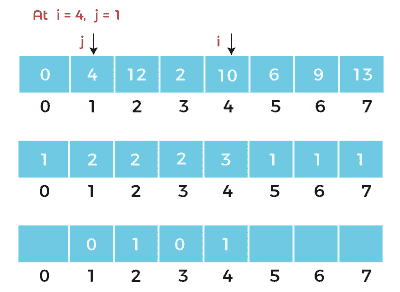

在“j”的增量之前，“j”指向索引 1。值“1”将被添加到子序列数组的索引 4 处，如下所示。因为“j”没有达到“I”，所以值 1 不固定在子序列数组的索引 4 处。

**在 j=2 时**

现在，j 指向指数 2。a[j]的值是 12，a[i]的值是 10 意味着 a[i] 

**在 j=3 时**

因为 a[i]>a[j]，即 10>2 意味着元素按递增顺序排列。索引 i=4 处的长度等于索引“j”处的长度加上 1，即 2+1 = 3。值 3 将在长度数组的索引 4 处相加，并且“j”将如下所示递增:

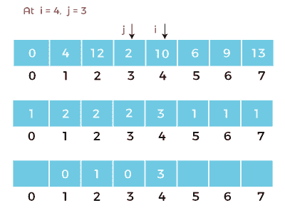

因为“j”达到了“I”，所以“I”将递增；“I”的值变为 5，“j”的值将再次从头开始，即 0。

**在指数 i= 5 时，j=0**

因为 a[i]>a[j]，即 6>0 意味着元素按递增顺序排列。索引 i=5 处的长度等于索引“j”处的长度加上 1，即 1+1 = 2。值 2 将在长度数组的索引 5 处相加，并且“j”将如下所示递增:

在“j”递增之前，“j”指向索引 0。值“0”将被添加到子序列数组的索引 5 处，如下所示。由于“j”没有达到“I”，因此值 0 在子序列数组的索引 5 处不固定。

**在 j=1 时**

现在，j 指向指数 1。由于 a[i]大于 a[j]，即 4>6 意味着元素按递增顺序排列。索引 i=5 处的长度等于索引“j”处的长度加上 1，即 2+1 = 3。值 3 将在长度数组的索引 5 处相加，并且“j”将如下所示递增:

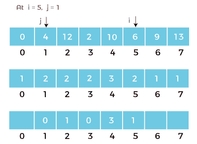

在“j”的增量之前，“j”指向索引 1。值“1”将被添加到子序列数组的索引 5 处，如下所示。因为“j”没有达到“I”，所以值 1 不固定在子序列数组的索引 5 处。

**在 j=2 时**

现在，j 指向指数 2。由于 a[j]大于 a[i]，即 12>6 意味着没有上升。现在，“j”将递增，“j”的值将变为 3。

**在 j=3 时**

现在，j 指向指数 3。由于 a[i]大于 a[j]，即 6>2 意味着元素按递增顺序排列。索引 i=5 处的长度等于索引“j”处的长度加上 1，即 2+1 = 3。值 3 将在长度数组的索引 5 处相加，“j”将如下所示递增:

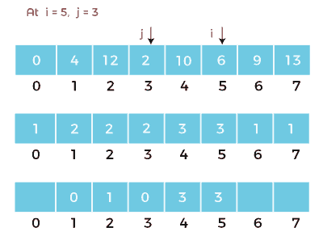

在“j”的增量之前，“j”指向索引 2。值“2”将被添加到子序列数组的索引 5 处，如下所示。因为“j”没有达到“I”，所以值 2 不固定在子序列数组的索引 5 处。

**在 j=4 时**

现在，j 指向指数 4。由于 a[j]大于 a[i]，即 10>6 意味着没有上升。现在“j”将递增，“j”的值将变为 5，如下所示:

因为“j”达到了“I ”,所以没有增加值的范围。“I”的值将递增，变成 6。“j”的值将从头开始，即 j=0。

**在指数 i=6 时，j=0**

因为 a[i]>a[j]，即 9>0 意味着元素按递增顺序排列。索引 i=6 处的长度等于索引 j=0 处的长度加上 1，即 1+1 =2。值 2 将在长度数组的索引 i=6 处相加，并且“j”将如下所示递增:

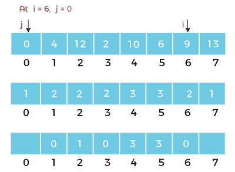

在“j”递增之前，“j”指向索引 0。值“0”将被添加到子序列数组的索引 6 处，如下所示。由于“j”没有达到“I”，因此值 0 在子序列数组的索引 6 处不固定。

**在 j=1 时**

现在 j 指向指数 1。由于 a[i]大于 a[j]，即 9>4 意味着元素以递增的顺序排列。索引 i=6 处的长度等于索引 j=1 处的长度加 1，即 2+1 = 3。我们将比较已经存储在索引 6(即 2)中的值和新计算的值(即 3)。因为 3>2，所以在如下所示的长度数组中，索引 6 处的 2 被 3 代替:

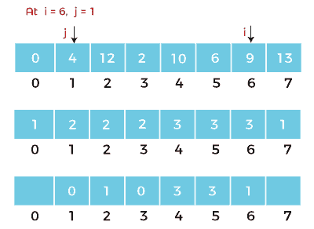

值 1 将在子序列数组的索引 6 处相加，如下所示。“j”的值将递增，并包含值 2。

**在 j=2 时**

现在，j 指向指数 2。因为 a[j]大于 a[i]，即 12>9 意味着没有上升。现在“j”将递增，“j”的值将变为 3，如下所示:

**在 j=3 时**

现在 j 指向指数 3。由于 a[i]大于 a[j]，即 9>2 意味着元素以递增的顺序排列。索引 i=6 处的长度等于索引 j=2 处的长度加上 1，即 2+1 = 3。我们将比较已经存储在索引 6(即 3)中的值和新计算的值(即 3)。因为两个值相同，所以不需要修改。

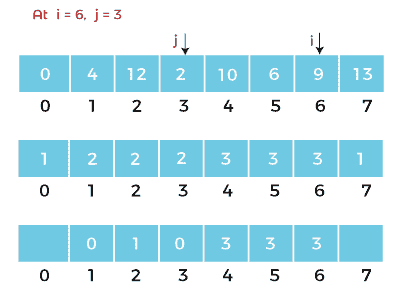

值 3 将在如下所示的子序列数组的索引 6 处相加，并且“j”的值将递增。

**在 j=4 时**

现在，j 指向指数 4。由于 a[j]大于 a[i]，即 6>4 意味着没有上升。现在“j”将递增，“j”的值将变为 5。

**在 j=5 时**

现在 j 指向指数 5。由于 a[i]大于 a[j]，即 9>6 意味着元素按递增顺序排列。索引 i=6 处的长度等于索引 j=5 处的长度加上 1，即 3+1=4。我们将比较已经存储在索引 6(即 3)的值和新计算的值(即 4)。因为 4>3，所以我们用 4 替换长度数组中索引 i=6 的 3，如下所示:

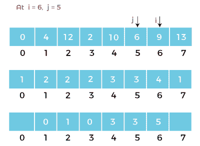

值 5 将在如下所示的子序列数组中的索引 6 处相加，并且“j”的值将递增。

**在 j=6 时**

在这种情况下，j 等于 I，所以不会有上升。“I”的值将递增，“I”的值变为 7。“j”从开头开始，即 0。

**在 i=7，j=0 时**

由于 a[i]大于 a[j]，即 13>0 意味着元素以递增的顺序排列。索引 7 处的长度将等于索引 j 处的长度加上 1，即 1+1=2。我们将比较已经存储在索引 7 中的值，即 1 和新计算的值，即 2。因为 2>1，所以我们将长度数组中索引 i=7 的 1 替换为 2，如下所示:

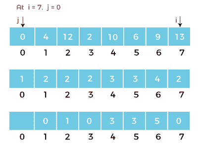

值 0 将被添加到如下所示的子序列数组的索引 7 处，并且“j”的值将递增。

**在 j=1 时**

由于 a[i]大于 a[j]，即 13>4 意味着元素以递增的顺序排列。索引 7 处的长度将等于索引 j 处的长度加上 1，即 2+1=3。我们将比较已经存储在索引 7(即 2)的值和新计算的值(即 3)。因为 3>2，所以我们用 3 替换长度数组中索引 i=7 的 2，如下所示:

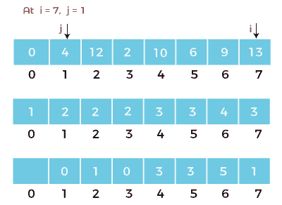

值 1 将在如下所示的子序列数组中的索引 7 处相加，并且“j”的值将递增。

**在 j=2 时**

由于 a[i]大于 a[j]，即 13>12 意味着元素以递增的顺序排列。索引 7 处的长度将等于索引 j 处的长度加上 1，即 2+1=3。我们将比较已经存储在索引 7(即 3)的值和新计算的值(即 4)。因为这两个值相等，所以不会有任何修改，并且“j”的值将递增。

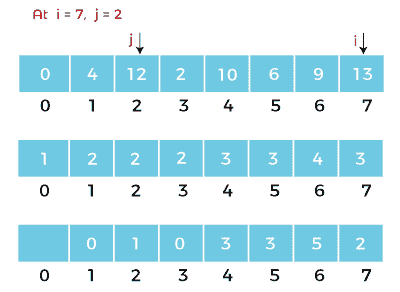

值 2 将在如下所示的子序列数组中的索引 7 处相加，并且“j”的值将递增。

**在 j=3 时**

由于 a[i]大于 a[j]，即 13>2 意味着元素以递增的顺序排列。索引 7 处的长度将等于索引 j 处的长度加上 1，即 2+1=3。我们将比较已经存储在索引 7 中的值，即，与新计算的值，即，3。由于两个值相等，因此不会有任何修改，并且“j”的值将递增。

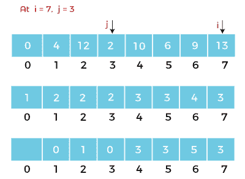

值 3 将在如下所示的子序列数组中的索引 7 处相加，并且“j”的值将递增。

**在 j=4 时**

由于 a[i]大于 a[j]，即 13>10 意味着元素以递增的顺序排列。索引 7 处的长度将等于索引 j 处的长度加上 1，即 3+1=4。我们将比较已经存储在索引 7(即 4)中的值和新计算的值(即 4)。因为 4>3，所以我们用索引 i=7 的长度数组中的 5 替换 3，如下所示:

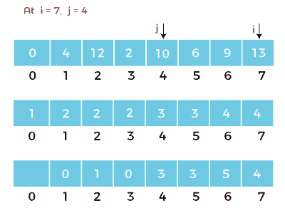

**在 j=5 时**

由于 a[i]大于 a[j]，即 13>6 意味着元素以递增的顺序排列。索引 7 处的长度将等于索引 j 处的长度加上 1，即 3+1=4。我们将比较已经存储在索引 7(即 4)中的值和新计算的值(即 4)。因为这两个值相等，所以不会有任何修改，并且“j”的值将递增。

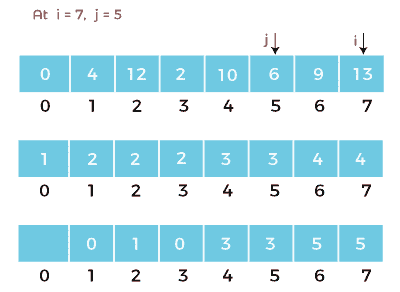

**在 j=6 时**

由于 a[i]大于 a[j]，即 13>9 意味着元素以递增的顺序排列。索引 7 处的长度将等于索引 j 处的长度加上 1，即 4+1=5。我们将比较已经存储在索引 7(即 4)的值和新计算的值(即 5)。因为 5>4，所以我们用 5 替换长度数组中索引 i=7 的 4，如下所示:

值 6 将在如下所示的子序列数组中的索引 7 处相加，并且“j”的值将递增。

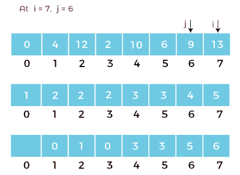

这样，我们就可以找到子序列的长度。在上面的长度数组中，5 是最大长度。为了找到长度为 5 的子序列，子序列数组中对应的单元格是索引 7。我们从指数 7 移到指数 6，从指数 6 移到指数 5，从指数 5 移到指数 3，从指数 3 移到指数 0。因此，索引应该是 0、3、5、6、7。这些索引处的元素是子序列。对应于这些索引的元素是 0、2、6、9、13。

* * *