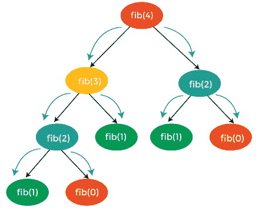

# 如何解决一个动态规划问题？

> 原文：<https://www.javatpoint.com/how-to-solve-a-dynamic-programming-problem>

## 什么是动态规划？

动态规划是理查德·贝尔曼在 20 世纪 50 年代开发的一种优化技术。基本上，动态编程是对常规递归的优化。在递归的情况下，对同一个子问题进行重复调用，但是我们可以借助动态编程来优化这个问题。使用动态编程背后的思想是，我们存储子问题的结果，这样我们就不需要在任何需要的时候重新计算子问题。这将时间复杂性从指数时间降低到线性时间。

**下面是指数时间递归的代码。**

```

int fib(int n)
{
    if(n<=1)
    return n;
  return fib(n-1)+fib(n-2);
} 

```

**下面是线性时间动态规划的代码。**

```

f[0] = 0;
f[1] = 1;
for(i=2; i<=n; i++)
{
    f[i] = f[i-1] + f[i-2];
}
return f[n];

```

**解决动态规划问题的技术。**

为了解决任何动态规划问题，我们可以使用 FAST 方法。

在这里，FAST 代表:

*   **‘F’**代表**求递归解:**每当我们发现任何 DP 问题，都要求递归解。
*   **‘A’**代表**分析解:**一旦我们找到递归解，那么我们就必须分析解并寻找重叠的问题。
*   **‘S’**代表**保存结果以备后用:**一旦发现重叠问题，我们就存储这些子问题的解决方案。为了存储解决方案，我们使用 n 维数组进行缓存。

如果我们使用‘F’、‘A’和‘S’，以上三个步骤用于自上而下的方法，这意味着我们正在实现自上而下的方法。因为这不纯粹是因为我们在使用递归技术。

*   **‘T’**代表**调整解决方案**，通过消除递归开销使其更加强大，这就是自下而上的方法。这里我们去掉了递归技术，并使用迭代方法来获得相同的结果，所以这是一种纯方法。递归总是一种开销，因为有可能会出现堆栈溢出错误，所以我们应该使用自下而上的方法来避免这个问题。

以上是解决复杂问题的四个步骤。

### 问题陈述:写一个高效的程序求第 n 个斐波那契数？

**我们知道斐波那契数列看起来像:**

**0、1、1、2、3、5、8、13、21、...**

**首先，我们找到递归解，**


**下面是上面递归解的代码:**

```

Fib(n)
{
    if(n<2)
    return n;
   return fib(n-1) + fib(n-2);
}

```

上述递归解也是上述问题的解，但这种情况下的时间复杂度为 O(2 <sup>n</sup> )。因此，采用动态规划将时间复杂度从指数时间降低到线性时间。

**第二步是分析解决方案**

**假设我们要计算 fib(4)。**

**Fib(4)= fib(3) + fib(2)**

**Fib(3) = fib(2) + fib(1)**

**Fib(2) = fib(1) + fib(0)**

如上图所示，fib(2)计算了两次，而 fib(1)计算了三次。所以，这里出现了重叠问题。在这一步中，我们已经分析了解决方案。

**第三步是保存结果。**

保存结果的过程称为记忆。在这一步中，我们将遵循相同的方法，即递归方法，但有一点不同，即我们使用缓存来存储解决方案，以便在需要时可以重复使用。

**下面是记忆的代码。**

```

Fib(n)
{
     int cache = new int[n+1];
     if(n<2)
     return n;
    if(cache[n]!= 0)
    return cache[n];
  return cache[n] =  fib(n-1) + fib(n-2); 
}

```

在上面的代码中，我们使用了大小为 n+1 的缓存数组。如果缓存[n]不等于零，那么我们从缓存返回结果，否则我们将计算缓存的值，然后返回缓存。我们在这里使用的技术是自顶向下的方法，因为它遵循递归方法。在这里，我们总是寻找缓存，这样缓存将根据需求填充。假设我们想要计算 fib(4)，首先我们查看缓存，如果该值不在缓存中，则计算该值并将其存储在缓存中。

**上述代码的可视化表示为:**



**第四步是调整解决方案**

在这一步中，我们将彻底消除递归，使其成为一种迭代方法。因此，这种技术被称为自下而上的方法。

```

Fib(n)
{
    int cache[] = new int[n+1];
    // base cases
    cache[0] = 0;
    cache[1] = 1;
    for(int i=2; i<=n; i++)
    {
            cache[i] = cache[i-1] + cache[i-2];
    }
return cache[n];
}

```

在上面的代码中，我们遵循了**自下而上**的方法。我们已经声明了大小为 n+1 的缓存数组。基本情况是缓存[0]和缓存[1]，它们的值分别为 0 和 1。在上面的代码中，我们已经完全消除了递归。我们使用了迭代方法。我们定义了一个 for 循环，在这个循环中，我们用索引 i=2 到 n 的值填充缓存，然后从缓存中返回结果。假设我们要计算 f(4)，首先我们将计算 f(2)，然后我们将计算 f(3)，最后，我们我们计算 f(4)的值。这里我们从下往上走，所以这种方法被称为自下而上方法。

**我们可以用图解法来可视化这种方法:**


从上图中我们可以看到，我们是从下往上填充缓存的，所以这被称为自下而上的方法。这种方法比前一种方法更有效，因为它不使用递归，但两种方法具有相同的时间和空间复杂性，即 O(n)。

在这种情况下，我们使用了 **FAST** 方法来获得最优解。以上是我们目前得到的最优解，但这不是纯粹的最优解。

**高效解决方案:**

```

fib(n)
{
    int first=0, second=1, sum=0;
    if(n<2)
   {
      return 0;
 }
for(int i =2; i<=n; i++)
{
    sum = first + second;
    first = second;
    second = sum;
}
return sum;
}

```

上述解决方案是有效的解决方案，因为我们不使用缓存。

* * *