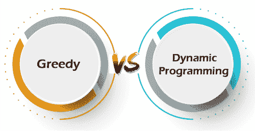

# 动态规划与贪婪方法

> 原文：<https://www.javatpoint.com/dynamic-programming-vs-greedy-approach>

在理解动态规划和贪婪方法之间的区别之前，我们应该分别了解动态规划和贪婪方法。

### 什么是贪婪法？

贪婪方法是用来解决问题的技术之一。这种方法用于解决优化问题。优化问题是需要最大或最小结果的问题。

**我们通过一个例子来了解一下。**

假设我们想从 A 地旅行到 B 地，我们可以通过步行、自行车、汽车、公共汽车、火车、飞机等各种方式从 A 地旅行到 B 地。所以，我们有各种解决方案来实现目标。但是这个问题有一个限制，我们必须在 12 小时内到达 B，我们可以通过飞行或火车来实现这个目标。因此，在这种情况下，我们有两种解决方案，即飞行或火车。这些类型的解决方案都是可行的解决方案。可行解是那些满足问题中给出的约束的解。

假设我们想以最小的代价走完这段距离，那么这就是所谓的最小化问题。最小化问题是一个需要最小成本的问题。在上面的问题中，如果我们乘火车去，那么提供一个最优的解决方案将花费最小的成本。最优解是提供可行解且成本最小的解。意味着只能有一个最优解，即不可能有多个解。

这个问题需要最小的结果，但有些问题需要最大的结果。需要最大或最小结果的问题称为优化问题。

贪婪方法认为问题应该分阶段解决。在每个阶段，我们考虑来自给定问题的输入，如果输入是可行的，那么我们包括它。这样，我们包括所有可行的输入，以找到一个最优解。

**贪婪法的算法**

```

Algorithm Greedy(a, n)
{
    for i = 1 to n do
    {
        x = Select(a);
        if feasible(x) then
        solution = solution + x;
    } 
}

```

在上面的贪婪算法中，我们传递了两个参数，即 a 和 n，其中‘a’是数组，n 是数组的大小。在 for 循环中，我们从“a”中选择输入值，然后检查它是否可行。如果所选输入可行，则将该输入添加到解决方案中。

### 什么是动态规划？

动态规划是解决优化问题的技术之一。以下是动态规划为获得最优解而遵循的程序:

*   它把复杂的问题分解成更简单的子问题。
*   我们会找到这些子问题的最优解。
*   存储这些子问题的结果。
*   我们将重用这些子问题的解决方案，这样我们就不需要重新计算它们。
*   最后，我们将计算复杂问题的结果。

以上是动态规划中用于解决优化问题的五个步骤。动态规划适用于具有如下某些特性的问题:

*   重叠子问题:重叠问题是那些有共同解决方案的问题。
*   最优子结构:最优子结构是由子问题的所有最优解组合而成的子结构。

### 动态规划与贪婪方法的区别



|  | 动态规划 | 贪婪方法 |
| **定义** | 它用于获得最优解。 | 它也用于获得最优解。 |
| **可行性** | 这种方法没有一套特殊的可行解。 | 在贪婪方法中，最优解从可行解集中获得。 |
| **递归** | 动态规划考虑了所有可能的顺序，以获得最优解。 | 在贪婪方法中，无需修改先前生成的解就可以获得最优解。 |
| **最优性原则** | 它保证使用最优性原则生成最优解。 | 它不能保证会产生最优解。 |
| **记忆** | 它创建查找表来存储占用内存空间的子问题的结果。 | 它在内存方面效率更高，因为它不创建任何表来存储以前的状态。 |
| **时间复杂度** | 动态规划比贪婪方法慢，像贝尔曼-福特算法需要 O(VE)时间。 | 贪婪方法比像 Dijkstra 的最短路径算法那样的动态编程要快(ElogV + VlogV)时间。 |
| **方法** | 动态编程使用自下而上或自上而下的方法，将复杂的问题分解成更简单的问题。 | 贪婪方法总是以序列的方式计算解，并且不查看以前的状态。 |
| **示例 0/1** | 背包问题 | 分数背包 |

* * *