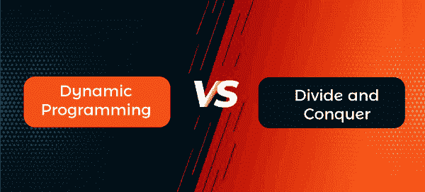

# 动态编程与分而治之

> 原文：<https://www.javatpoint.com/dynamic-programming-vs-divide-and-conquer>

在了解动态规划和分而治之的区别之前，我们应该分别了解动态规划和分而治之。

### 什么是分治？

分而治之是用来解决问题的策略。策略可以定义为解决问题的方法。为了解决计算问题，设计了这种策略。有各种各样的技术可以解决这个问题，但是我们必须决定这个技术是否适合这个问题。

假设问题很大，那么我们把问题分解成更小的子问题，然后分别解决这些子问题。一旦所有的子问题都解决了，我们就会把所有子问题的解决方案结合起来，找到大问题的解决方案。如果子问题也很大，那么再次应用分治策略来解决子问题。分而治之策略的约束是子问题要和主问题一样。假设主要问题是排序，那么子问题也应该是排序。分治策略本质上是递归的。如果问题很大，那么我们递归地解决这个问题。

**分治的一般方法:**

```

Divide_and_conquer(p)
{
     if(small(p))
     {
          S(p);
     }
    else
     {
         Divide P into p1, p2, ?pk
         Apply divide_and_conquer(p1),?.. divide_and_conquer(pk)
         Combine((divide_and_conquer(p1)),?.. (divide_and_conquer(pk)));
)
      }
}

```

因为动态规划是递归的，所以过程是递归的，算法也是递归的。

**以下是使用分治策略可以解决的问题:**

*   合并排序:将数组分成两半，递归排序左右两半，然后我们将这两半合并。这种技术被称为合并排序。
*   快速排序:首先将数组划分为小项和大项，然后递归排序这两组。这种技术被称为快速排序。

**分而治之示例:**

*   搜索:二分搜索法 ***采用分治策略。*T3】**
*   排序:合并排序和快速排序是分而治之技术的例子。
*   树木穿越
*   矩阵乘法

### 什么是动态规划？

动态规划是指将优化问题分成更简单的子问题，并存储每个子问题的解，以便每个子问题可以解决一次。一旦所有的子问题都被解决了，我们将连接每个子问题的结果来找到初始问题的解决方案。

**每个动态规划都有四个步骤:**

*   动态执行是以这样一种方式进行的，即问题可以分解为最优的子问题。
*   它通过以较小子问题的最优解的形式显示来递归地定义解的值。
*   我们将计算最优解的值。
*   根据计算值构造最优解。

**让我们以表格的形式了解每一步。**

| 第一步 | 结构 | 描述最优解的结构。 |
| 第二步 | 优化原理 | 它递归地定义最优解的值。 |
| 第三步 | 自底向上计算 | 它通过使用表结构以自下而上的方式计算最优解的值。 |
| 第四步 | 最优解的构造 | 它根据计算值构造最优解。 |

**使用动态规划可以解决以下问题:**

*   最优子结构:问题的最优解包含所有子问题的最优解。
*   重叠子问题:递归解包含少量重复多次的不同子问题。

### 动态规划技术

**有两种技术可以解决问题:**

*   **自下而上的方法:**假设我想成为一个令人惊叹的程序员。首先，我会练习，然后我会参加比赛。我会多练习，努力提高。努力工作后，我会成为一名出色的程序员。这是一种自下而上的方法。
*   **自上而下的方法:**这种方法与自下而上的方法相反。我将从最终解决方案开始。首先，我会成为一名出色的程序员。然后，我会多练习，努力提高。我会参加竞赛，然后我会练习。

### 分治法与动态规划的区别



| 动态规划 | 分治法 |
| 在动态规划中，生成许多决策序列，并考虑所有重叠的子实例。 | 在这种技术中，问题被分成小的子问题。这些子问题是独立解决的。最后，将子问题的所有解组合在一起，得到给定问题的最终解。 |
| 在动态规划中，完全避免了解的重复。 | 该方法忽略了子解的重复，即可以得到重复的子解。 |
| 动态编程比分治技术更有效。 | 分而治之的策略不如动态规划有效，因为我们不得不修改解决方案。 |
| 这是非递归方法。 | 这是一种递归方法。 |
| 它采用自下而上的方法解决问题。 | 它采用自上而下的方法解决问题。 |

* * *