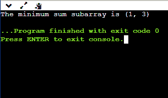

# 最短和连续子阵列

> 原文：<https://www.javatpoint.com/shortest-sum-contiguous-subarray>

子阵列基本上是一个阵列的一部分，或者是另一个阵列中的一个阵列。子数组包含连续的元素，而超序列不包含连续的元素。在这里，我们将找到最小的相邻子阵列的和。

假设我们给出了一个包含 n 个整数的数组。主要目的是找出连续数组中最小的元素的和。

**我们通过一些例子来了解一下。**

**例 1:**

```

arr = {3, 2, 5, 5, 3, 2, 10}
Number of elements in the array is 7.
The smallest sum of the contiguous subarray: 2

```

**例 2:**

```

arr = {-4, 5, -1, -6, 8}
Number of elements in the array is 5
The smallest sum of the contiguous subarray: -7

```

有多种技术可以解决这个问题。这个问题的第一个解决方案是暴力方法。在这种方法中，我们找到所有可能的阵列，然后搜索具有最小和的子阵列。

### 蛮力算法

```

min = ∞
for (int i=0; i<n; i++) 
{
   int sum;
   for (int j=i; j<n;j++)
   {
       sum = sum+b[j];
   }
if(sum < min)
{
   min = sum;
}
}
return min;

```

上述算法生成 O(n <sup>2</sup> 的时间复杂度。时间复杂度很高，所以我们将使用另一种方法来解决这个问题。我们将使用卡登算法来解决这个问题。

### 高效方法的算法

```

minimum_sum = INFINITY
sum = 0
for i in 1 to size_of_array:
sum = min(array[i], array[i] + sum)
minimum_sum = min(ans, sum)
print(minimum_sum)

```

上述算法的时间复杂度为 O(n)。这是最好的时间复杂度，因为我们只需要遍历元素一次。

**在 C** 中实现

```

#include <stdio.h>
#include <limits.h>
// Find the minimum sum subarray of a given size `k`
void minimum_subarray(int arr[], int n, int k)
{
    // base case
    if (n == 0 || n <= k) {
        return;
    } 
    // stores the sum of elements in the current sum
    int current_sum = 0;
    // stores the sum of minimum sum subarray found so far
    int minimum_sum = INT_MAX;
    // stores ending index of the minimum sum subarray found so far
    int last = 0; 
    for (int i = 0; i < n; i++)
    {
        // add the current element to the current_sum
        current_sum += arr[i];        
        if (i + 1 >= k)
        {
            // update the minimum sum with a current sum value
            if (minimum_sum > current_sum)
            {
                minimum_sum = current_sum;
                last = i;
            }
            // remove a leftmost element from the array
            current_sum -= arr[i + 1 - k];
        }
    }
    printf("The minimum sum subarray is (%d, %d)", last - k + 1, last);
}
int main(void)
{
    int arr[] = { 10, 4, 2, 5, 6, 3, 8, 1 };
    int k = 3; 
    int n = sizeof(arr)/sizeof(arr[0]);
   minimum_subarray(arr, n, k);
    return 0;
}

```

**输出**



* * *