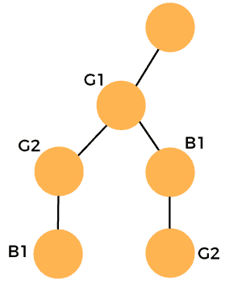
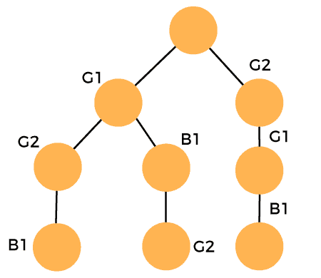
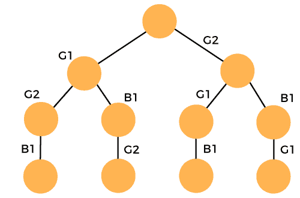
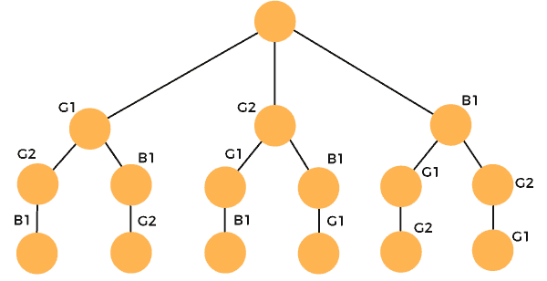
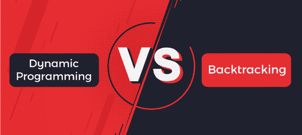

# 动态编程与回溯

> 原文：<https://www.javatpoint.com/dynamic-programming-vs-backtracking>

在了解动态规划和回溯的区别之前，我们应该分别了解动态规划和回溯。

### 什么是回溯？

回溯是解决问题的技术之一。使用这种技术，我们可以解决我们的问题。这种策略使用了一种蛮力方法，蛮力方法表示对于给定的问题，我们应该尝试所有可能的解决方案，并从所有可能的解决方案中选择所需的解决方案。相比之下，动态规划用于解决优化问题，而回溯不用于解决优化问题。当给定问题存在多个解时，回溯使用所有解来解决问题。

**现在我们将通过一个例子了解动态编程是如何使用蛮力方法的。**

假设有三个是三个学生，两个是女生，一个是男生。我们有三把椅子，我们必须把这些学生安排在这些椅子上。我们可以通过多少种方式安排这些学生？。因为有 3 个学生，我们可以把这些学生安排在 3 个！方式，即 6 种方式。现在，我们必须找出所有可能的安排，所有的安排或解决方案都可以用称为状态空间树的树的形式来表示。

G1，G2，B1

**状态空间树:**

**第一排列**

首先，考虑如下所示的节点:

考虑第一层的第一个女孩 G1，即如下所示的第一把椅子:

考虑下一级的第二个女孩 G2，即下图所示的第二把椅子:

考虑下一级的一个男生 B1，即如下图所示的第三把椅子:

**第二排列**

我们会原路返回。首先，我们从第三把椅子上取下 B1，从第二把椅子上取下 G2。在第二把椅子上加上 B1，然后在第三把椅子上加上 G2，如下图所示:

**第三排列**

我们将再次回溯。首先，我们从第三把椅子上移除 G2，然后从第二把椅子上移除 B1，然后从第一把椅子上移除 G1。考虑第一把椅子上的 G2，如下所示:

考虑下一级的 G1，即如下所示的第二把椅子:

考虑第三层的 B1，即如下所示的第三把椅子:

**第 4 排**

我们将再次回溯。首先，我们从第三把椅子上取下 B1，然后从第二把椅子上取下 G1。在第二把椅子上加上 B1，然后在第三把椅子上加上 G1，如下所示:

**第 5 排**

我们将再次回溯。首先，我们从第三把椅子上取下 G1，然后从第二把椅子上取下 B1，然后从第一把椅子上取下 G2。

考虑第一层的 B1，即如下所示的第一把椅子:

考虑下一级别的 G1，即如下所示的第二把椅子:

考虑下一级 G2，即如下图所示的第三把椅子:

**第 6 排**

我们将再次回溯。首先，我们从第三把椅子上取下 G2，然后从第二把椅子上取下 G1。在第二把椅子上加上 G2，然后在第三把椅子上加上 G1，如下所示:

### 什么是动态规划？

动态规划是一种通过将某些类型的复杂问题分解成更简单的子问题并精确地解决每个问题一次来有效地解决它们的技术。动态编程将子问题的结果存储在表中，并在需要时重用它们，以避免一次又一次地解决相同的问题。

**使用动态规划可以解决什么类型的问题？**

以下是使用动态编程可以解决的两个问题:

*   **最优子结构:**如果利用子问题的最优解可以得到给定问题的最优解，则给定问题具有最优子结构性质。换句话说，我们可以通过使用基于子问题的递归关系来定义问题的解决方案。
*   **重叠子问题:**一个给定的问题具有重叠子问题的性质，如果要解决这个问题，我们必须多次求解它的子问题。

使用动态编程方法，我们避免了解决重叠的子问题，我们只解决每个问题一次，并将结果保存在缓存中。当再次需要时，我们将从缓存中获得结果，而不是再次求解它们。

**动态规划方法**

有两种方法用于实现动态编程:

*   **自上而下的方法:**也称为记忆化。它使用递归和缓存来实现。每当调用递归函数时，我们都会检查缓存，看看问题是否已经解决。如果已经解决了，那么我们从缓存中返回结果，否则我们将解决子问题，将结果保存到缓存中并返回结果。
*   **自下而上法:**又称制表法。该技术用于首先解决所有较小的子问题，然后转移到使用较小子问题结果的较大子问题。

### 动态规划和回溯的区别

*   动态规划是一种将复杂的问题分成更简单的子问题的技术。该技术适用于表现出以下性质的问题:
    重叠子问题
    最优子结构
    回溯是一种递归地增量构建解并在任何时间点移除不满足问题约束的所有解的技术。
*   动态规划和回溯的主要区别在于动态规划完全依赖于最优性原则，这意味着序列的子序列应该是最优的。与动态规划相反，回溯不能保证完全最优解。
*   动态规划是一种解决优化问题的技术。优化问题使用最小或最大结果。与动态编程相反，回溯使用蛮力方法，而不考虑优化问题。如果我们有多个解决方案，那么它会考虑所有这些解决方案。

* * *