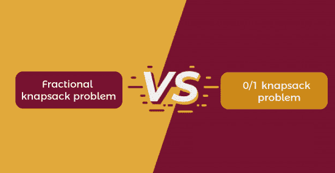

# 分数与 0/1 背包问题

> 原文：<https://www.javatpoint.com/fractional-vs-0-1-knapsack-problem>

在理解分数背包问题和 0/1 背包问题的区别之前，我们应该分别了解分数背包问题和 0/1 背包问题。

### 什么是背包问题？

假设你给了一个负重能力有限的背包或袋子，每个物品都有一定的重量和价值。这里的问题是“在背包中放入哪一件物品，以使重量限制不超过，并且物品的总价值尽可能大？”。

考虑现实生活中的例子。假设有一个小偷进入了博物馆。小偷装的是背包，或者我们可以说是负重能力有限的包。博物馆里有各种不同价值的物品。小偷决定他应该把什么东西放在包里，这样利润就会最大化。

与背包问题相关的一些要点是:

*   这是一个组合优化相关的问题。
*   给定一组 N 个项目——通常从 1 到 N 编号；这些项目中的每一个都有质量 wi 和值 vi。
*   它确定集合中要包含的每个项目的数量，以便总重量 M 小于或等于给定的限制，并且总值尽可能大。
*   这个问题经常出现在资金紧张的资源分配中。

假设我们有一个 15 公斤的背包，那么 M = 15 公斤。意思是背包的总重量是 15 公斤。背包中物品的总重量应小于或等于 m。给出的一些物品具有一些关键特征，即物品的重量和物品的价值。如下图所示，第一个项目的重量为 12 公斤，价值为 4 美元，第二个项目的重量为 2 公斤，价值为 2 美元，第三个项目的重量为 1 公斤，价值为 1 美元，第四个项目的重量为 4 公斤，价值为 10 美元，第五个项目的重量为 1 公斤，价值为 2 美元。在这里，我们必须决定我们是否必须包括这个项目。

**背包问题变体**

**背包问题有两种变体:**

*   **0/1 背包问题:**在 0/1 背包问题的情况下，物品是不可分割的。在这里，不可分割意味着我们不能打破一个项目。在这种情况下，我们要么拿一个项目，要么不拿。我们要么把物品完全拿走，放在背包里，要么把物品完全留下。我们不可能把物品的一部分放在背包里。

这里，“0”表示我们没有拿走该项目，“1”表示我们完全拿走了该项目。这类问题通过使用动态编程方法来解决。

**与 0/1 背包问题相关的一些要点有:**

*   在这个问题中，我们不能拿项目的分数。这里，我们要决定是否要取该项，即 x = 1 还是不取，即 x = 0。
*   贪婪方法不能在这个问题中提供最优结果。
*   另一种方法是根据单位重量的成本对物品进行分类，从最高的开始，直到背包装满。尽管如此，这并不是一个好的解决方案。假设有 N 个项目。我们有两个选择，要么选择，要么排除该项目。强力方法具有 O(2 <sup>N</sup> )指数运行时间。我们使用动态规划方法来获得最优解，而不是使用蛮力方法。

```

Dynamic-0-1-knapsack (v, w, n, W) 
for w = 0 to W do 
 c[0, w] = 0 
for i = 1 to n do 
   c[i, 0] = 0 
   for w = 1 to W do 
      if wi ? w then 
         if vi + c[i-1, w-wi] then 
            c[i, w] = vi + c[i-1, w-wi] 
         else c[i, w] = c[i-1, w] 
             else 
      c[i, w] = c[i-1, w] 

```

*   **分数背包问题:**在这个问题中，物品是可分的。在这里，整除意味着你可以取一个项目的任何分数。这个问题是用贪婪的方法解决的。

**与分数背包问题相关的一些要点有:**

*   我们知道分数背包问题使用的是项目的分数，所以在这个问题中使用了贪婪方法。
*   分数背包问题可以通过首先根据项目的值进行排序来解决，可以在 **O(NlogN)** 中完成，这种方法从找到最有价值的项目开始，我们尽可能考虑最有价值的项目，所以从由 v <sub>i</sub> 表示的最高价值的项目开始。然后，我们考虑排序列表中的下一项，这样，我们在 O(N)时间复杂度中执行线性搜索。
*   因此，总的运行时间将是 0 加上 0 等于 0。我们可以说分数背包问题比 0/1 背包问题求解速度快得多。

```

Algorithm: Greedy-Fractional-Knapsack (w[1..n], p[1..n], W) 
for i = 1 to n 
   do x[i] = 0 
weight = 0 
for i = 1 to n 
   if weight + w[i] ? W then  
      x[i] = 1 
      weight = weight + w[i] 
   else 
      x[i] = (W - weight) / w[i] 
      weight = W 
      break 
return x

```

**0/1 背包问题和分数背包问题的区别。**



| 0/1 背包问题 | 分数背包问题 |
| 这个问题是用动态规划方法解决的。 | 这个问题是用贪婪方法解决的。 |
| 例如:假设我们有 10 个空间。A 的量是 5，B 的量是 4，C 的量是 3。首先，我们把 A 放进去，然后把 B 放在背包里。背包占用的总空间是 9。因为背包的总空间是 10，所以我们不能把“C”放在背包里。 | 例如，假设我们有 10 个空间。A 的量是 5，B 的量是 4，C 的量是 3。首先，我们把 A 放进去，然后把 B 放在背包里。到目前为止，背包占用的总空间是 9。背包里还有 1 个空间。所以，我们可以从 C 中取 1 个量，放在背包里。现在，背包里的空间完成了。 |
| 这个问题要么带一个项目，要么不带。它不占一部分。 | 在这个问题中，我们也可以取零头项。 |
| 它具有最佳结构。 | 它有一个最佳的结构。 |
| 它会找到总价值小于或等于权重的最有价值的子集项目。 | 它查找总值等于重量的项目。 |

* * *