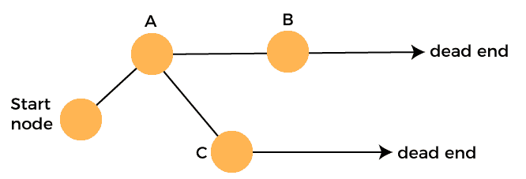
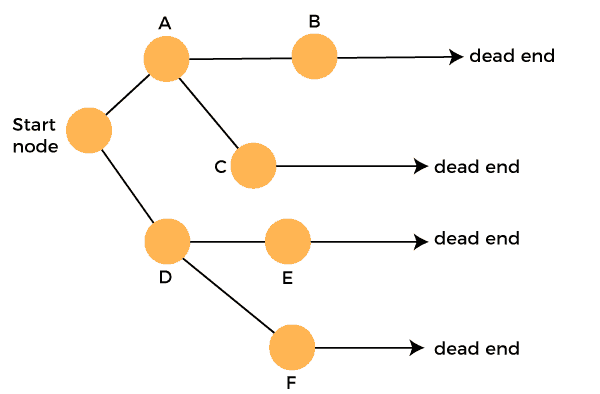
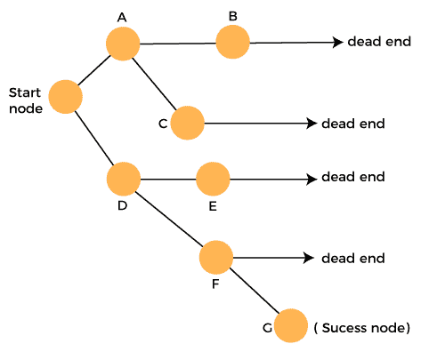

# 追踪

> 原文：<https://www.javatpoint.com/backtracking-introduction>

在本主题中，我们将学习回溯，这是解决递归解的一个非常重要的技能集。递归函数是那些多次调用自己的函数。考虑回文的一个例子:

最初，函数 ispalindome(S，0，8)用参数 ispalindome(S，1，7)调用一次。递归调用 ispalindome(S，1，7)用参数 ispalindome(S，2，6)调用一次。

回溯是可以用来解决这个问题的技术之一。我们可以使用这种策略编写算法。它使用蛮力搜索来解决问题，蛮力搜索表示对于给定的问题，我们试图做出所有可能的解决方案，并从所有期望的解决方案中选择最佳解决方案。动态规划也遵循这一规则，但动态规划用于解决优化问题。相比之下，回溯不用于解决优化问题。当我们有多个解决方案时使用回溯，并且我们需要所有这些解决方案。

回溯的名字本身就暗示着我们正在倒退和前进；如果它满足条件，那么返回成功，否则我们再次返回。它用于解决这样一个问题，即从指定的集合中选择一个对象序列，使该序列满足某些标准。

### 何时使用回溯算法？

当我们有多个选择时，我们会从可用的选择中做出决定。在以下情况下，我们需要使用回溯算法:

*   没有足够的信息来做出最佳选择，所以我们使用回溯策略来尝试所有可能的解决方案。
*   每一个决定都会带来一组新的选择。话说回来，我们回溯做出新的决定。在这种情况下，我们需要使用回溯策略。

### 回溯是如何工作的？

回溯是一种尝试各种决策序列的系统方法，直到你发现它是有效的。让我们通过一个例子来理解。

我们从一个开始节点开始。首先，我们移动到节点 a，由于它不是一个可行的解决方案，所以我们移动到下一个节点，即 B。B 也不是一个可行的解决方案，它是一个死胡同，所以我们从节点 B 回溯到节点 a。

假设从节点 A 到节点 C 存在另一条路径，那么，我们从节点 A 移动到节点 C，这也是一个死胡同，所以再次从节点 C 回溯到节点 A，我们从节点 A 移动到起始节点。

现在，我们将检查从起始节点开始是否存在任何其他路径。因此，我们从开始节点移动到节点 D。由于这不是一个可行的解决方案，所以我们从节点 D 移动到节点 E。节点 E 也不是一个可行的解决方案。这是一个死胡同，所以我们从节点 E 回溯到节点 d。

假设从节点 D 到节点 f 存在另一条路径。因此，我们从节点 D 移动到节点 f。由于这不是一个可行的解决方案，并且是一个死胡同，我们检查从节点 f 的另一条路径

假设从节点 F 到节点 G 存在另一条路径，那么从节点 F 移动到节点 G。节点 G 是成功节点。

**与回溯相关的术语有:**

*   **活节点:**可以进一步生成的节点称为活节点。
*   **E 节点:**子节点正在生成并成为成功节点的节点。
*   **成功节点:**该节点如果提供了可行的解决方案，则称其为成功节点。
*   **死节点:**不能进一步生成，也没有提供可行解的节点称为死节点。

许多问题可以通过回溯策略来解决，并且这些问题满足复杂的约束集，这些约束有两种类型:

*   **隐式约束:**是元组中每个元素如何关联的规则。
*   **显式约束:**限制每个元素从给定集合中选择的规则。

### 回溯的应用

*   皇后问题
*   子集问题的和
*   图形着色
*   汉密尔顿循环

### 回溯和递归的区别

递归是一种技术，它一次又一次地调用同一个函数，直到达到基本情况。回溯是一种算法，它找到所有可能的解决方案，并从给定的解决方案集中选择所需的解决方案。

* * *