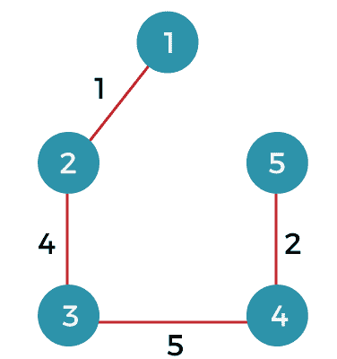

# 最小生成树

> 原文：<https://www.javatpoint.com/minimum-spanning-tree-introduction>

在了解最小生成树之前，我们应该先了解生成树。

**要理解生成树的概念，请考虑下图:**

上面的图可以表示为 G(V，E)，其中‘V’是顶点数，‘E’是边数。上图的生成树表示为 G`(V `，e `)。在这种情况下，V` = V 意味着生成树中的顶点数与图中的顶点数相同，但边数不同。生成树中的边数是原始图中边数的子集。因此，边数可以写成:

e。

也可以写成:

E` = |V| - 1

生成树中存在以下两种情况:

*   生成树中的顶点数将与原始图中的顶点数相同。
    **V` = V**
*   生成树中的边数等于边数减 1。
    **E` = |V| - 1**
*   生成树不应包含任何循环。
*   生成树不应断开。

#### 注意:一个图可以有多个生成树。

考虑下图:

上图包含 5 个顶点。我们知道，生成树中的顶点与图中的顶点相同；因此，v’等于 5。生成树中的边数将等于(5 - 1)，即 4。以下是可能的生成树:

### 什么是最小生成树？

最小生成树是边的和最小的生成树。考虑包含边权重的下图:

**下面是我们可以从上图中做出的生成树。**

*   第一个生成树是这样的树，其中我们删除了顶点 1 和 5 之间的边，如下所示:
    上面的树的边之和是(1 + 4 + 5 + 2): 12
*   第二个生成树是这样的树，其中我们删除了顶点 1 和 2 之间的边，如下所示:
    上面的树的边之和是(3 + 2 + 5 + 4) : 14
*   第三个生成树是这样的树，其中我们已经移除了顶点 2 和 3 之间的边，如下所示:
    上面的树的边之和是(1 + 3 + 2 + 5) : 11
*   第四个生成树是我们已经去掉了顶点 3 和 4 之间的边的树，如下所示:
    上面树的边的和是(1 + 3 + 2 + 4) : 10。边缘成本 10 最小，因此它是最小生成树。

最小生成树的一般性质:

*   如果我们从生成树中移除任何边，那么它就会断开。因此，我们不能从生成树中移除任何边。
*   如果我们给生成树增加一条边，那么它就会产生一个循环。因此，我们不能向生成树添加任何边。
*   在一个图中，每条边都有一个不同的权重，那么只存在一个唯一的最小生成树。如果边权重不明确，则可以有多个最小生成树。
*   一个完整的无向图可以有 n n-2 个生成树。
*   每个有向和无向图至少包含一个生成树。
*   断开的图没有任何生成树。
*   在完全图中，我们可以去掉最大(e-n+1)边来构造生成树。

**我们通过一个例子来了解最后一个属性。**

考虑下面给出的完整图表:

从上面的完全图可以得到的生成树的数量等于 n n-2 = 4 4-2 = 16。

因此，从上图可以创建 16 个生成树。

构建生成树可以移除的最大边数等于 e-n+1 = 6 - 4 + 1 = 3。

* * *