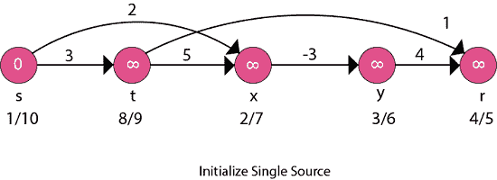

# 有向无环图中的单源最短路径

> 原文：<https://www.javatpoint.com/single-source-shortest-path-in-a-directed-acyclic-graphs>

通过根据顶点的拓扑排序放松加权 DAG(有向无环图)G = (V，e)的边，我们可以计算出∅(V+E 时间内来自单个源的最短路径。最短路径在 dag 中总是被很好地描述，因为即使有负权重的边，也不存在负权重的循环。

```
DAG - SHORTEST - PATHS (G, w, s)
 1\. Topologically sort the vertices of G.
 2\. INITIALIZE - SINGLE- SOURCE (G, s)
 3\. for each vertex u taken in topologically sorted order
 4\. do for each vertex v ∈ Adj [u]
 5\. do RELAX (u, v, w) 

```

该数据的运行时间由第 1 行和第 3 - 5 行的 for 循环决定。拓扑排序可以在∅时间实现。在第 3 - 5 行的 for 循环中，就像在 Dijkstra 算法中一样，每个顶点都有一次重复。对于每个顶点，离开顶点的边都被精确地检查一次。与 Dijkstra 算法不同，我们每条边只使用 O (1)次。因此，运行时间是∅ (V + E)，它在图的邻接表描述的大小上是线性的。

**示例:**


**步骤 1:** 要对顶点进行拓扑排序，请应用**深度优先搜索**，然后按照完成时间的降序以线性顺序排列顶点。

 

现在，按照拓扑排序顺序取每个顶点，放松每个边。


```

adj [s] →t, x
0 + 3 < ∞
d [t] ← 3
0 + 2 < ∞
d [x] ← 2

```


```

adj [t] → r, x
3 + 1 < ∞
d [r] ← 4
3 + 5 ≤ 2

```


```

adj [x] → y
2 - 3 < ∞
d [y] ← -1

```


```

adj [y] → r
-1 + 4 < 4
3 <4
d [r] ← 3

```


**因此最短路径为:**

```

s to x is 2
s to y is -1
s to t is 3
s to r is 3

```