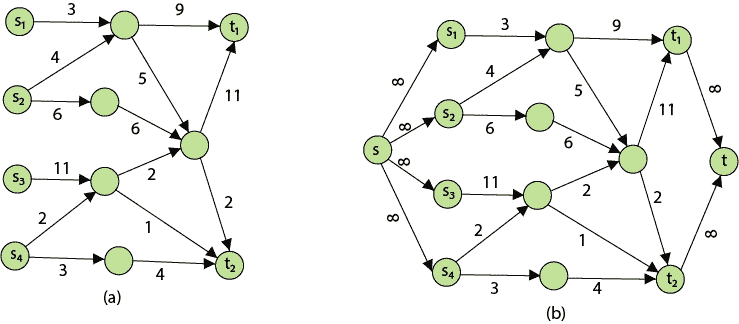
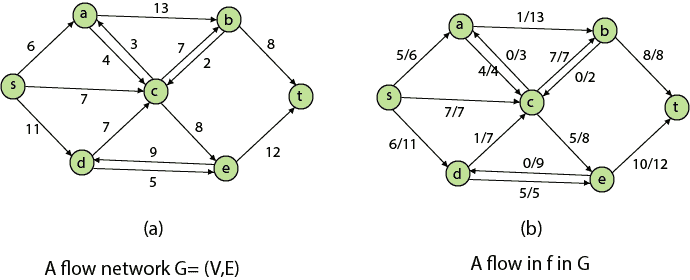
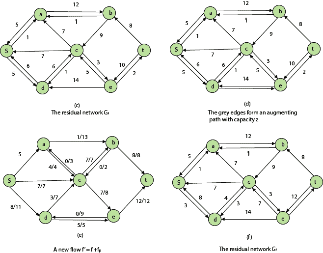

# 网络流量问题

> 原文：<https://www.javatpoint.com/daa-network-flow-problems>

最明显的流量网络问题如下:

**问题 1:** 给定一个流量网络 G = (V，E)，最大流量问题是寻找一个最大值的流量。

**问题 2:** 多源汇最大流量问题和最大流量问题类似，只是有一套{s 1 ，s 2 ，s 3 .......s n 个源和一组{t 1 、t 2 、t 3 ..........水槽的 t n 。

幸运的是，这个问题并不比常规的最大流量更可靠。给定多个源和汇流网络 G，我们通过添加以下内容来定义新的流网络 G’

*   一个超级源 s，
*   一个超级水槽测试，
*   对于每个 s i ，添加容量为∑的边(s，s i ，以及
*   对于每个 t i ，添加容量为∠的边(t i ，t)

图中显示了一个多源汇流网络和一个等效的单源汇流网络

**剩余网络:**剩余网络由能够接纳更多净流量的边组成。假设我们有一个流网络 G = (V，E)有源 s 和汇 t，设 f 是 G 中的一个流，并考察一对顶点 u，v ∈ V，在超过容量 c (u，V)之前，我们可以从 u 推到 V 的额外净流量之和是(u，V)的剩余容量，由下式给出

当净流量 f (u，v)为负时，剩余容量 c f (u，v)大于容量 c (u，v)。

**例如:**如果 c (u，v) = 16 且 f (u，v) =16 且 f (u，v) = -4，则剩余容量 c f (u，v)为 20。

给定一个流网络 G = (V，E)和一个流 f，f 诱导的 G 的剩余网络为 G f = (V，E f ，其中

也就是说，剩余网络的每条边，或者说剩余边，可以允许一个严格正的净流量。

**增广路径:**给定流网络 G = (V，E)和流 f，**增广路径** p 是剩余网络 G 中从 s 到 t 的简单路径 f 。通过剩余网络的解，增广路径上的每个边(u，v)允许从 u 到 v 的一些额外的正净流量，而不违反边上的容量约束。

设 G = (V，E)为流量为 f 的流网络，增广路径 p 的**剩余容量**为

剩余容量是可通过增加路径推动的最大流量。如果有一条扩充路径，那么它的每条边都有一个正容量。我们将使用这个事实来计算流网络中的最大流量。

