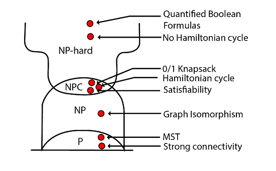

# 复杂性类别

> 原文：<https://www.javatpoint.com/daa-complexity-classes>

**NP 类问题的定义** : -所有基于决策的问题的集合进入 NP 问题的划分，这些问题不能在多项式时间内解决或产生输出，但在**多项式时间**内得到验证。NP 类包含 P 类作为子集。NP 问题很难解决。

#### 注:-术语“NP”并不意味着“不是多项式”最初，这个术语的意思是“非确定性多项式”。这意味着根据一个输入数将产生输出。

**P 类问题的定义:** -基于决策的问题集进入 P 问题的划分，这些问题可以在多项式时间内解决或产生输出。容易解决的问题

**多项式时间的定义:** -如果我们根据给定的输入在特定的时间量内产生输出，例如在一分钟、几小时内。这被称为多项式时间。

**非多项式时间的定义:** -如果我们根据给定的输入产生一个输出，但没有时间约束，则称为非多项式时间。但是是的，产出会产生，但是时间还没有确定。

**基于决策问题的定义:** -如果一个问题的输出是简单的“是”或“否”(或者你可能需要这个作为真/假，0/1，接受/拒绝)，那么这个问题被称为决策问题。)我们将许多优化问题称为决策问题。例如，贪婪方法，D.P，给定一个图 G= (V，E)如果存在任何哈密顿圈。

**NP 难类的定义:** -这里你要满足以下几点才能进入 NP 难的划分

1.  如果我们能在多项式时间内解决这个问题，那么我们就能在多项式时间内解决所有的 NP 问题
2.  如果您在多项式时间内将问题从一种形式转换为另一种形式

**NP-complete 类的定义:** -一个问题在 NP-complete 中，如果

1.  它在 NP 中
2.  这是 NP 难的

**所有 NP 类的图形表示，包括 NP、NP-hard 和 NP-complete**

**图:复杂度等级**