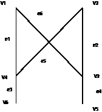
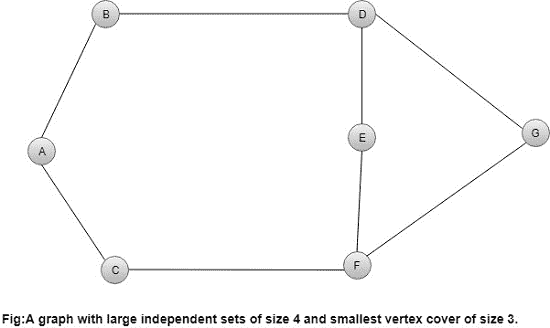

# 子集覆盖

> 原文：<https://www.javatpoint.com/daa-subset-sum-problem>

**证明:-**

1.  子集覆盖
2.  顶点覆盖≤ρ子集覆盖
3.  子集覆盖≤ρ顶点覆盖
4.  子集覆盖&straightepsilon; NP

### 1)子集覆盖

**定义:** -对一个得到完全图 G 的所有边进行并集后的边子集的个数，称为子集覆盖。

**根据你创建的图 G，子集覆盖的大小=2**



```

v1{e1,e6}     v2{e5,e2}     v3{e2,e4,e6}     v4{e1,e3,e5}     v5{e4}     v6{e3}
v3Uv4= {e1, e2, e3, e4, e5, e6} complete set of edges after the union of vertices.

```

### 2)顶点覆盖≤ρ子集覆盖

在顶点为 N 的图 G 中，如果存在大小为 k 的顶点覆盖，那么也必然存在大小为 k 的子集覆盖。如果你能在多项式时间内实现从顶点覆盖到子集覆盖的约简，这意味着你做得对。

### 3)子集覆盖≤ρ顶点覆盖

为了验证输出，执行约简并创建团，通过一个方程，N-K 也验证团，通过团，你可以快速生成 3nf，并在多项式时间内求解 3nf 的布尔函数。你会得到输出。表示输出已经过验证。

### 4)子集覆盖&straightepsilon; NP:-

**证明:** -如你所知，你可以通过顶点覆盖得到子集覆盖，通过团得到顶点覆盖，要将基于决策的 NP 问题转化为团，首先你必须将 3nf 和 3nf 转化为 SAT，将 SAT 转化为源自 NP 的 CIRCUIT SAT。

**NPC 证明:-**

从顶点覆盖到子集覆盖的多项式时间内已经成功地进行了约简

输出也在多项式时间内得到验证，正如您在上面的对话中所做的那样，因此得出结论: **SUBSET COVER 也来自 NPC** 。

## 独立集:

图 G = (V，e)的独立集是顶点的 V'⊆V 子集，使得 e 中的每条边至多入射到 v 中的一个顶点上。独立集问题是在 g 中寻找最大尺寸的独立集。寻找小独立集并不难，例如，小独立集是单个节点，但很难找到大独立集。

