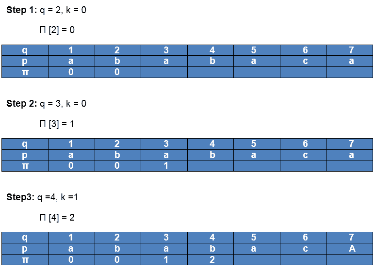
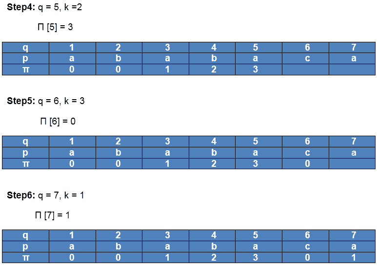
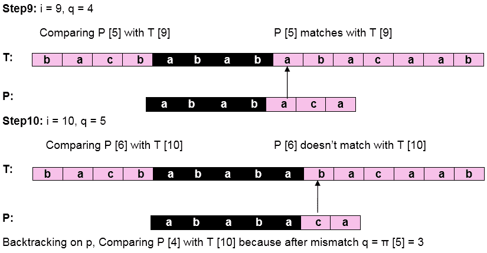
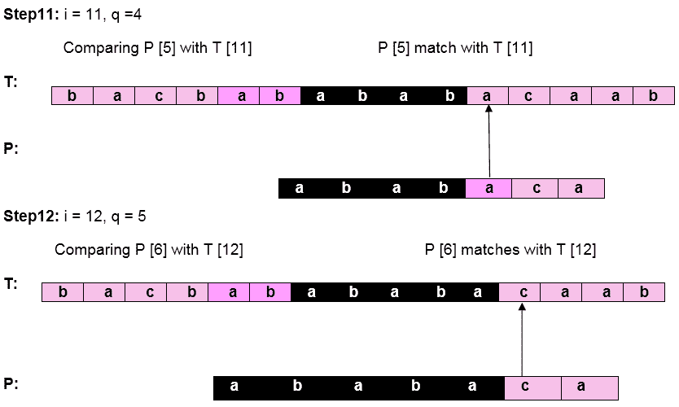

# 克努特-莫里斯-普拉特(KMP)算法

> 原文：<https://www.javatpoint.com/daa-knuth-morris-pratt-algorithm>

Knuth-Morris 和 Pratt 为字符串匹配问题引入了一种线性时间算法。O (n)的匹配时间是通过避免与“S”的元素进行比较来实现的，所述“S”的元素先前已经与要匹配的图案“p”的某些元素进行了比较。也就是说，对字符串“S”的回溯永远不会发生

## KMP 算法的组件:

**1。前缀函数(π):**模式的前缀函数π封装了模式如何与自身的移位相匹配的知识。该信息可用于避免模式“p”的无用移位。换句话说，这能够避免字符串“s”的回溯

**2。KMP 匹配器:**以字符串‘S’、‘模式‘p’和前缀函数‘π’为输入，在‘S’中查找‘p’的出现，并返回‘p’的移位数，之后查找出现。

## 前缀函数(π)

以下伪代码计算前缀函数π:

```
COMPUTE- PREFIX- FUNCTION (P)
 1\. m ←length [P]		//'p' pattern to be matched
 2\. Π [1] ← 0
 3\. k ← 0
 4\. for q ← 2 to m
 5\. do while k > 0 and P [k + 1] ≠ P [q]
 6\. do k ← Π [k]
 7\. If P [k + 1] = P [q]
 8\. then k← k + 1
 9\. Π [q] ← k
 10\. Return Π

```

## 运行时间分析:

在上面计算前缀函数的伪代码中，从步骤 4 到步骤 10 的 for 循环运行了' m '次。步骤 1 到步骤 3 需要恒定的时间。因此计算前缀函数的运行时间为 0(m)。

**示例:**为下面的模式“p”计算π:


**解决方案:**

```
Initially: m = length [p] = 7
	  Π [1] = 0
	  k = 0

```




迭代 6 次后，前缀函数计算完成:


## KMP 火柴人:

以模式“p”、字符串“S”和前缀函数“π”作为输入的 KMP 匹配器在 S 中找到 p 的匹配。以下伪代码计算 KMP 算法的匹配组件:

```
KMP-MATCHER (T, P)
 1\. n ← length [T]
 2\. m ← length [P]
 3\. Π← COMPUTE-PREFIX-FUNCTION (P)
 4\. q ← 0		// numbers of characters matched
 5\. for i ← 1 to n	// scan S from left to right 
 6\. do while q > 0 and P [q + 1] ≠ T [i]
 7\. do q ← Π [q]		// next character does not match
 8\. If P [q + 1] = T [i]
 9\. then q ← q + 1		// next character matches
 10\. If q = m			           // is all of p matched?
 11\. then print "Pattern occurs with shift" i - m
 12\. q ← Π [q]				// look for the next match

```

## 运行时间分析:

从第 5 步开始的 for 循环运行“n”次，即与字符串的长度一样长。由于第 1 步到第 4 步需要恒定的时间，因此循环的运行时间受此支配。因此匹配函数的运行时间为 0(n)。

**示例:**给定字符串“T”和模式“P”，如下所示:


让我们执行 KMP 算法，找出“P”是否出现在“t”中

对于“p”前缀函数，？以前计算过，如下所示:


**解决方案:**

```
Initially: n = size of T = 15
m = size of P = 7

```






已发现模式“P”在字符串“t”中出现复杂性。为找到匹配而发生的移位总数为 i-m = 13 - 7 = 6 个移位。