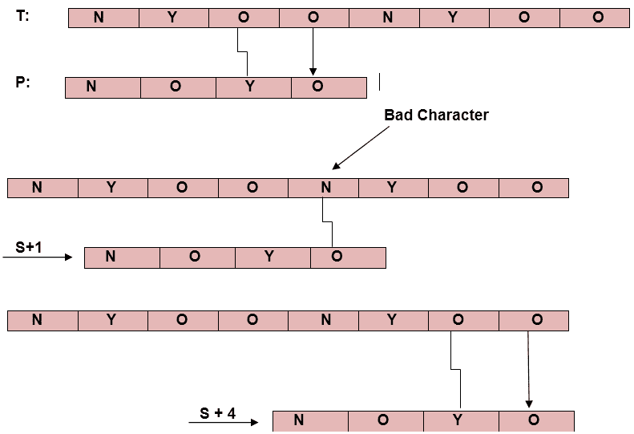

# 博耶-摩尔算法

> 原文：<https://www.javatpoint.com/daa-boyer-moore-algorithm>

罗伯特·博耶和 J·斯特罗瑟·摩尔于 1977 年建立了这个组织。B-M 字符串搜索算法是一种特别有效的算法，并且从那时起就一直是字符串搜索算法的标准基准。

B-M 算法采用“向后”方法:模式字符串(P)与文本字符串(T)的开头对齐，然后从最右边的字符开始，从右向左比较模式的字符。

如果对不在模式内的字符进行比较，则通过分析该位置的任何其他方面都找不到匹配，因此模式可以完全改变，超过不匹配的字符。

为了确定可能的移位，B-M 算法同时使用了两种预处理策略。每当出现不匹配时，算法使用这两种方法计算变化，并选择更显著的偏移，如果对每种情况使用最有效的策略的话。

这两种策略被称为 B - M 启发式算法，因为它们用于减少搜索。它们是:

1.  坏角色试探法
2.  好的后缀启发法

## 1.坏角色试探法

这种启发式有两个含义:

*   假设文本中有一个字符完全没有出现在模式中。当这个字符(称为坏字符)出现不匹配时，整个模式可以改变，开始匹配这个“坏字符”旁边的表单子字符串
*   另一方面，模式中可能存在坏字符，在这种情况下，请将模式的性质与文本中的坏字符对齐。

因此，在任何情况下，偏移量都可能大于 1。

**示例 1:** 让 Text T = < nyoo nyoo >和 pattern P = < noyo >



**示例 2:** 如果一个坏角色不存在，那么模式。


### 坏角色试探法中的问题:

在某些情况下，坏性格试探法会产生一些负面的变化。

### 例如:


这意味着我们需要一些额外的信息来在遇到坏角色时产生转变。这些信息是关于模式中每个方面的最后位置，以及模式中使用的字符集(通常称为模式的字母∑)。

```
COMPUTE-LAST-OCCURRENCE-FUNCTION (P, m, ∑ )
 1\. for each character a ∈ ∑
 2\. do λ [a] = 0
 3\. for j ← 1 to m
 4\. do λ [P [j]] ← j
 5\. Return λ

```

## 2.好后缀试探法:

好的后缀是匹配成功的后缀。在坏字符试探法中出现负偏移的不匹配之后，查看模式的子串是否匹配，直到坏字符中有一个好后缀，如果是，那么我们有一个向前的跳转，等于找到的后缀的长度。

### 示例:


```
COMPUTE-GOOD-SUFFIX-FUNCTION (P, m)
 1\. Π ← COMPUTE-PREFIX-FUNCTION (P)
 2\. P'← reverse (P)
 3\. Π'← COMPUTE-PREFIX-FUNCTION (P')
 4\. for j ← 0 to m
 5\. do ɣ [j] ← m - Π [m]
 6\. for l ← 1 to m
 7\. do j ← m - Π' [L]
 8\. If ɣ [j] > l - Π' [L]
 9\. then ɣ [j] ← 1 - Π'[L]
 10\. Return ɣ

```

```
BOYER-MOORE-MATCHER (T, P, ∑)
 1\. n ←length [T]
 2\. m ←length [P]
 3\. λ← COMPUTE-LAST-OCCURRENCE-FUNCTION (P, m, ∑ )
 4\. ɣ← COMPUTE-GOOD-SUFFIX-FUNCTION (P, m)
 5\. s ←0
 6\. While s ≤ n - m
 7\. do j ← m
 8\. While j > 0 and P [j] = T [s + j]
 9\. do j ←j-1
 10\. If j = 0
 11\. then print "Pattern occurs at shift" s
 12\. s ← s + ɣ[0]
 13\. else s ← s + max (ɣ [j], j -  λ[T[s+j]])

```

### 字符串匹配算法的复杂度比较；

| 算法 | 预处理时间 | 匹配时间 |
| 天真的 | O | (O (n - m + 1)m) |
| 拉宾-卡普 | O(m) | (O (n - m + 1)m) |
| 有限自动机 | o(m &#124;∞&#124;) | O (n) |
| 克努特-莫里斯-普拉特 | O(m) | O (n) |
| 博伊尔-摩尔 | o(&#124;∞&#124;) | (O((n-m+1)+&#124;∞&#124;)) |