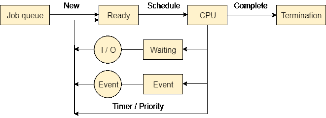

# 进程队列

> 原文：<https://www.javatpoint.com/os-process-queues>

操作系统为每个进程状态管理各种类型的队列。与流程相关的 PCB 也存储在相同状态的队列中。如果进程从一个状态移动到另一个状态，那么它的印刷电路板也从相应的队列中断开链接，并添加到进行转换的另一个状态队列中。

操作系统维护以下队列。

### 1.作业队列

开始时，所有进程都存储在作业队列中。它保存在辅助存储器中。长期调度程序(作业调度程序)挑选一些作业并将其放在主内存中。

### 2.就绪队列

就绪队列保存在主内存中。短期调度程序从就绪队列中挑选作业，并将其分派给中央处理器执行。

### 3.等待队列

当进程需要一些 IO 操作来完成其执行时，OS 会将进程的状态从运行更改为等待。与进程相关联的上下文存储在等待队列中，当进程完成输入输出时，处理器将使用该队列。