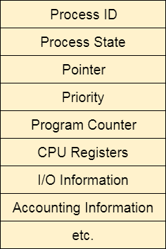

# 中央处理器调度

> 原文：<https://www.javatpoint.com/os-cpu-scheduling>

在像微软操作系统这样的单编程系统中，当一个进程等待任何输入输出操作完成时，中央处理器仍然是偶像。这是一种开销，因为它浪费时间并导致饥饿问题。然而，在多道程序设计系统中，在进程等待期间，中央处理器并不保持空闲，而是开始执行其他进程。操作系统必须定义中央处理器将被赋予哪个进程。

**在多道程序设计系统**中，操作系统调度 CPU 上的进程以获得最大的利用率，这个过程称为 **CPU 调度**。操作系统使用各种调度算法来调度进程。

这是短期调度程序的一项任务，为作业池中存在的进程数量调度 CPU。每当正在运行的进程请求一些输入输出操作时，短期调度程序会保存进程的当前上下文(也称为印刷电路板)，并将其状态从运行更改为等待。期间，流程处于等待状态；短期调度器从就绪队列中挑选另一个进程，并将 CPU 分配给该进程。这个过程叫做**上下文切换**。

## 过程控制块中保存了什么？

操作系统在进程的生命周期内维护一个进程控制块。当进程终止或终止时，进程控制块被删除。以下信息保存在过程控制块中，并随着过程状态的变化而变化。

## 为什么我们需要时间安排？

在多道程序设计中，如果长期调度器选择更多的输入/输出绑定进程，那么在大多数情况下，中央处理器仍然是偶像。操作系统的任务是优化资源的利用。

如果大多数正在运行的进程将它们的状态从正在运行变为正在等待，那么系统中可能总是存在死锁的可能性。因此，为了减少这种开销，操作系统需要调度作业，以获得最佳的 CPU 利用率，并避免死锁的可能性。