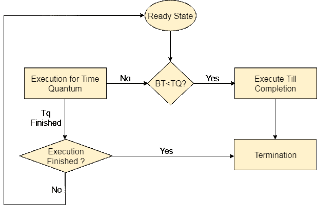

# 循环调度算法

> 原文：<https://www.javatpoint.com/os-round-robin-scheduling-algorithm>

循环调度算法是最流行的调度算法之一，实际上可以在大多数操作系统中实现。这就是**抢先版**的先到先得调度。该算法侧重于时间共享。在这个算法中，每个进程都以**循环方式**执行。系统中定义了一个时间片，称为时间**量子**。就绪队列中的每个进程被分配给该时间段的中央处理器，如果该进程的执行在该时间段内完成，则该进程将**终止**，否则该进程将返回到**就绪队列**并等待下一轮完成执行。

## 优势

1.  它实际上可以在系统中实现，因为它不依赖于突发时间。
2.  它没有遭受饥饿或车队效应的问题。
3.  所有的作业都有一个中央处理器的费用分配。

## 不足之处

1.  时间量越高，系统中的响应时间就越高。
2.  时间量越低，系统中的上下文切换开销就越高。
3.  决定一个完美的时间量在系统中确实是一个非常困难的任务。