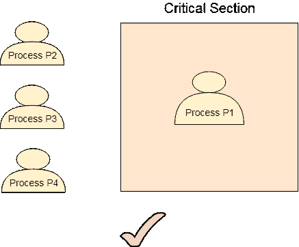
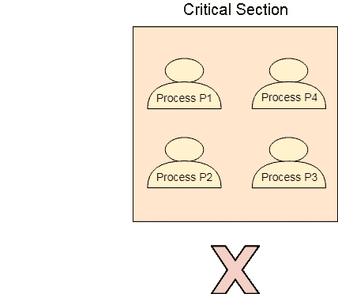

# 临界区问题

> 原文：<https://www.javatpoint.com/os-critical-section-problem>

关键部分是程序中试图访问共享资源的部分。该资源可以是计算机中的任何资源，如内存位置、数据结构、中央处理器或任何输入输出设备。

关键部分不能由多个进程同时执行；操作系统面临着允许和不允许进程进入临界区的困难。

临界区问题用于设计一组协议，以确保进程间的竞争条件永远不会出现。

为了同步协作过程，我们的主要任务是解决临界区问题。我们需要以满足以下条件的方式提供解决方案。

## 同步机制的要求

### 主要的

1.  **互斥**

我们的解决方案必须提供互斥。互斥是指如果一个进程在临界区内执行，那么另一个进程不能进入临界区。

9.  **进度**

进步意味着如果一个进程不需要执行到临界区，那么它就不应该停止其他进程进入临界区。

### 副手

1.  **有界等待**

我们应该能够预测每个流程进入关键部分的等待时间。这个过程不能无休止地等待进入关键部分。

3.  **建筑中立**

我们的机制必须是建筑自然的。这意味着，如果我们的解决方案在一个架构上运行良好，那么它也应该在其他架构上运行。