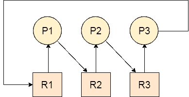

# 死锁介绍

> 原文：<https://www.javatpoint.com/os-deadlocks-introduction>

每个进程都需要一些资源来完成它的执行。但是，资源是按顺序授予的。

1.  进程请求一些资源。
2.  如果资源可用，操作系统授予资源，否则让进程等待。
3.  过程使用它，并在完成时释放。

死锁是指每个计算机进程都在等待分配给另一个进程的资源。在这种情况下，没有一个进程得到执行，因为它需要的资源被其他进程持有，而其他进程也在等待其他资源被释放。

让我们假设有三个进程 P1、P2 和 P3。有三种不同的资源 R1、R2 和 R3。R1 被分配到 P1，R2 被分配到 P2，R3 被分配到 P3。

过了一段时间，P1 要求 R1，而 P2 正在利用它。P1 停止执行死刑，因为没有 R2 就无法完成。P2 还要求得到 P3 正在使用的 R3。P2 也停止执行死刑，因为没有 R3 就无法继续。P3 还要求得到被 P1 利用的 R1，因此 P3 也停止执行死刑。

在这种情况下，三个过程之间形成了一个循环。所有的进程都没有进展，他们都在等待。由于所有进程都被阻止，计算机变得没有响应。

### 饥饿和死锁的区别

| Sr | 僵局 | 饿死 |
| one | 死锁是指没有进程被阻塞，也没有进程继续运行的情况 | 饥饿是指低优先级进程被阻塞，而高优先级进程继续运行的情况。 |
| Two | 僵局是一种无限的等待。 | 饥饿是漫长的等待，但不是无限的。 |
| three | 每一个僵局都是饥饿。 | 每一次饥饿都不必陷入僵局。 |
| four | 请求的资源被另一个进程阻止。 | 所请求的资源被更高优先级的进程持续使用。 |
| five | 当互斥、保持和等待、无抢占和循环等待同时发生时，死锁发生。 | 这是由于不受控制的优先级和资源管理造成的。 |

## 死锁的必要条件

1.  **互斥**

资源只能以互斥的方式共享。这意味着，如果两个进程不能同时使用同一资源。

3.  **保持等待**

一个进程等待一些资源，同时持有另一个资源。

5.  **不可抢占**

该过程一旦安排，将一直执行到完成。同时，调度程序无法调度其他进程。

7.  **循环等待**

所有进程必须以循环方式等待资源，以便最后一个进程等待第一个进程持有的资源。