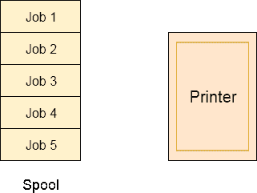
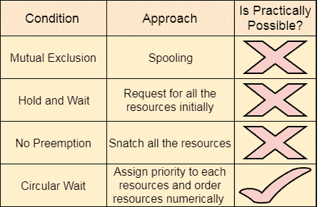

# 死锁预防

> 原文：<https://www.javatpoint.com/os-deadlock-prevention>

如果我们用一张四条腿站立的桌子来模拟死锁，那么我们也可以用同时发生时导致死锁的四种情况来模拟四条腿。

然而，如果我们打破了桌子的一条腿，那么桌子肯定会掉下来。死锁也是如此，如果我们能违反四个必要条件中的一个，不让它们同时发生，那么我们就能防止死锁。

让我们看看如何预防每一种情况。

## 1.互斥现象

从资源的角度来看，一个资源永远不能被多个进程同时使用，这是很公平的，但这是死锁背后的主要原因。如果一个资源可以同时被多个进程使用，那么这个进程就永远不会等待任何资源。

然而，如果我们能够以互斥的方式侵犯资源，那么死锁是可以避免的。

### 假脱机

对于像打印机这样的设备，假脱机可以工作。有一个与打印机相关联的存储器，用于将每个进程中的作业存储到其中。稍后，Printer 收集所有作业，并根据 FCFS 打印每一个作业。通过使用这种机制，进程不必等待打印机，它可以继续它正在做的任何事情。稍后，它会在产出时收集产出。

尽管假脱机是一种违反互斥的有效方法，但它有两种问题。

1.  这不能适用于所有资源。
2.  在某个时间点之后，进程之间可能会出现争用情况，以获取该线轴中的空间。

我们不能强迫一个资源同时被多个进程使用，因为这不够公平，并且在性能上可能会出现一些严重的问题。因此，对于一个过程，我们实际上不能违反互斥。

## 2.等待

保持和等待条件是指进程保持一个资源并等待其他资源完成其任务。死锁的发生是因为可能有多个进程持有一个资源，并以循环顺序等待其他资源。

然而，我们必须找到某种机制，通过这种机制，进程要么不持有任何资源，要么不等待。这意味着，在执行开始之前，必须为进程分配所有必要的资源。一旦开始执行，进程就不能等待任何资源。

**！(保持并等待)=！坚持住！等待(持有和等待的否定是，要么你不持有，要么你不等待)**

如果一个进程最初声明了所有的资源，这实际上是可以实现的。然而，这听起来很实用，但不能在计算机系统中完成，因为一个过程最初不能确定必要的资源。

进程是由中央处理器执行的一组指令。每个指令可能在多个时间需要多个资源。操作系统无法解决这一需求。

这种方法的问题在于:

1.  实际上不可能。
2.  由于某些进程可能会将资源保存很长时间，因此饥饿的可能性会增加。

## 3.没有优先权

死锁的产生是因为进程一旦启动就无法停止。但是，如果我们从导致死锁的进程中拿走资源，那么我们就可以防止死锁。

这根本不是一个好的方法，因为如果我们拿走一个正在被过程使用的资源，那么到目前为止它所做的所有工作都可能变得不一致。

考虑打印机正被任何进程使用。如果我们将打印机从该进程中移走，并将其分配给其他进程，那么所有已打印的数据可能会变得不一致和无效，并且该进程无法从其离开的地方再次开始打印，这将导致性能低下。

## 4.循环等待

为了避免循环等待，我们可以给每个资源分配一个优先级。进程不能请求优先级较低的资源。这确保了没有一个单独的进程可以请求某个其他进程正在使用的资源，并且不会形成循环。

在所有方法中，违反循环等待是唯一可以实际实现的方法。